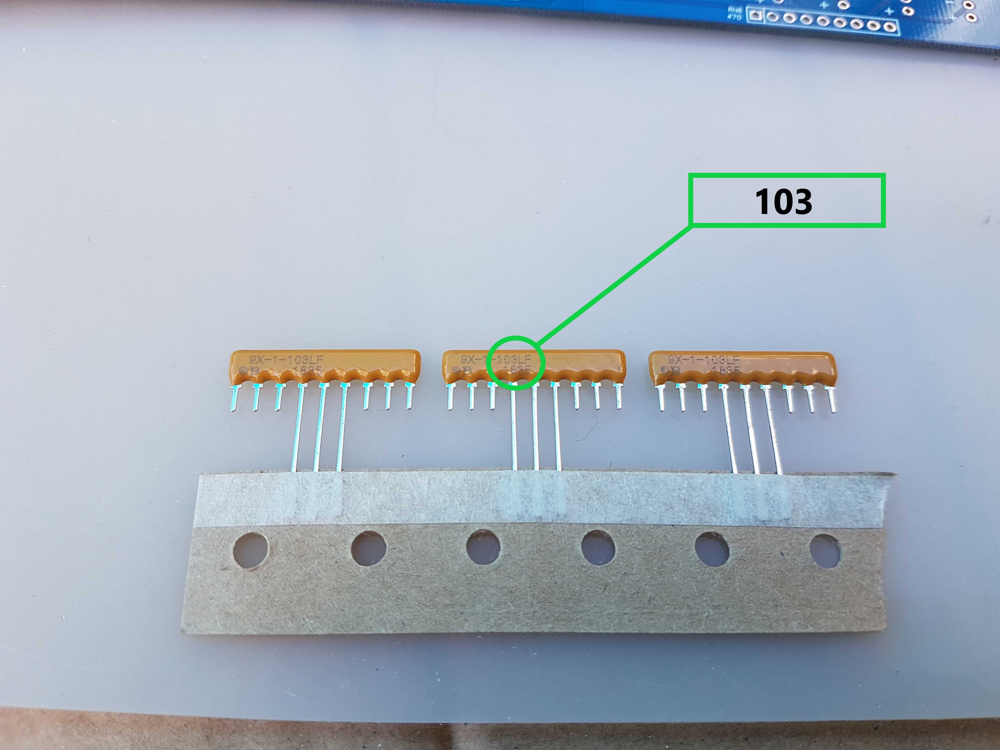
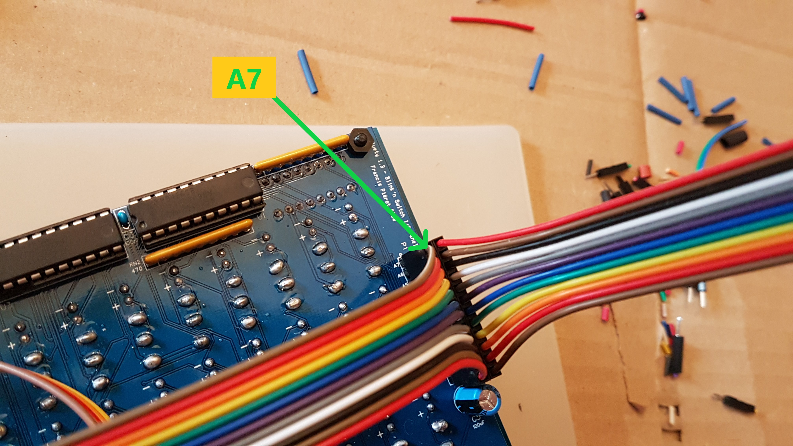

# Bluety

Bluety est un ensemble de circuits imprimés pour un boitier destiné à recevoir un ordinateur compatible RC2014, avec
une conception particulièrement adaptée au SC126 de Stephen S. Cousins. Le RC2014 Pro de Spencer Owens convient également, 
ainsi que de nombreux ordinateurs au format RC2014.

L'ensemble se compose de plusieurs éléments :

* une façade avant
* une façade arrière
* *Blink'n Switch*, une carte d'entrée-sortie avec deux ports complets sélectionnables et un port de contrôle en sortie
* *Bus Daughter*, une carte d'interfaçage avec le bus RC2014
* un écran LCD 4x20 avec adaptateur I2C

La conception a été basée sur un boitier bleu qui a donné son nom à Bluety. 
Les circuits imprimés et si possible les composants ont également été choisis de la couleur bleue.
Mais Bluety conviendra à tout autre boitier de dimensions supérieures (pour les façades) et d'une profondeur suffisante pour 
l'ordinateur choisi. 

L'écran peut être fourni sans adaptateur I2C, c'est par exemple préférable pour le RC2014 Pro, et on le controlera alors avec une carte d'entrée-sortie.

Je vous souhaite un bon assemblage et beaucoup de plaisir avec Bluety.

> Remarque : extension de bus
>
> L'ordinateur SC126 possède 2 connecteurs de bus ce qui est assez peu, mais il a un connecteur d'extension latéral,
conçu pour recevoir par exemple le kit SC113 qui propose 5 connecteurs de bus ainsi qu'un nouveau connecteur d'extension.
>
> La carte du SC113 est cependant trop longue pour le boitier de Bluety, aussi j'en ai dérivé une version SC113-Tiny
qui propose 3 connecteurs de bus au lieu de 5 et convient au boitier. Il présente lui aussi un connecteur d'extension 
pour ajouter de nouveaux SC113 à l'exterieur du boitier.
>
> Notez que cette carte SC113-Tiny n'est pas supportée par Stephen S. Cousins, et je fournis uniquement le circuit 
imprimé en option avec Bluety. Je conseille de commander un SC113 officiel auprès de Stephen 
et d'utiliser ses composants sur la carte SC113Tiny : quelques composants du kit SC113 seront inutilisés mais le fonctionnement et l'assemblage restent identiques.
>
>

## 1. Contenu du kit

Vérifiez le contenu du kit, et contactez moi en cas d'erreur.

Ne touchez pas les circuits intégrés et l'écran LCD sans être équipé d'un bracelet antistatique relié à une masse (par exemple celle de la sortie d'un transformateur 5V), et laissez les à l'abri dans leur étui jusqu'au moment de la fixation de la façade avant sur le boitier pour éliminer le risque de les endommager avec de l'électricité statique. Dans tous les cas, ne les placez pas sur le circuit avant d'avoir procédé aux vérifications indiquées dans cette notice.

> Dans tout le processus d'assemblage, les étapes où vous devrez procéder à une vérification ou à un assemblage particulier seront indiquées dans le style de ce paragraphe. N'ignorez pas ces étapes, elles garantissent le bon résultat de l'assemblage.

### Cartes

* 1 Circuit Bus Daughter 
* 1 Circuit Blink'n Switch 
* 1 Façade avant 
* 1 Façade arrière 

### Composants

* 8 LED 3mm bleues, 16 LED 3mm vertes, 16 LED 3mm jaunes 
* 11 condensateurs céramique 100nF (104)  
* 1 condensateur électrolytique 100uF  
* 3 réseaux résistance 10K (marquées 103) 
* 5 réseaux résistance 470 (marquées 471) 
* 10 Circuits intégrés (3x 74HCT273N, 3x 74HCT688, 2x 74HCT245N, 2x 74HCT32) 
* 1 écran LCD  

NOTE: La couleur des condensateurs et résistances peut varier.

### Connecteurs

* Connecteur 40P angle droit 
* Connecteur 2x12P angle droit 
* 4 supports CI 16P 
* 2 supports CI 14P 
* 8 supports CI 20P 
* 2 connecteurs femelle 2P pattes de 11mm 
* 4 connecteurs femelle 8P pattes de 11mm 
* 1 connecteur mâle 2x12P 
* 1 connecteur d'alimentation 
* 1 connecteur HDMI F/F 

### Interrupteurs

* 4 interrupteurs ON/ON ou ON/OFF  
* 16 interrupteurs ON-OFF-ON  
* 2 interrupteurs dipswitch 8 positions 
* 1 micro interrupteur avec cable 2 fils 
* 2 micro interrupteur avec cable 3 fils 

NOTE : La couleur des interrupteurs peut varier.

### Boutons

* 1 bouton Reset  
* 1 bouton d'alimentation avec LED 

### Visserie

* 6 boulons M2x8 
* 2 boulons M3x8 
* 5 Supports 12mm avec vis et écrou 
* 4 Supports 10mm avec vis et écrou 

### Cables

* 1 cable HDMI/microHDMI M/M 
* 1 cable bouton on/off avec 3 connecteurs 
* 1 cable alimentation principal rouge  
* 1 cable alimentation principal noir 
* 1 cable reset 2 fils 
* 1 cable I2C 4 fils 
* 2 cables Dupont 12 fils 

NOTE: La couleur des cables I2C et Reset peut varier.

## 2. Préparatifs

Outils nécessaires :

* Station de soudure 
* Fil à soudure (diamètre 0.6mm ou 0.8mm recommandé) 
* Pince fine 
* Pince fine coudée 
* Pince coupante coudée 
* Pompe à soudure 
* Tapis silicone (ou protection isolante du plan de travail) 
* Bracelet anti-statique 
* Nécessaire de nettoyage de pane de fer à souder (brosse métallique et flux)  
* Clés ALEN 2 et 1.4mm (fixations connecteurs en façade arrière) 
* Tournevis avec têtes cruxiforme, plat, allen 
* Multimètre avec mesure de voltage et résistance, éventuellement test de continuité  

Respectez les consignes d'assemblage pour obtenir une belle façade avec les composants bien alignés.

L'ordre des branchements et des assemblages est destiné à vous faciliter le travail : ne sautez pas les étapes.

Pour les soudures, j'emploie une méthode qui limite les risques :

* souder une seule patte avec peu de soudure
* vérifier que le composant a été mis au bon endroit et dans le bon sens
* en cas d'erreur, retirer la soudure et replacer correctement le composant
* quand tout est correct, souder toutes les autres pattes
* compléter la soudure de la première patte

Si vous placez trop de soudure ou soudez toutes les pattes, il vous sera difficile voire impossible de réparer une erreur comme un interrupteur ou une LED à l'envers.

Je recommande en particulier cette méthode pour tous les composants apparaissant en façade avant.

## 3. Carte "Bus Daughter"

Cette carte se connecte sur n'importe quel emplacement de bus d'un ordinateur RC2014 et véhicule les signaux utiles jusqu'à la carte Blink'n Switch d'entrée / sortie. Son assemblage ne présente pas de difficulté majeure mais vous devrez faire attention à l'orientation des connecteurs.

* Soudez le condensateur C9, marqué "104" (100 nF). L'orientation n'a pas d'importance. Coupez les pattes au dos. 
* Soudez le connecteur 2x12P P3. Attention à souder le petit côté coudé.  
* Soudez le connecteur 40P P2. Soudez le petit côté. Ne chauffez pas trop sinon le plastique ramollit  et les pattes peuvent pivoter. Si cela arrive, réchauffez la soudure et remettez la patte en position à l'aide d'une pince.  

## 4. Carte "Blink'n Switch"

Cette carte offre deux ports d'entrée/sortie complets, avec des LEDs témoins et des interrupteurs pour contrôler les entrées, ainsi que 8 LEDs en façade pour le port de contrôles 13 (0Dh) de l'ordinateur SC126 de Stephen S. Cousins. Ce port peut également être utilisé par un ordinateur RC2014 pour afficher 8 bits sur les LEDs de la façade avant avec un `OUT` sur le port 13.

Le montage de cette carte nécessite plusieurs assemblages temporaires avec la façade avant pour que les composants apparaissant sur cette dernière soient correctement alignés. **Respectez l'ordre de montage et les consignes** pour avoir les meilleurs chances d'obtenir une belle façade.

### Dos du circuit imprimé (partie 1)

Placez le **dos** visible, (le trou du bouton marche arret en bas à gauche)

* Soudez les 10 condensateurs 100nF C1 à C4 et C6 à C11  
* Soudez les 8 supports 20P et les 2 supports 14P, encoches vers le *haut* ou la *gauche* selon le cas  
* Soudez les 3 réseaux de résistance **10K** RN1 RN4 RN7 

    > * attention à *ne pas confondre avec les 470* : le composant est marqué *103*,ce qui signifie 10 x 10^3, soit 10 Kilo Ohms 
    > * soudez d'abord une seule patte, vérifiez la position et le point de référence à gauche, correspondant au petit carré imprimé sur le circuit 
    > * une fois la position vérifiée soudez les autres pattes

* Soudez les 5 réseaux de résistance **470** RN2 RN3 RN5 RN6 RN8 

    > * le composant est marqué 471, ce qui signifie 47 x 10^1, soit 470 Ohms   
    > * Attention au sens : alignez le point du composant avec le petit carré imprimé à gauche sur le circuit 

* Pour les composants le nécessitant, coupez l'excédent des pattes au fur et à mesure pour ne pas être gêné
    > *Ne soudez pas* le connecteur P1 et le condensateur C5 maintenant : ils gêneraient la suite de l'assemblage.

Voici l'allure de la carte à ce stade. Notez que les supports de circuit fournis sont de type "tulipe" de meilleure qualité que sur cette image. 

### Avant : supports des dip-switch

> ***Important :***
>
> Tous les éléments soudés sur l'avant apparaissent en façade à travers une ouverture, aussi une grande partie de l'assemblage consiste à souder *une seule patte*, puis placer la façade pour vérifier et corriger l'alignement. Ainsi il est possible de réchauffer la soudure pour bouger l'élément en cas de problème d'alignement.
> Une fois celui-ci correct on peut souder le reste des pattes.

Tournez la carte pour voir l'**avant**, le trou du bouton power étant maintenant en bas à droite. 

* Soudez *une patte* de chacun des 2 supports CI 16P (SW10 et SW21), encoche vers la gauche. Ils serviront de base aux DIP-Switchs de sélection du numéro de port. 

* Vissez les 5 supports 12mm sur la carte : support sur le dessus, boulon au dos.  Ils vont servir à plusieurs assemblages prooires afin de bien aligner les composants de la façade, donc ne les démontez pas tout le long de cette étape. L'espace de certains boulons est restreint une fois les composants en place, aussi il est préférable de maintenir le boulon et tourner le support plutôt que l'inverse.  Si un composant nécessite à un moment de tourner un boulon, dévissez légèrement le support, tournez un peu le boulon et revissez le support.

* Emboitez un second support 16P et un DIP-Switch sur chacun des deux supports. 

    > * Fixez la façade avant avec deux ou trois supports en passant les dipswitch à travers leurs ouvertures. 
    > * Si un switch n'est pas bien aligné, faites chauffer la soudure de la patte et réalignez l'ensemble 
    >   pour qu'il soit bien aligné avec l'ouverture de la façade.

* Retournez l'ensemble et terminez la soudure des supports.

* Dévissez les vis de la façade, démontez la ainsi que les ensembles support+dip-switch emboités pour qu'il ne reste que les deux supports soudés.

### Avant : Connecteurs I/O et Power

* Posez le circuit imprimé, face avant sur le dessus, sur des supports de préférence non métalliques afin qu'il soit au dessus du plan de travail et permette aux composants de glisser dans leurs emplacements. Veillez à assurer une hauteur d'environ 10 mm. 
* Positionnez les 4 connecteurs femelles 8P à longues pattes et les 2 connecteurs femelles 2P à longues pattes 
* Fixez la façade. Ne mettez pas la vis centrale, elle gênerait le positionnement des connecteurs. 
* Posez la façade arrière sur la façade avant et perpendiculairement de manière à recouvrir les ouvertures des connecteurs. Vous pouvez placer une feuille de papier entre les deux pour ne pas risquer d'abimer leur revêtement. 
* Retournez délicatement l'ensemble et posez le à l'envers sur le plan de travail. 
* A l'aide d'une pince, placez les connecteurs dans les ouvertures de la façade.   C'est un peu délicat, ne forcez pas pour ne pas tordre les pattes. Si cela arrive, démontez la façade, sortez le connecteur, redressez les pattes et recommencez l'opération.
* Ls connecteurs doivent être bien placés dans les encoches de la façade.   
* Lorsque tout est bien en place, soudez *une patte* de chacun des 6 connecteurs.  
    > * Retournez l'ensemble pour vérifier l'alignement.  
* Lorsque tout est correctement placé, retournez et terminez la soudure des pattes restantes.
* Coupez l'excédent de pattes. Attention aux projections éventuelles des petits bouts de métal car ces pattes sont très ridgides : protégez vos yeux.
* Dévissez la façade

### Avant : interrupteurs

Préparez les 16 interrupteurs à trois positions ON-OFF-ON et 4 interrupteurs à deux positions ON-OFF ou ON-ON.

* Séparez les tas pour ne pas vous tromper. Le kit présente normalement deux couleurs différentes mais cela peut dépendre du stock.
* Positionnez les 8 interrupteurs à **trois positions ON-OFF-ON** du port A, SW1 à SW8. Attention à placer l'encoche située sur 
le pas de vis vers le bas *pour chaque interrupteur*. Ils doivent être tous orientés de la même façon car ils ne sont  généralement pas totalement symétriques. 
* Positionnez les 8 interrupteurs à **trois positions ON-OFF-ON** SW17 à SW24. Même précaution pour l'encoche du pas de vis qui doit être en bas.
* Positionnez les 4 interrupteurs à **deux positions ON-OFF ou ON-ON** SW9, SW11, SW20, SW22, encoche du pas de vis vers le bas. 

    > * Placez tous les boutons en position basse.
    > * Vérifiez l'alignement
* Glissez et fixez la façade à l'aide des vis.
    > * Assurez vous que tout est bien aligné et qu'aucun bouton ne s'est délogé, sinon replacez le et refaites la fixation de la façade.
    > * Vérifiez que les interrupteurs situés les plus à droite sont bien à deux positions et non trois.

* Retournez la carte, et soudez *un seul point* de chacun des 20 interrupteurs avec une petite quantité de soudure.

	> * Soulevez légèrement l'extrémité de la carte côté LCD afin que les interrupteurs soient bien plaqués contre le circuit, et que les pattes à souder dépassent bien du circuit  
    > * Vérifiez l'alignement en retournant l'ensemble. Alignez les leviers à l'aide d'une règle ou d'un bord de la façade avant. Au besoin, chauffez le point de l'interrupteur mal aligné pour le replacer correctement.    

* Quant tout est bien aligné, soudez les autres pattes, remettez de la soudure sur la première selon besoin. Faites ceci pour les 20 interrupteurs. N'hésitez pas à charger en soudure, pour que l'ensemble assure une bonne solidité en plus du contact électrique. 
* Remettez les interrupteurs en position basse
* Dévissez et enlevez la façade.

### Avant : LEDs

* Préparez les LEDs :

    > * 16 vertes pour les ports d'entrée
    > * 16 jaunes pour les ports de sortie
    > * vous pouvez inverser les couleurs vertes et jaunes selon votre goût
    > * 8 bleues pour le port de contrôle
    > * si vous préférez avoir des LED remplaçables, vous pouvez souder des supports femelles à deux broches à la place des LEDs, mais le parfait alignement des LEDs à la bonne longueur sera assez compliqué. Cette possibilité est laissée à votre appréciation et les supports ne sont pas fournis dans le kit.

* Posez le circuit imprimé, face avant sur le dessus, sur des supports de préférence non métalliques afin qu'il soit au dessus du plan de travail et permette aux LEDs de glisser dans leurs emplacements. Veillez à assurer une hauteur d'environ 10 mm.
* Placez les 16 LEDs vertes (ou jaunes) des ports d'entrée LED1 à LED8 et LED17 à LED24. La patte la plus courte est l'anode et se place en haut sur le signe (-) du circuit imprimé. 
* Placez les 16 LEDs jaunes (ou vertes) des ports de sortie LED9 à LED16 et LED25 à LED32. La patte la plus courte est l'anode et se place en haut sur le signe (-) du circuit imprimé.
* Placez les 8 LED bleues du port de contrôle LED33 à LED40. La patte la plus courte est l'anode et se place en haut sur le signe (-) du circuit imprimé.

    > * Vérifiez une dernière fois que les pattes les plus courtes sont bien situées sur le haut, ainsi que l'applat de la LED.

* Fixez de nouveau la façade à l'aide des 5 vis. Pensez à bien visser la vis unique à côté du trou du bouton marche/arrêt : elle assurera le bon alignement des LED situées sous le LCD.  
* Soulevez l'ensemble : les LEDs glissent dans leur logement et se plaquent sur le circuit imprimé.
* Retournez délicatement l'ensemble pour que les LEDs glissent en sens inverse et se placent dans leur ouverture sur la façade. Une grande partie d'entre elles va s'y positionner directement, pour les autres agissez avec une pince sur les pattes pour les placer dans leur ouverture en façade. Posez l'ensemble retourné sur le plan de travail, en appui sur les interrupteurs.

    > * Si une LED est mal positionnée, utilisez ses pattes et une pince pour la replacer correctement. Procédez délicatement pour ne pas tordre les pattes. 
    > * Vérifiez bien que toutes les LEDs sont  placées dans leur logement sur la façade en la regardant par en dessous. Elles doivent toutes dépasser de la même hauteur.  
    > * Vérifiez une dernière fois que les pattes les plus courtes sont bien sur le symbole (-) du circuit.   En cas d'erreur, vous devez retourner la carte, dévisser et ôter la façade, remettre la LED dans le bon sens, revisser la façade et reprendre le bon positionnement des LEDs dans les logements.

* Une fois tout bien positionné et vérifié, soudez les pattes des LEDs.
* Coupez l'excédent des pattes
* Dévissez la façade.

### Dos du circuit imprimé (partie 2)

* Retournez le circuit.
* Soudez le condensateur C5, attention à la polarité la patte la plus courte est sur le (-). Coupez les pattes de l'autre côté.  
* Soudez le connecteur mâle 2x12P P1. 

### Finition

* Nettoyez soigneusement la façade avec un chiffon doux ou microfibre.

  > **N'utilisez aucun produit détergent ou alcoolique**.
  > Les produits speciaux pour écran plat sont acceptables.
  > Si vous souhaitez utiliser un produit, faites un essai sur un petit endroit au dos de la façade ou sur la carte BusDaughter pour vérifier qu'il n'abime pas le vernis.

**IMPORTANT : Mettez votre bracelet anti-statique**

Installez les circuits intégrés dans leurs emplacements :

    * 3x 74HCT273N
    * 3x 74HCT688
    * 2x 74HCT245N
    * 2x 74HCT32

* Revissez la façade.
* Emboitez les dip-switch sur leurs supports 16P puis emboitez les ensembles sur le circuit imprimé à travers l'ouverture en façade.
* Branchez les 2 cables 12 fils sur le connecteur P1. Repérez le fil A7 par sa couleur ou avec un petit autocollant placé à l'extrémité libre. 

## 5. Façade avant

Pour assembler l'écran LCD et le bouton d'alimentation vous devez une dernière fois dévisser la façade pour écarter Blink'n Switch.

### Ecran LCD 4x20

* Dévissez la façade.
* Fixez les 4 supports 10mm à l'écran, support sur l'avant et boulon au dos.  
* Fixez le câble 4 fils sur le connecteur I2C  
	> Note : il est plus difficile de brancher le câble après la fixation de l'écran sur la façade 
* Vissez l'ensemble sur la façade à l'aide des vis.  

### Bouton d'alimentation

  * Vissez le bouton d'alimentation à l'aide de l'écrou. Si vous désirez utiliser le joint, placez le sur le pas de vis à l'intérieur du bouton pour qu'il aille s'appuyer sur l'extérieur de la façade, mais ce joint est facultatif  
  * Repérez les bornes du bouton : **+** et **-** à l'extérieur alimentent la LED, **NO** est l'entrée 5V, **C** est le fil de sortie 5V et **NC** ne sera pas connecté. 
  * Branchez le fil rouge long sur la borne centrale 
  * Branchez le cable 3 fils :

    * les deux fils rouges sur les bornes **+** et **C** 
    * le fil noir sur la borne **-** 

## 6. Façade arrière (SC126+HDMI)

Cette façade arrière offre des interrupteurs pour contrôler les mémoires FLASH de l'ordinateur SC126, ainsi qu'un connecteur HDMI et une ouverture permettant de passer un cable USB pour une liaison directe vers un PiZero Terminal RC2014, et enfin un connecteur d'alimentation et un bouton reset. Une ouverture permet de passer les cables vers les connecteurs arrière d'un SC126.

Les micro interrupteurs sont livrés soudés avec un cable de longueur convenant à un SC126. Si vous utilisez un boitier plus grand ou un autre ordinateur, vous pouvez utiliser des cables Dupont male/femelle comme rallonge, les branchements restent similaires.

Les branchements seront effectués ultérieurement.

* Vissez le micro interrupteur avec 2 fils sur la position verticale "flash select" à l'aide des vis M2x8 et d'une clé Allen (non fournie).

    > ATTENTION si vous avez placé la RomWBW en U1 sur SC126, vous devez mettre les deux fils en bas, par contre si vous avez placé la rom SCM en U1 vous devez mettre les deux fils en haut.

* Vissez les deux interrupteurs avec 3 fils aux positions "flash protect" horizontales à l'aide de 4 vis M2x8
* Vissez le connecteur d'alimentation, patte la plus longue en bas (c'est le '-')
* Vissez le bouton reset, la position des pattes n'a pas d'importance
* Vissez le connecteur HDMI à l'aide des deux vis M3x8

## 7. Installation et branchements

Tous les composants sont fixés ou soudés, il reste maintenant à effectuer les branchements et l'installation de l'ordinateur dans le boitier.

### Installation SC126

* Percez le fond du boitier à l'aide du gabarit SC126.     Seuls 3 trous sont nécessaires car 1 des supports est en face d'une patte du boitier et ne sera pas vissé, mais il assurera un rôle pour éviter une pliure du circuit imprimé lors des branchements. 
* Pour le gabarit SC126 vous pouvez percer un trou supplémentaires pour le SC113Tiny, qui procure 3 connecteurs de bus supplémentaires. Lui aussi ne sera fixé que par une vis, mais pour la stabilité du tout on placera deux supports. 
* Vous pouvez également faire une ouverture sur le côté gauche du boitier pour que le port d'extension du SC113Tiny soit accessible à l'extérieur.

         > $$A FAIRE : gabarits RC2014 Pro, SC126 et SC126+SC113T
         > $$A FAIRE : gabarit ouverture latérale

* Branchez le cable I2C maintenant, l'accès sera moins aisé une fois la façade arrière mise en place. Prenez soin de bien respecter la correspondance des fils : repérez le fil GND sur l'écran LCD pour le brancher sur la broche 0V du connecteur I2C sur le SC126 et faites de même pour les trois autres cables, l'ordre reste le même donc vous ne devez pas avoir de fil croisé.  
* Branchez également un cable Dupont sur le port 1 si vous souhaitez l'utiliser plus tard, là aussi l'accès sera moins aisé une fois la façade arrière en place.  
* Vissez les supports sur le SC126 : 4 pour SC126, et 2 pour SC113Tiny si vous l'utilisez.  
* Fixez le SC126 à l'aide des supports boulons vis. Notez qu'avec le gabarit fourni, seuls 3 supports du SC126 et 1 support du SC113 Tiny seront vissés. Si vous souhaitez visser les 6 supports vous devrez avancer légèrement la carte en direction de l'avant mais l'interrupteur situé sur SC126 peut vous en empêcher. Les vis des supports iront sous le boitier, et les boulons sont normalement déjà vissés sur le dessus de la carte. 
* Fixez la façade avant
* Fixez la façade arrière.

### Branchement BusDaughter => Blink'n Switch

* Branchez les deux cables 12 fils sur la BusDaughter en prenant soin de respecter le repérage du fil A7 efffectué lors du branchement sur Blink'n Switch. Ne mettez pas les mêmes couleurs des deux cables côte à côte, il serait difficile de les différencier.
* Installez la carte BusDaughter dans l'emplacement bus de votre choix.

    > Attention à l'emplacement de la broche 1 : le côté biseauté de la carte se présente sur l'avant de l'ordinateur

* Normalement, les deux cables doivent rester parallèles. Le plus à droite sur Blink'n Switch sera aussi le plus à droite sur BusDaughter. Si ce n'est pas le cas, vérifiez le branchement.

### Façade avant

Ls branchements sont facilités si vous avez connecté les cables de l'écran LCD et du bouton on/off *avant* de visser la façade :

* Si vous n'avez pas déjà fixé le cable I2C sur l'écran LCD, dévissez l'écran de la façade, branchez le cable puis revissez l'écran. Reportez-vous à la section *Façade avant* pour le branchement.
* Si vous n'avez pas fixé les cables sur le bouton d'alimentation, dévissez la façade, effectuez les branchements comme indiqué dans la section *Façade avant* puis revissez la façade.

Ensuite vous pouvez brancher les cables.

* Le cable rouge long du bouton d'alimentation va sur la broche courte du connecteur arrière. 
* Le cable rouge double du bouton d'alimentation va sur la broche + du connecteur J2 sur SC126 
* Conservez le cable noir double du bouton d'alimentation accessible vers le connecteur J2, il sera branché plus tard.
* Branchez le cable I2C sur l'ordinateur SC126, en prenant soin de l'ordre des broches. Le connecteur 6 fils du SC126 permet de placer le cable dans toutes les configurations possibles, donc il n'y a pas besoin de croiser des fils.  

### Façade arrière

La façade arrière regroupe les cables qui sortent du boitier.

Le connecteur d'alimentation sert le bouton marche/arrêt de la façade et l'alimentation du SC126. Le bouton Reset est particulièrement utile pour les utilisateurs de la carte PiZero Terminal qui nécessite un reset après la mise en marche.

Les interrupteurs de sélection permettent de choisir entre les deux ROM du SC126 et d'autoriser leur écriture pour une mise à jour.

Le connecteur HDMI se branche par une rallonge directement sur la carte PiZero Terminal, permettant d'avoir une sortie écran couleur via le logiciel PiGfx.

L'orifice à côté de la prise HDMI permet de passer une rallonge USB pour brancher un clavier USB sur un PiZero Terminal. Cette ouverture a été préférée à une prise USB en raison des difficultés à trouver un connecteur approprié. 

En bas de la façade, une ouverture permet de passer les cables utiles pour les nombreux connecteurs du SC126, par exemple la prise série pour controler l'ordinateur via une machine de bureau ou portable.

* Branchez la rallonge HDMI sur le connecteur, puis sur votre PiZeroTerminal
* Branchez les deux interrupteurs 3 fils sur les connecteurs JP1 et JP2 du SC126 : attention à placer le bon cable sur le bon connecteur selon que vous avez placé RomWBW en U1 et SCM en U2 ou l'inverse
* Branchez l'interrupteur 2 fils sur le connecteur P9, attention a 
* Branchez le bouton reset sur le connecteur P8
* Branchez le connecteur d'alimentation sur le connecteur J2, attention le + est au milieu

    > $$A FAIRE : détails des cables et du cablage

Pour l'interrupteur "SELECT" : le connecteur P9 du SC126 sélectionne la mémoire 1 ou 2 selon qu'il est fermé (interrupteur de la façade arrière face aux deux fils) ou ouvert (interrupteur sur la position où seul le fil central est connecté). Veillez à placer l'interrupteur de façon à ce que les fils sélectionnent bien la ROM qui se trouve à l'emplacement concerné. Le modèle d'installation fourni dans cette documentation convient, mais si vous avez inversé les ROms par rapport à ce modèle vous devrez inverser également l'interrupteur de sélection et les branchements des cables à trois fils.

### Bouton Power

Avec le branchement proposé, le bouton de la façade avant contrôle l'alimentation du SC126 via le connecteur J2. Pour que ce dernier puisse alimenter le SC126 il faut placer l'interrupteur de la carte SC126 en position ON, afin de déporter la fonction ON/OFFF sur le bouton de la façade avant.

* Branchez le fil rouge de la broche **C** du bouton on/off sur le bornier J2 du SC126  
*

## 9. Logiciel et utilisation

Il n'y a rien de particulier à programmer pour les ports d'entrée sortie et celui de contrôle : les instructions OUT et IN enverront ou recevront les 8 bits de données.

$$TODO: Pour l'écran LCD, une version spéciale de SCM a été développée. 

### Port de contrôle (13/0Dh)

Le port de contrôle est cablé sur le numéro de port 13 (0Dh), ceci correspond aux deux logiciels de l'ordinateur SC126 : le moniteur SCM affiche l'état de ses tests à l'allumage sur ce port, et le boot de RomWBW affiché également son statut sur ce port.

Tout programme peut allumer ou éteindre ces leds en envoyant une donnée 8-bits sur le port 13. La LED la plus à gauche représente le bit de poids fort.

> Remarque : le port 13 retient sa dernière donnée, donc pour éteindre les LEDs il faut explicitement écrire un 0.

### Ports d'entrée sortie

Les 2 ports d'entrée et de sortie possèdent chacun 8 LEDs qui représentent les 8 bits de données, le bit de poids fort étant représenté par la LED la plus à gauche.

Pour utiliser le port d'*entrée* A ou B :

* choisir le numéro de port avec le DIPswitch, le bit de poids fort du numéro est représenté par l'interrupteur le plus à gauche.
* placer les interrupteurs en position médiane et connecter vos fils sur le port d'entrée
* les interrupteurs peuvent être placés en position haute pour forcer un bit à 1, ou basse pour le forcer à 0
* l'interrupteur supérieur à droite des LEDs les active ou non, elles affichent l'état de l'entrée qui leur correspond
* utiliser les instructions IN pour lire l'état du port

Pour utiliser le port de *sortie* A ou B :

* choisir le numéro de port avec le DIPswitch
* connecter vos fils sur le port de sortie
* l'interrupteur inférieur à droite des LEDs les active ou non
* utiliser les instructions OUT pour écrire sur le port : 5V sont placés sur les sorties des bits placés à 1

> Remarque : Chaque port de sortie retient sa dernière donnée, donc pour éteindre les LEDs il faut explicitement écrire un 0.

### Ecran LCD

Pour accéder à l'écran LCD il faut passer par le bus I2C sur le port 0Ch du SC126. Un logiciel spécifique est disponible.

    > $$TODO : logiciel LCD/I2C