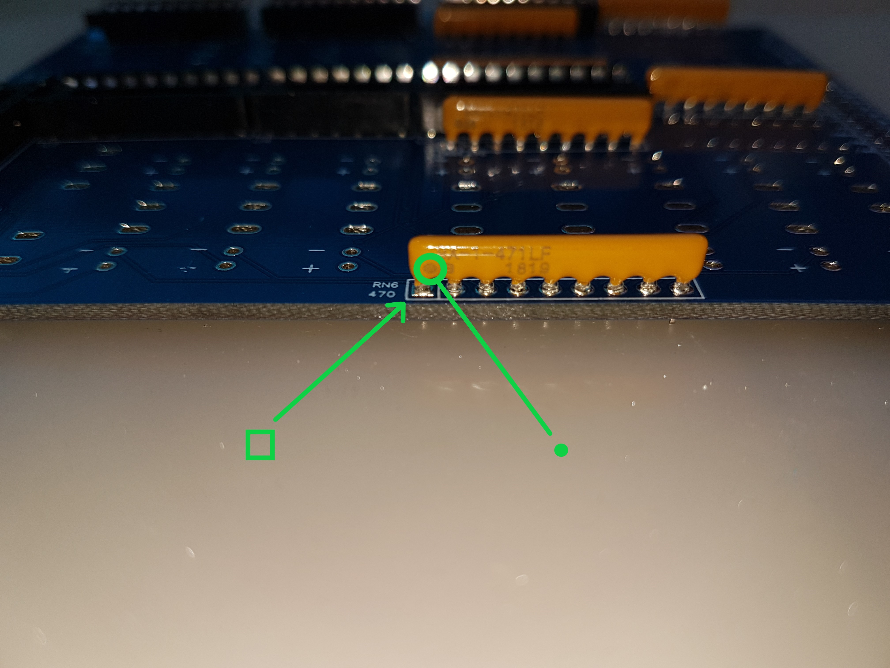

# Assemblage
---
Cette notice décrit le montage des cartes de Bluety.

> Important: une soudure ou un branchement sera nécessaire sur votre ordinateur RC2014 pour les fonctions du bouton marche/arrêt de la façade. 

Outils nécessaires :

* Station de soudure 
* Soudure (diamètre 0.6mm ou 0.8mm recommandé) 
* Pince fine 
* Pince fine coudée 
* Pince coupante coudée 
* Pompe à soudure 
* Tapis silicone (ou protection isolante du plan de travail) 
* Bracelet anti-statique 
* Nécessaire de nettoyage de pane de fer à souder (brosse métallique et flux)  
* Clés ALEN 2 et 1.4mm (fixations connecteurs en façade arrière) 
* Alcool isopropanol (nettoyage cartes) 
 
---

## Carte "Bus Daughter"

Cette carte se connecte sur n'importe quel connecteur de bus d'un ordinateur RC2014 et véhicule les signaux utiles jusqu'à la carte Blink'n Switch d'entrée / sortie. Son assemblage ne présente pas de difficulté majeure mais vous devrez faire attention à l'orientation des connecteurs.

Pièces :

> * Circuit Bus Daughter 
> * Condensateur 10nF 
> * Header 40P angle droit 
> * Header 2x12P angle droit 

* Soudez le condensateur C9 (100 nF). Coupez les pattes au dos. 
* Soudez le header 2x12P P3. Attention à souder le petit côté coudé.   
* Soudez le header 40P P2. Soudez le petit côté. Ne chauffez pas trop sinon le plastique ramollit trop et les pattes pivotent. Si cela arrive, réchauffez la soudure et remettez la patte en position à l'aide d'une pince.  
* Nettoyez à l'alcool isopropanol.

## Blink'n Switch

Cette carte offre deux ports d'entrée/sortie complets, avec des LEDs témoins et des interrupteurs pour contrôler les entrées, ainsi que 8 LEDs en façade pour le port de contrôles 13 (0Dh) de l'ordinateur SC126 de Stephen S. Cousins. Ce port peut également être utilisé par un ordinateur RC2014 pour afficher 8 bits sur les LEDs de la façade avant avec un `OUT` sur le port 13.

Le montage de cette carte nécessite plusieurs assemblages temporaires avec la façade avant pour que les composants apparaissant sur cette dernière soient correctement alignés. **Respectez l'ordre de montage et les consignes** pour avoir les meilleurs chances d'obtenir une belle façade.

Pièces :

> * Circuit Blink'n Switch 
> * Façade avant 
> * 5 Supports 12mm avec vis et écrou 
> * 4 supports CI 16P 
> * 2 supports CI 14P 
> * 8 supports CI 20P 
> * 8 LED 3mm bleues, 16 LED 3mm vertes, 16 LED 3mm jaunes 
> * 4 interrupteurs ON/ON ou ON/OFF 
> * 16 interrupteurs ON-OFF-ON 
> * 2 interrupteurs dipswitch 8 positions 
> * 2 headers femelle 2P pattes de 11mm 
> * 4 headers femelle 8P pattes de 11mm 
> * 1 header mâle 2x12P 
> * 10 condensateurs céramique 100nF (104) 
> * 1 condensateur électro 100uF 
> * 3 réseaux résistance 10K (A103J) 
> * 5 réseaux résistance 470 (A471J) 
> * Circuits intégrés (3x 74HCT273N, 3x 74HCT688, 2x 74HCT245N, 2x 74HCT32) 

Dans l'ordre, vous allez monter :

1. Les supports de circuit intégrés et les réseaux de résistances au dos du circuit
2. Les supports de dip-switch sur le devant
3. Les connecteurs femelles d'entrée, sortie et puissance sur le devant
4. Les interrupteurs sur le devant
5. Les LEDs sur le devant
6. Le reste des composants au dos

### Dos du circuit imprimé (partie 1)

Placez le **dos** visible, (le trou du bouton marche arret en bas à gauche)

* Soudez les 10 condensateurs 100nF C1 à C4 et C6 à C11  

* Soudez les 8 supports 20P et les 2 supports 14P, encoches vers le *haut* ou la *gauche* selon le cas  

* Soudez les 3 réseaux de résistance **10K** RN1 RN4 RN7  
    > * attention à *ne pas confondre avec les 470* : le composant est marqué A103J (103 signifie 10 x 10^3)
    > * soudez d'abod une seule patte, vérifiez la position et le point de référence à gauche 
    > * attention au sens : alignez le point du composant avec le petit carré imprimé à gauche sur le circuit
    > * une fois la position vérifiée soudez les autres pattes

* Soudez les 5 réseaux de résistance **470** RN2 RN3 RN5 RN6 RN8  
    > * le composant est marqué A471J (471 signifie 47 x 10^1)
    > * Attention au sens : alignez le point du composant avec le petit carré imprimé à gauche sur le circuit 

* Pour les composants le nécessitant, coupez l'excédent des pattes au fur et à mesure pour ne pas être gêné
 
*Ne soudez pas* le header P1 et le condensateur C5 maintenant : ils gêneraient la suite de l'assemblage.

Voici l'allure de la carte à ce stade.  

### Avant : supports des dip-switch

> ***Important :***
>
> Tous les éléments soudés sur l'avant apparaissent en façade à travers une ouverture, aussi une grande partie de
> l'assemblage consiste à souder *une seule patte*, puis placer la façade pour vérifier et corriger l'alignement.
> Ainsi il est possible de réchauffer la soudure pour bouger l'élément en cas de problème d'alignement. 
> Une fois celui-ci correct on peut souder le reste des pattes.

Tournez la carte pour voir l'**avant**, le trou du bouton power étant maintenant en bas à droite.  

* Soudez *une patte* de chacun des 2 supports CI 16P (SW10 et SW21), encoche vers la gauche. Ils serviront de base aux DIP-Switchs de sélection du numéro de port. 

* Vissez les 5 supports 12mm sur la carte : support sur le dessus, boulon au dos.  Ils vont servir à plusieurs assemblages provisoires afin de bien aligner les composants de la façade, donc ne les démontez pas tout le long de cette étape. L'espace de certains boulons est restreint une fois les composants en place, aussi il est préférable de maintenir le boulon et tourner le support plutôt que l'inverse.  Si un composant nécessite à un moment de tourner un boulon, dévissez légèrement le support, tournez un peu le boulon et revissez le support.

* Emboitez un second support 16P et un DIP-Switch sur chacun des deux supports. 
    > * Fixez la façade avant avec deux ou trois supports en passant les dipswitch à travers leurs ouvertures. 
    > * Si un switch n'est pas bien aligné, faites chauffer la soudure de la patte et réalignez l'ensemble 
    >   pour qu'il soit bien aligné avec l'ouverture de la façade.

* Retournez l'ensemble et terminez la soudure des supports.

* Dévissez les vis de la façade, démontez la ainsi que les ensembles support+dip-switch emboités pour qu'il ne reste que les deux supports soudés.

### Avant : Headers I/O et Power

* Posez le circuit imprimé, face avant sur le dessus, sur des supports de préférence non métalliques afin qu'il soit au dessus du plan de travail et permette aux composants de glisser dans leurs emplacements. Veillez à assurer une hauteur d'environ 10 mm. 

* Positionnez les 4 connecteurs femelles 8P à longues pattes et les 2 connecteurs femelles 2P à longues pattes 

* Fixez la façade. Ne mettez pas la vis centrale, elle gênerait le positionnement des headers. 

* Posez la façade arrière sur la façade avant et perpendiculairement de manière à recouvrir les ouvertures des headers. Vous pouvez placer une feuille de papier entre les deux pour ne pas risquer d'abimer leur revêtement. 

* Retournez délicatement l'ensemble et posez le à l'envers sur le plan de travail. 

* A l'aide d'une pince, placez les connecteurs dans les ouvertures de la façade.   C'est un peu délicat, ne forcez pas pour ne pas tordre les pattes. Si cela arrive, démontez la façade, sortez le connecteur, redressez les pattes et recommencez l'opération.

* Ls headers doivent être bien placés dans les encoches de la façade.   

* Lorsque tout est bien en place, soudez *une patte* de chacun des 6 connecteurs.  
    > * Retournez l'ensemble pour vérifier l'alignement.  

* Lorsque tout est correctement placé, retournez et terminez la soudure des pattes restantes.

* Coupez l'excédent de pattes. Attention aux projections éventuelles des petits bouts de métal : protégez vos yeux.

* Dévissez la façade

### Avant : interrupteurs

Préparez les 16 interrupteurs à trois positions ON-OFF-ON et 4 interrupteurs à deux positions ON-OFF ou ON-ON.

* Séparez les tas pour ne pas vous tromper. Le kit présente normalement deux couleurs différentes mais cela peut dépendre du stock.
 
* Positionnez les 8 interrupteurs à **trois positions ON-OFF-ON** du port A, SW1 à SW8. Attention à placer l'encoche située sur 
le pas de vis vers le bas *pour chaque interrupteur*. Ils doivent être tous orientés de la même façon car ils ne sont  généralement pas totalement symétriques. 

* Positionnez les 8 interrupteurs à **trois positions ON-OFF-ON** SW17 à SW24. Même précaution pour l'encoche du pas de vis qui doit être en bas.

* Positionnez les 4 interrupteurs à **deux positions ON-OFF ou ON-ON** SW9, SW11, SW20, SW22, encoche du pas de vis vers le bas. 
    > * Placez tous les boutons en position basse.
    > * Vérifiez l'alignement

* Glissez et fixez la façade à l'aide des vis.
    > * Assurez vous que tout est bien aligné et qu'aucun bouton ne s'est délogé, sinon replacez le et refaites la fixation de la façade.
    > * Vérifiez que les interrupteurs situés les plus à droite sont bien à deux positions et non trois.

* Retournez la carte, et soudez *un seul point* de chacun des 20 interrupteurs avec une petite quantité de soudure.
	> * Soulevez légèrement l'extrémité de la carte côté LCD afin que les interrupteurs soient bien plaqués contre le circuit
    > * Vérifiez l'alignement en retournant l'ensemble. Au besoin, chauffez le point de l'interrupteur mal aligné pour le replacer correctement. 

* Quant tout est bien aligné, soudez les autres pattes, remettez de la soudure sur la première selon besoin. Faites ceci pour les 20 interrupteurs.

* Remettez les interrupteurs en position basse

* Dévissez et enlevez la façade.

### Avant : LEDs

* Préparez les LED
	> * 16 vertes pour les ports d'entrée
	> * 16 jaunes pour les ports de sortie
	> * vous pouvez inverser les couleurs vertes et jaunes selon votre goût
	> * 8 bleues pour le port de contrôle
    > * si vous préférez avoir des LED remplaçables, vous pouvez souder des supports femelles à deux broches à la place des LEDs, mais le parfait alignement des LEDs à la bonne longueur sera assez compliqué. Cette possibilité est laissée à votre appréciation et les supports ne sont pas fournis dans le kit.

* Posez le circuit imprimé, face avant sur le dessus, sur des supports de préférence non métalliques afin qu'il soit au dessus du plan de travail et permette aux LEDs de glisser dans leurs emplacements. Veillez à assurer une hauteur d'environ 10 mm.

* Placez les 16 LEDs vertes (ou jaunes) des ports d'entrée LED1 à LED8 et LED17 à LED24. La patte la plus courte est l'anode et se place en haut sur le signe (-) du circuit imprimé.

* Placez les 16 LEDs jaunes (ou vertes) des ports de sortie LED9 à LED16 et LED25 à LED32. La patte la plus courte est l'anode et se place en haut sur le signe (-) du circuit imprimé.

* Placez les 8 LED bleues du port de contrôle LED33 à LED40. La patte la plus courte est l'anode et se place en haut sur le signe (-) du circuit imprimé.
    > * Vérifiez une dernière fois que les pattes les plus courtes sont bien situées sur le haut, ainsi que l'applat de la LED.

* Fixez de nouveau la façade à l'aide des 5 vis. Pensez à bien visser la vis unique à côté du trou du bouton marche/arrêt : elle assurera le bon alignement des LED situées sous le LCD.

* Soulevez l'ensemble : les LEDs glissent dans leur logement et se plaquent sur le circuit imprimé.

* Retournez délicatement l'ensemble pour que les LEDs glissent en sens inverse et se placent dans leur ouverture sur la façade. Une grande partie d'entre elles va s'y positionner directement, pour les autres agissez avec une pince sur les pattes pour les placer dans leur ouverture en façade.

* Posez l'ensemble retourné sur le plan de travail, en appui sur les interrupteurs.
    > * Si une LED est mal positionnée, utilisez ses pattes et une pince pour la replacer correctement. Procédez délicatement pour ne pas tordre les pattes.
    > * Vérifiez bien que toutes les LEDs sont  placées dans leur logement sur la façade en la regardant par en dessous. Elles doivent toutes dépasser de la même hauteur.
    > * Vérifiez une dernière fois que les pattes les plus courtes sont bien sur le symbole (-) du circuit. En cas d'erreur, vous devez retourner la carte, dévisser et ôter la façade, remettre la LED dans le bon sens, revisser la façade et reprendre le bon positionnement des LEDs dans les logements.

* Une fois tout bien positionné et vérifié, soudez les pattes des LEDs.

* Coupez l'excédent des pattes

* Dévissez la façade.

### Dos du circuit imprimé (partie 2)

* Retournez le circuit.
* Soudez le condensateur C5, attention à la polarité la patte la plus courte est sur le (-). Coupez les pattes de l'autre côté.
* Soudez le connecteur mâle 2x12P P1. 

### Finition

* Nettoyez soigneusement la façade avec un chiffon doux ou microfibre. 

> **N'utilisez aucun produit détergent ou alcoolique**. 
> Les produits speciaux pour écran plat sont acceptables. 
> Si vous souhaitez utiliser un produit, faites un essai sur un petit endroit au dos de la façade pour vérifier qu'il n'abime pas le vernis.

* IMPORTANT : Mettez votre bracelet anti-statique

* Installez les circuits intégrés dans leurs emplacements
    * 3x 74HCT273N
    * 3x 74HCT688
    * 2x 74HCT245N
    * 2x 74HCT32

* Revissez (définitivement) la façade.

* Emboitez les dip-switch sur leurs supports 16P puis emboitez les ensembles sur le circuit imprimé à travers l'ouverture en façade.

* Branchez les cables 12 fils sur le connecteur P1. Repérez le fil A7 par sa couleur ou avec un petit autocollant placé à l'extrémité libre.

## Façade avant

### Bouton d'alimentation

* Vissez le bouton d'alimentation. Utilisez ou non le joint, dans ce cas il se place sur le devant de la façade donc vous devez l'enfiler sur le pas de vis avant d'installer le bouton.

* Branchez le cable 5 fils.
	* fil noir sur la borne -
	* fil blanc sur la borne +
	* fil gris sur la borne C
	* fil violet sur la borne ON
	* fil bleu sur la borne NC

        > $$A faire  : branchement power button

### Ecran LCD 4x20

* Fixez les 4 supports à l'écran, support sur l'avant et boulon au dos.

* Fixez le câble 4 fils sur le connecteur I2C
	> Note : il est plus diffficile de brancher le câble après la fixation de l'écran dur la façade 

* Vissez l'ensemble sur la façade à l'aide des vis.

## Façade arrière (SC126+HDMI)

Cette façade arrière offre des interrupteurs pour contrôler les mémoires FLASH de l'ordinateur SC126, ainsi qu'un connecteur HDMI et USB pour une liaison directe vers un PiZero Terminal RC2014.

* Soudez le câble 2 fils sur 1 micro-interrupteur
* Vissez le micro interrupteur à la position verticale "flash select" à l'aide des vis et d'une clé Alen 1.4mm (non fournie)
* Soudez les câbles à 3 fils sur 2 micro-interrupteurs
* Vissez ces deux interrupteurs aux positions "flash protect" horizontales
* Vissez le connecteur d'alimentation, patte la plus longue en bas (c'est le '-')
* Vissez le bouton reset

        > $$A FAIRE : branchements RESET, POWER
        > $$A FAIRE : branchement USB

---

# Installation et branchements

## Installation ordinateur dans le boitier

* Percez le fond du boitier à l'aide du gabarit RC2014 Pro ou SC126.
* Pour le gabarit SC126 vous pouvez aussi percer deux trous supplélmentaires pour le SC113Tiny, qui procure 3 connecteurs de bus supplémentaires. 
* Vous pouvez également faire une ouverture sur le côté gauche du boitier pour que le port d'extension du SC113Tiny soit accessible à l'extérieur.

         > $$A FAIRE : gabarits RC2014 Pro, SC126 et SC126+SC113T
         > $$A FAIRE : gabarit ouverture latérale

* Fixez l'ordinateur à l'aide de supports boulon vis. Les vis iront sous le boitier, et les boulons sur le dessus de la carte.

La position exacte de l'ordinateur n'a pas d'importance car tout est relié par cable, toutefois si vous utilisez la combinaison SC126+SC113Tiny vous pouvez caler l'ordinateur sur le bord du boitier où vous pratiquerez une ouverture pour le bus d'extension.

* Fixez la façade avant
* Fixez la façade arrière

## BusDaughter => Blink'n Switch

* Branchez deux cables 12 fils sur la BusDaughter en prenant soin de respecter le repérage du fil A7 par une couleur : ne mettez pas les mêmes couleurs côte à côte, pour pouvoir différencier les deux côtés

* Branchez l'autre extrêmité des cables sur la carte Blink'n Switch, en suivant la couleur repérée pour le fil A7.

* Installez la carte BusDaughter dans l'emplacement bus de votre choix, de préférence vers le bord du boitier pour laisser la place aux autres cartes.
	> Attention à l'emplacement de la broche 1 : le côté biseauté de la carte se présente sur l'avant de l'ordinateur  

* Normalement, les deux cables doivent rester parallèles. Le plus à droite sur Blink'n Switch sera aussi le plus à droite sur BusDaughter. Si ce n'est pas le cas, vérifiez le branchement.

## Façade avant

* Branchez le cable 5 fils du bouton d'alimentation

        > $$A FAIRE : branchements power button

* Si vous n'avez pas déjà branché le cable I2C sur l'écran LCD, dévissez le de la façade, branchez le cable, et revissez l'écran.

*  Branchez le cable I2C sur l'ordinateur SC126, en prenant soin de l'ordre des broches. Le connecteur 6 fils du SC126 permet de placer le cable dans toutes les configurations possibles, donc il n'y a pas besoin de croiser des fils.

## Façade arrière

* Branchez la rallonge HDMI sur le connecteur, puis sur votre PiZeroTerminal
* Branchez les trois interrupteurs FLASH sur les connecteurs SC126 indiqués :
	* JP1 et JP2 pour les interrupteurs de protection 
	* P9 pour l'interrupteur de sélection
* Branchez le bouton reset sur le connecteur P8
* Branchez le connecteur d'alimentation sur le connecteur J2, attention le + est au milieu

        > $$A FAIRE : détails des cables et du cablage

## Bouton Power

Pour pouvoir utiliser le bouton Marche/Arrêt de la façade, vous devez le brancher sur votre ordinateur. 

Le bouton est livré avec un cable custom qui se termine en connecteurs Dupont femelle :

* 3 fils pour la fonction ON/OFF :
	* 1 fil de sortie vers l'alimentation de l'ordinateur
	* 1 fil qui le relie au +5V lorsque le bouton est enfoncé
	* 1 fil qui le relie à la masse lorsque le bouton n'sst pas enfoncé
* 2 fils GND/+5V pour alimenter la LED

Vous devez repérer sur votre ordinateur :

- l'emplacement de la LED qui signale l'alimentation. Si vous n'avez pas encore soudé cette LEDs vous pouvez la remplacer par deux connecteurs mâles, sinon il vous faudra souder sur les pattes de la LEDs deux câbles mâles dout vous couperez l'une des extrémités.
- les trois broches du bouton d'alimentation corespondant aux trois fonctions (sortie, gnd, +5V). Si vous n'avez pas encore soudé le bouton, vous pouvez le remplacer par trois connecteurs mâles, sinon vous devrez souder sur les pattes du bouton de l'ordinateur trois câbles mâles dout vous couperez l'une des extrémités.

Si vous devez souder des câbles sur la carte de votre ordinateur, assurez-vous de mettre une quantité suffisante de soudure pour la solidité de l'ensemble et si vous le pouvez, percez un petit trou dans la carte afin de les attacher à celle-ci avec un filament plastifié. 

Certaines cartes peuvent avoir des connecteurs faisant double emploi avec le bouton marche arrêt ou la LED pour permettre un branchement externe. Dans ce cas le travail est facilité, mais si ces connecteurs sont de type femelle vous aurez besoin de rallonges Dupont de type male/male.

        > $$A FAIRE :  décrire le branchement sur RC2014 pro et sur SC126

---

# Logiciel et utilisation

Il n'y a rien de particulier à programmer pour les ports d'entrée sortie et celui de contrôle : les instructions OUT et IN enverront ou recevront les 8 bits de données.

Le port de contrôle est cablé sur le numéro de port 0Dh, ceci correspond au logiciel de l'ordinateur SC126 et est également utilisé dans la version SC126 de RomWBW.

## Ports d'entrée sortie et contrôle

Les 2 ports d'entrée et de sortie et celui de controle possèdent chacun 8 LEDs qui représentent les 8 bits de données, le bit le plus haut (b7) étant représenté par la LED la plus à gauche. .

Pour utiliser le port d'entrée A ou B

* choisir le numéro de port avec le DIPswitch
* placer les interrupteurs en position médiane et connecter vos fils sur le port d'entrée
* les interrupteurs peuvent être placés en position haute pour forcer un bit à 1, ou basse pour le forcer à 0
* l'interrupteur supérieur à droite des LEDs les active ou non
* utiliser les instructions IN pour lire l'état du port

Pour utiliser le port de sortie A ou B

* choisir le numéro de port avec le DIPswitch
* connecter vos fils sur le port de sortie
* l'interrupteur inférieur à droite des LEDs les active ou non
* utiliser les instructions OUT pour écrire sur le port

Pour utiliser le port de contrôle

* utiliser l'instruction OUT sur le port 0D pour allumer ou éteindre les LEDs

> Remarque : Chaque port de sortie retient sa dernière donnée, donc pour éteindre les LEDs il faut explicitement écrire un 0.

## Ecran LCD

Pour accéder à l'écran LCD il faut passer par le bus I2C sur le port 0Ch du SC126. Un logiciel spécifique est disponible.

        > $$A FAIRE : logiciel LCD/I2C