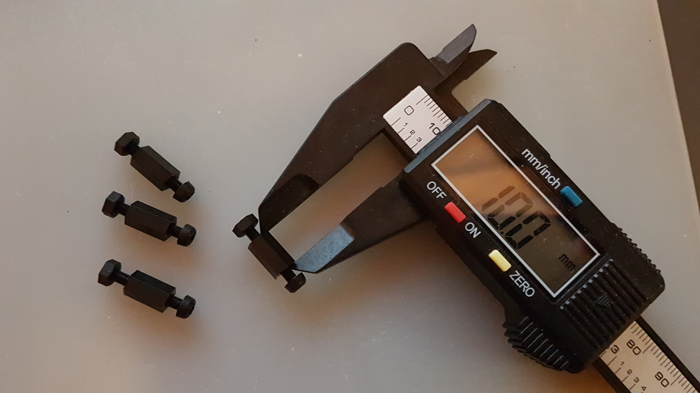
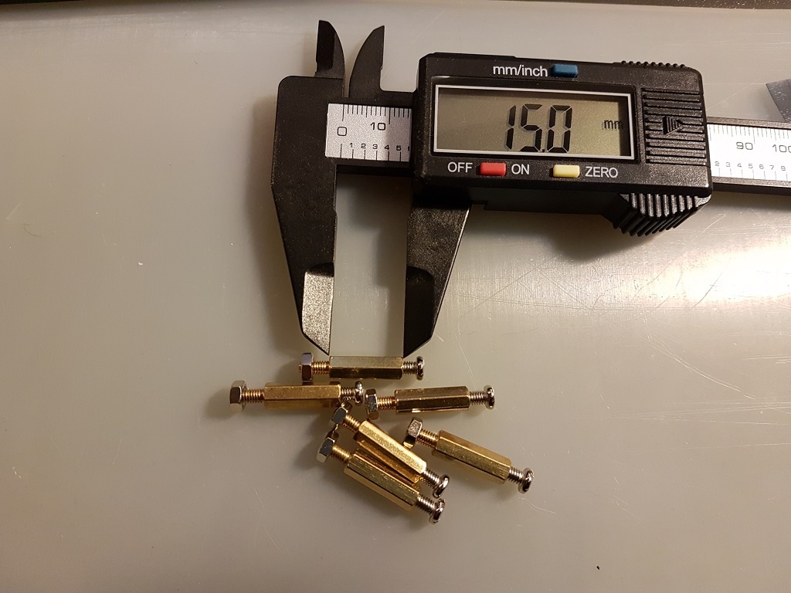
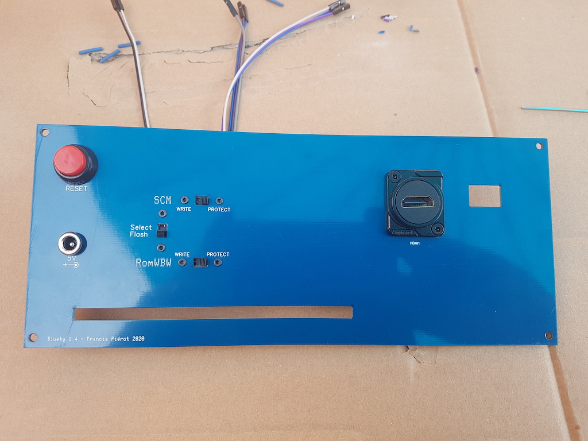

# Bluety

## Table des matières

[TOC]

## Présentation

Bluety est un ensemble de circuits imprimés pour un boitier destiné à recevoir un ordinateur de type RC2014, en particulier le kit SC126 de Stephen S. Cousins et le RC2014 Pro de Spencer Owens.

L'ensemble se compose des éléments suivants :

* Une façade avant, avec des ouvertures pour un écran LCD et des nombreux connecteurs, LEDs et interrupteurs ainsi qu'un bouton marche/arrêt.
* Une façade arrière avec un connecteur d'alimentation, une sortie HDMI, des interrupteurs de contrôle des ROMs du SC126, des ouvertures pour faciliter les branchements et un bouton Reset.
* *Blink'n Switch*, une carte d'entrée-sortie avec deux ports d'entrée/sortie sélectionnables et un port de  sortie fixe utilisé par le SC126 pour afficher le status lors du démarrage. Cette carte équivaut à deux carte I/O mais ses contrôleurs en façades en rendent l'utilisation beaucoup plus simple et elle présente des possibilités supplémentaires.
* *Bus Daughter*, une carte compatible RC2014 pour connecter *Blink'n Switch* au bus RC2014.
* Un écran LCD 4x20 rétro éclairé, *avec ou sans adaptateur I2C*.
* Tous les câbles nécessaires pour les branchements.

La conception du kit et son design sont basés sur un boitier bleu que l'on peut se procurer sur la plupart des sites marchands proposant de l'électronique (voir [Boitier](#boitier)). La couleur de ce boitier a donné son nom et son design à Bluety et a dicté la taille des façades. Les circuits imprimés et si possible les composants ont été choisis de couleur bleue. Mais Bluety conviendra à tout autre boitier de dimensions supérieures (pour les façades) et d'une profondeur suffisante pour l'ordinateur choisi. L'utilisateur devra pratiquer une ouverture sur les façades de son boitier pour pouvoir y fixer les façades de Bluety.

Bluety est particulièrement conçu pour accueillir le kit [SC126](https://www.tindie.com/products/tindiescx/sc126-z180-sbc-motherboard-kit/) de Stephen S. Cousins et la carte *[PiZero Terminal](https://www.tindie.com/products/semachthemonkey/raspberry-pi-zero-serial-terminal-for-rc2014/?pt=ac_prod_search)* qui possède une sortie HDMI ou la carte [BusRaider](https://www.tindie.com/products/robdobson/play-retro-games-rc2014-graphics-kit/) de Rob Robson. Le SC126 est un ordinateur équipé d'un processeur Z-180 à 18 MHz (compatible Z-80), de deux ROM Flash de 512 Ko permettant le choix entre les logiciels de contrôle [*Small Computer Monitor*](https://smallcomputercentral.wordpress.com/small-computer-monitor/) et [RomWBW](https://github.com/wwarthen/RomWBW), d'une RAM Flash de 512 Ko, ainsi que de nombreux contrôleurs de périphériques intégrés tels que deux ports série, un port SD et un port I2C. Ce dernier permet d'accéder à l'écran LCD.

Bluety est également utilisable avec le [RC2014](https://www.tindie.com/stores/Semachthemonkey/) de Spencer Owens dans toutes ses versions jusqu'à la version [RC2014 Pro](https://www.tindie.com/products/Semachthemonkey/backplane-pro-for-rc2014-z80-homebrew-computer/) équipée du [Backplane Pro](https://www.tindie.com/products/Semachthemonkey/backplane-pro-for-rc2014-z80-homebrew-computer/) avec 12 connecteurs de bus, ainsi que de nombreux ordinateurs respectant le bus RC2014, bien que l'écran LCD ne soit pas encore utilisable en l'absence de bus I2C. Le logiciel de contrôle en cours de développement est destiné à l'interface I2C, une version non-I2C sera développée par la suite.

Je vous souhaite un bon assemblage et beaucoup de plaisir avec Bluety.

> **Extension de bus**
>
> L'ordinateur SC126 possède 2 connecteurs de bus et un connecteur d'extension latéral, conçu pour recevoir par exemple le kit [SC113](https://www.tindie.com/products/tindiescx/sc113-modular-backplane-kit-for-rc2014/?pt=ac_prod_search) qui propose 6 connecteurs de bus et un nouveau connecteur d'extension.
> 
>La carte SC113 est cependant trop longue pour le boitier de Bluety, aussi Bluety peut être équipé d'une version raccourcie, SC113-Tiny, qui propose 3 connecteurs de bus au lieu de 5 et convient aux dimensions du boitier. Il présente lui aussi un connecteur d'extension pour ajouter un SC113 à l'extérieur du boitier.
> 
>Le circuit imprimé SC113 Tiny est disponible en option avec le kit Bluety, sans ses composants.

> Notez que *cette carte SC113-Tiny n'a pas été conçue par Stephen S. Cousins* et n'est donc pas supportée par lui mais par moi-même en cas de problème. Je fournis *uniquement le circuit imprimé* en option avec Bluety : je vous conseille de commander un [SC113](https://www.tindie.com/products/tindiescx/sc113-modular-backplane-kit-for-rc2014/) et d'utiliser ses composants sur la carte SC113 Tiny. Quelques composants du kit SC113 sont inutilises mais en dehors de cela le fonctionnement et l'assemblage sont identiques.
>
> 

> **Interrupteur marche/arrêt SC126**
>
> Bluety possède son propre bouton marche/arrêt. Si vous n'avez pas encore assemblé votre SC126, vous pouvez remplacer l'interrupteur par un connecteur à trois broches et placer un jumper sur les deux broches éloignées du bord de la carte afin de remplacer l'interrupteur en position ON comme indiqué sur l'image ci-dessous. Si en revanche votre SC126 est déjà assemblé, il vous suffira de placer l'interrupteur en position ON.
>
> 
>
> 

## Contenu du kit

Vérifiez le contenu du kit, et contactez moi en cas d'erreur. Vous pouvez aussi intervenir dans le groupe de discussion https://groups.google.com/forum/#!forum/rc2014-z80.

Avant toute chose, une précaution importante.

<TABLE><TR><TD></TD><TD><B>Ne touchez pas les circuits intégrés et l'écran LCD sans être équipé d'un bracelet antistatique relié à une masse</B>. De préférence, laissez les à l'abri dans leur étui anti-statique jusqu'au moment de la fixation de la façade avant sur le boitier pour éliminer le risque de les endommager avec de l'électricité statique. Dans tous les cas, ne les placez pas sur le circuit avant d'avoir procédé aux vérifications électriques.</TD></TR></TABLE>

<TABLE><TR><TD></TD><TD> Dans le processus d'assemblage, les étapes où vous devrez procéder à une vérification ou à un assemblage particulier seront indiquées par ce panneau. <B>N'ignorez pas ces étapes</B>, elles garantissent le bon résultat de l'assemblage.</TD></TR></TABLE>

### Cartes et circuits imprimés

<TABLE><TR><TD></TD><TD>Veillez à protéger les deux façades de toute rayure, brulure, ou projection de flux lors des soudures. Ce sont les faces visibles donc conservez les à l'écart lorsqu'elles ne sont pas nécessaires. Les façades ne nécessitent aucune soudure.</TD></TR></TABLE>

Les façades peuvent être légèrement incurvées mais ceci disparaitra après fixation sur le boitier

| Nombre | Carte          |                                                              |
| ---| -------------- | -----------------------------------------------------------: |
| 1 | Bus Daughter   |  |
| 1 | Blink'n Switch |  |
| 1 | Façade avant   |  |
| 1 | Façade arrière |  |

### Composants

| Nombre | Composants                                                   |                                                              |
| --- | --------------------------------------------------------- | -----------------------------------------------------------: |
| 40 | 8 LED 3mm bleues 16 LED 3mm vertes 16 LED 3mm jaunes  Note : vous pouvez choisir la couleur des LEDs lors de votre commande. |  |
| 11 | Condensateurs céramique 100nF (marqués 104) |  |
| 1 | Condensateur électrolytique 100uF |  |
| 3 | Réseaux résistance 10 KOhms (marqués 103) |  |
| 5 | Réseaux résistance 470 Ohms (marqués 471) |  |
| 10 | Circuits intégrés : - 3x 74HCT273N - 2x 74HCT245N - 3x 74HCT688 - 2x 74HCT32 |  |
| 1 | Ecran LCD 4x20 rétroéclairé bleu avec adaptateur I2C       |  |

### Connecteurs et supports

| Nombre | Connecteurs et supports de circuits intégrés |                                                              |
| --- | ----------------------------------------- | -----------------------------------------------------------: |
| 1 | Connecteur 40P angle droit                 |  |
| 1 | Connecteur 2x12P mâle angle droit          |  |
| 4 | Supports CI 16P                            |  |
| 2 | Supports CI 14P                            |  |
| 8 | Supports CI 20P                            |  |
| 2 | Connecteurs femelle 2P pattes de 11mm      |  |
| 4 | Connecteurs femelle 8P pattes de 11mm      |  |
| 1 | Connecteur mâle 2x12P droit                |  |
| 1 | Connecteur d'alimentation                  |  |
| 1 | Connecteur HDMI                        |  |

### Interrupteurs

| Nombres | Interrupteurs                          |                                                              |
| --- | ----------------------------------- | -----------------------------------------------------------: |
| 4 | Interrupteurs ON/ON ou ON/OFF |  |
| 16 | Interrupteurs ON-OFF-ON |  |
| 2 | Interrupteurs dipswitch 8 positions  |  |
| 1 | Micro interrupteur avec câble 2 fils |  |
| 2 | Micro interrupteur avec câble 3 fils |  |

NOTE : La couleur des interrupteurs et des câbles peut varier.

### Boutons

| Nombre | Boutons                         |                                                              |
| --- | ---------------------------- | -----------------------------------------------------------: |
| 1 | Bouton Reset                 |  |
| 1 | Bouton marche/arrêt avec LED |  |

### Visserie

| Nombre | Visserie et Supports                                |                                                              |
| --- | ------------------------------------------------ | -----------------------------------------------------------: |
| 6 | Boulons M2x8 (interrupteurs façade arrière) |  |
| 2 | Boulons M3x8 (connecteur HDMI)              |  |
| 5 | Supports 12mm avec vis et écrou (façade avant)    |  |
| 4 | Supports 10mm avec vis et écrou (écran LCD)       |  |
| 6 | Supports 15mm avec vis et écrou (fond de boitier) |  |

NOTE : la couleur et la matière des supports 15mm peut varier.

### Câbles

Bluety est livré avec des câbles sur mesure dont la longueur convient pour le boitier de référence d'une profondeur de 190 mm.  et pour les trois configurations suivantes :

* SC126 seul

* SC126 avec SC113 Tiny

* RC2014 Pro

Si vous utilisez un boitier plus profond vous devrez utiliser des rallonges de type Dupont, ou sertir vous mêmes des câbles à la bonne longueur.

| Nombre | Câbles                                   |                                                              |
| --- | ------------------------------------- | -----------------------------------------------------------: |
| 1 | Câble HDMI/microHDMI              |            |
| 1 | Câble bouton marche/arrêt avec 3 connecteurs |  |
| 1 | Câble alimentation principale rouge    |  |
| 1 | Câble alimentation principale noir     |  |
| 1 | Câble reset 2 fils |  |
| 1 | Câble I2C 4 fils |  |
| 2 | Câbles Dupont 12 fils                  |  |

## Préparatifs

Préparez votre équipement. 

### Boitier

Bluety est conçu pour un boitier bleu que l'on peut trouver sur la plupart des sites marchands : AliExpress, Banggood, Amazon, eBay. Dans le champ de recherche de votre site préféré, entrez "**Blue Metal Electronic Enclosures**" et choisissez le boitier de dimensions **250 x 190 x 110** (mm) dans les résultats. 

<TABLE><TR><TD></TD><TD>Il existe d'autres boitiers d'aspect similaire mais de dimensions inférieures qui ne conviendront pas à Bluety, donc vérifiez bien les dimensions.</TD></TR></TABLE>

|  |  |
| ------------------------------------------------------------ | ------------------------------------------------------------ |
|  |  |

Le coût est d'environ 20 à 40 euros / dollars livraison comprise. Les coûts de livraison en provenance de chine sont très bas par rapport à ceux au départ de France, aussi je ne propose pas le boitier dans le kit car son poids augmenterait considérablement le coût de livraison de Bluety.

Il y a une autre raison pour laquelle je ne propose pas le boitier : vous devez vous attendre à ce que les coins des cadres plastifiés blancs puissent être abimés durant le transport : j'ai eu ce problème sur  3 exemplaires que j'ai commandés. 

C'est aussi parce que je ne peux pas garantir le bon état des angles que je ne propose pas le boitier avec le kit Bluety. Toutefois avec un peu de travail au cutter et du papier de verre très fin, on peut arrondir les angles et leur redonner un bel aspect. Par ailleurs les deux cadres sont  identiques et symétriques, donc on peut les démonter pour placer le meilleur en façade avant.

Si vous possédez une imprimante 3D de taille sufffisante vous pouvez reproduire ces cadres, mais je ne propose pas de modèle. N'hésitez pas à me contacter si vous pouvez fabriquer ces cadres ou leur modèle.

Si vous souhaitez utiliser un autre boitier, vous devez vous assurer que ses dimensions seront d'au moins 250 mm de largeur par 110 mm de hauteur, avec une profondeur d'au moins 190 mm. Ces dimensions  conviennent au SC126 et à toutes les versions du RC2014 y compris la version Pro avec ses 12 connecteurs de bus. Vous devrez également peut-être fabriquer certains câbles si la longueur de ceux fournis avec le kit n'est pas suffisante.

Pour fixer le SC126 ou le RC2014 Pro sur le fond du boitier, le kit propose deux gabarits de perçage.

### Inventaire des outils

Ce tableau liste les outils dont vous aurez besoin pour assembler le kit.

| Outil                                                        |                                                              |
| ------------------------------------------------------------ | -----------------------------------------------------------: |
| Station de soudure, de préférence avec température réglable  |  |
| Fil à soudure (diamètre 0.6mm ou 0.8mm recommandé)           |  |
| Pince fine                                                   |  |
| Pince fine coudée                                            |  |
| Pince coupante coudée                                        |  |
| Pompe à soudure                                              |  |
| Tapis silicone (ou protection isolante du plan de travail). Ce tapis protège votre plan de travail des brulures mais aussi des rayures, et isole les circuits les uns des autres lorsque les circuits imprimés sont posés dessus. Nettoyez régulièrement la surface afin d'éviter que les résidus de métal ou de soudure rayent les façades ou les circuits imprimés, avec le risque d'abimer des pistes. Débarrassez les bouts de métal et de soudure, passez le tapis sous l'eau du robinet et séchez le. Faites cette opération régulièrement pendant l'assemblage, ne laissez pas les débris s'accumuler sur le tapis. |                           |
| Bracelet anti-statique. Reliez la pince à une masse. Ne reliez pas la pince directement à une prise de terre, vous seriez au contact avec la terre de tout votre réseau électrique et risqueriez de vous charger d'électricité au lieu de l'inverse. Si vous n'avez pas de boitier spécial vous pouvez relier la pince à la sortie négative d'un transformateur 5V ou au boitier métallique d'un ordinateur. |  |
| Accessoires de nettoyage de pane de fer à souder (brosse métallique et flux) |  |
| Clés ALLEN pour vis M2x8 et M3x8                             |  |
| Tournevis avec têtes cruxiformes, plates, Allen si vous n'avez pas de clés Allen. |  |
| Multimètre avec mesure de voltage et résistance, éventuellement test de continuité (diodes) |  |
| Perceuse à colonne pour le fond du boitier (par exemple Dremel) avec une mêche de 3mm |                                |

### Conseils 

Respectez les consignes d'assemblage pour obtenir une belle façade avec les composants bien alignés.

L'ordre des branchements et des assemblages est destiné à vous faciliter le travail : ne sautez pas les étapes.

<TABLE><TR><TD></TD><TD>Pour les soudures, voici une méthode qui limite les dégâts en cas d'erreur : 
<LI> souder <EM>une seule patte</EM> avec peu de soudure</LI>
<LI> vérifier que le composant a été mis au bon endroit et dans le bon sens</LI>
<LI> en cas d'erreur, retirer la soudure et replacer correctement le composant</LI>
<LI> quand tout est correct, souder les autres pattes normalement</LI>
<LI> compléter la soudure de la première patte</TD></TR></TABLE>

Si vous placez trop de soudure ou soudez toutes les pattes, il sera difficile voire impossible de réparer une erreur comme un interrupteur ou une LED à l'envers. Avoir une seule patte légèrement soudée permet de vérifier l'alignement mais aussi la polarité lorsque celle-ci est importante.

Je recommande en particulier cette méthode pour tous les composants apparaissant en façade avant.

## Carte Bus Daughter

Cette carte se connecte sur n'importe quel emplacement de bus d'un ordinateur RC2014 et véhicule les signaux utiles jusqu'à la carte Blink'n Switch d'entrée / sortie. Son assemblage ne présente pas de difficulté majeure mais vous devrez faire attention à l'orientation des connecteurs.

| Etape | Description                                                        |                                                              |
| --- | --------------------------------------------------------- | ------------------------------------------------------------ |
| 1 | Soudez le condensateur C9, marqué "104" (100 nF). L'orientation n'a pas d'importance. Coupez les pattes au dos. |  |
| 2 | Soudez le connecteur 2x12P P3. Attention à souder le petit côté coudé, et orientez les broches vers le côté biseauté de la carte. |  |
| 3 | Soudez le connecteur 40P P2. Soudez le petit côté, le grand côté doit être en avant lorsque l'angle biseauté de la carte est à gauche (cf image ci-contre). Ne chauffez pas trop sinon le plastique ramollit et les pattes peuvent pivoter. Si cela arrive, réchauffez la soudure et remettez la patte en position à l'aide d'une pince. |  |

## Carte Blink'n Switch

Cette carte offre deux ports d'entrée/sortie avec des LEDs témoins et des interrupteurs pour contrôler les entrées, ainsi que 8 LEDs en façade pour le port de contrôles 13 (0Dh) de l'ordinateur SC126 de Stephen S. Cousins. Ce port peut être utilisé par n'importe quel ordinateur RC2014 pour afficher 8 bits sur les LEDs de la façade avant avec un `OUT` sur le port 13. 

<TABLE><TR><TD></TD><TD>Le montage de cette carte nécessite plusieurs assemblages temporaires avec la façade avant pour que les composants apparaissant sur cette dernière soient correctement alignés. <B>Respectez l'ordre de montage et les consignes</B> pour avoir les meilleurs chances d'obtenir une belle façade.</TD></TR></TABLE>

### Arrière (partie 1) : supports et composants

Placez le **dos** visible, (l'orifice' du bouton marche arrêt en bas à gauche)

| Etape  | Description                                                       |                                                              |
| --- | --------------------------------------------------------- | -----------------------------------------------------------: |
| 1 | Soudez les 10 condensateurs 100nF C1 à C4 et C6 à C11. Ces condensateurs sont marqués *104*. |   |
| 4^ |  |  |
| 2 | Soudez les 8 supports 20P et les 2 supports 14P, encoches vers le *haut* ou la *gauche* selon le cas. |   |
| 3 | Soudez les 3 réseaux de résistance **10K** RN1 RN4 RN7.      |  |
| 4 | Attention à *ne pas confondre avec les 470* : le composant est marqué *103*,ce qui signifie 10 x 10^3^, soit 10 Kilo Ohms. |  |
| 5 | Soudez d'abord une seule patte, vérifiez la position et le point de référence à gauche, correspondant au petit carré imprimé sur le circuit.   Une fois la position vérifiée soudez les autres pattes. |  |
| 6 | Soudez les 5 réseaux de résistance **470** RN2 RN3 RN5 RN6 RN8. |  |
| 7 | Le composant est marqué 471, ce qui signifie 47 x 10^1^, soit 470 Ohms. |  |
| 8 | Attention au sens : alignez le point du composant avec le petit carré imprimé à gauche sur le circuit |  |

<TABLE>
<TR>
<TD width="100px"> </TD><TD>Pour les composants le nécessitant, coupez l'excédent des pattes au fur et à mesure pour ne pas être gêné.</TD>
</TD><TR>
<TD width="100px"> </TD><TD><EM>Ne soudez pas</EM> le connecteur P1 et le condensateur C5 pour l'instant : ils gêneraient la suite de l'assemblage.</TD>
</TR></TABLE>

Voici l'allure de la carte à ce stade. 

### Avant : supports des dip-switch

<TABLE>
<TR>
<TD> </TD><TD>Tous les éléments soudés sur l'avant apparaissent en façade à travers une ouverture, aussi une grande partie de l'assemblage consiste à souder <EM>une seule patte</EM>, puis placer la façade pour vérifier et corriger l'alignement. Ainsi il est possible de réchauffer la soudure pour bouger l'élément en cas de problème d'alignement. Une fois celui-ci correct on peut souder le reste des pattes.</TD>
</TR></TABLE>

Tournez la carte pour voir l'**avant**, le trou du bouton power étant maintenant en bas à droite. 

| Etape  | Description                                                       |                                                   |
| ---- | -------------------------------------------------------- | ------------------------------------------------: |
| 1 | Soudez *une patte* de chacun des 2 supports CI 16P (SW10 et SW21), encoche vers la gauche. Ils serviront de base aux DIP-Switchs de sélection du numéro de port. |  |
| 2 | Vissez les 5 supports 12 mm sur la carte : support sur le dessus, boulon au dos. |  |
| 3 | Les supports vont servir à plusieurs assemblages provisoires afin de bien aligner les composants de la façade, donc ne les démontez pas tout le long de cette étape. L'espace de certains écrous est restreint une fois les composants en place, aussi il est préférable de maintenir l'écrou et tourner le support plutôt que l'inverse. |   |
| 4 | Si un composant nécessite à un moment de tourner un boulon, dévissez légèrement le support, tournez un peu l'écrou et revissez le support. |                                                   |
| 5 | Emboitez un second support 16P et un DIP-Switch sur chacun des deux supports. |   |
| 6 | Fixez la façade avant avec au moins deux ou trois des supports en passant les dipswitch à travers leurs ouvertures. Si un switch n'est pas bien aligné, faites chauffer la soudure de la patte et réalignez l'ensemble pour qu'il soit bien aligné avec l'ouverture de la façade. |   |
| 7 | Une fois que tout est bien aligné, retournez l'ensemble et terminez la soudure des supports. |                                                   |
| 8 | Dévissez les vis de la façade, démontez la ainsi que les ensembles support+dip-switch emboités pour qu'il ne reste que les deux supports soudés. |                                                   |

### Avant : connecteurs E/S et Alimentation

| Etape | Description                                                        |                                                              |
| ---- | -------------------------------------------------------- | ------------------------------------------------------------ |
| 1 | Posez le circuit imprimé, face avant sur le dessus, sur des supports de préférence non métalliques afin qu'il soit au dessus du plan de travail et permette aux composants de glisser dans leurs emplacements. Veillez à assurer une hauteur d'environ 10 mm. Des rouleaux de ruban adhésifs conviennent comme illustré sur l'image ci-contre. |              |
| 2 | Positionnez les 4 connecteurs femelles 8P à longues pattes (11mm) et les 2 connecteurs femelles 2P à longues pattes (11mm) |              |
| 3 | Fixez la façade *en évitant de fixer la vis centrale* elle gênerait le positionnement des connecteurs. |              |
| 4 | Posez la façade arrière sur la façade avant et perpendiculairement de manière à recouvrir les ouvertures des connecteurs. Vous pouvez placer une feuille de papier entre les deux si vous craignez d'abimer leur revêtement, la feuille de papier de soie qui les protège lorsque vous recevez le kit convient parfaitement à cet usage. |              |
| 5 | Retournez délicatement l'ensemble et posez le à l'envers sur le plan de travail. |              |
| 6 | A l'aide d'une pince, placez les connecteurs dans les ouvertures de la façade.  Ne forcez pas pour ne pas tordre les pattes. Si cela arrive, démontez la façade, sortez le connecteur, redressez les pattes et recommencez l'opération. |              |
| 7 | Les connecteurs doivent être bien placés dans les encoches de la façade. Utiisez une petite pince pour les repositionner jusqu'à ce que les six soient bien placés dans leur ouverture de la façade. |  |
| 8 | Lorsque tout est bien en place, soudez *une patte* de chacun des 6 connecteurs. |              |
| 9 | Retournez l'ensemble pour vérifier l'alignement. En cas de besoin, rechauffez la soudure pour repositionner le conencteur. |              |
| 10 | Lorsque tout est correctement placé, retournez et terminez la soudure des pattes restantes. |                                                              |
| 11 | Coupez l'excédent de pattes. Attention aux projections éventuelles des petits bouts de métal car ces pattes sont très ridgides : protégez vos yeux. |                                                              |
| 12 | Dévissez la façade.                                          |                                                              |
### Avant : interrupteurs

Préparez les 16 interrupteurs à trois positions ON-OFF-ON et 4 interrupteurs à deux positions ON-OFF ou ON-ON.

Pour pouvoir utiliser le port d'entrée correctement vous devez prendre garde à ne pas vous tromper de type

<TABLE><TR><TD width="100px"></TD><TD>Séparez les tas pour ne pas vous tromper. Le kit présente normalement deux couleurs différentes mais cela peut dépendre du stock. Les interrupteurs sont livrés dans des sachets diffférents</TD></TR></TABLE>

| Etape | Description                                                        |                                                              |
| --- | --------------------------------------------------------- | ------------------------------------------------------------ |
| 1 | Positionnez les 8 interrupteurs à **trois positions ON-OFF-ON** du port A, SW1 à SW8. Attention à  *l'encoche située sur le pas de vis* : vous pouvez la placer vers le bas ou vers le haut mais assurez-vous d'utiliser la même orientation *pour chaque interrupteur*. Ils doivent être placés de la même façon car ils ne sont pas totalement symétriques. |              |
| 2 | De la même manière, positionnez les 8 interrupteurs à **trois positions ON-OFF-ON** SW17 à SW24 en prêtant attention à l'encoche. |                                                              |
| 3 | Positionnez les 4 interrupteurs à **deux positions ON-OFF ou ON-ON** SW9, SW11, SW20, SW22, encoche du pas de vis vers le bas. |              |
| 4 | Placez tous les boutons en position basse ou centrale (pour ceux à trois positions) |                                                              |
| 5 | Glissez et fixez la façade à l'aide des vis.                 |                                                              |
| 6 | Assurez vous que tout est bien aligné et qu'aucun bouton ne s'est délogé, sinon replacez le et refaites la fixation de la façade. En principe vous ne pourrez pas fixer la façade si un interrupteur n'est pas bien en place dans son logement. |                                                              |
|  | Vérifiez que les quatre interrupteurs situés les plus à droite sont bien ceux à deux positions et non trois. En cas d'erreur, dévissez la façade, rectifiez et revissez la façade. | |
| 7 | Retournez la carte, et soudez *un seul point* de chacun des 20 interrupteurs avec une petite quantité de soudure. |                                                              |
| 8 | Soulevez légèrement l'extrémité de la carte côté LCD afin que les interrupteurs soient bien plaqués contre le circuit, et que les pattes à souder dépassent bien du circuit. Sur l'image ci-contre, l'interrupteur le plus à gauche n'est pas assez enfoncé dans son logement parce que l'extrêmité côté LCD de la carte est plus basse. En la soulevant on rétablit l'horizontalité de la carte et les interrupteurs seront tous enfoncés de la même longueur dans leur logement. |              |
| 9 | Vérifiez l'alignement en retournant l'ensemble. Alignez les leviers à l'aide d'une règle ou d'un bord de la façade avant. Au besoin, chauffez le point de l'interrupteur mal aligné pour le replacer correctement. |  |
| 10 | Quant tout est bien aligné, soudez les autres pattes, remettez de la soudure sur la première selon besoin. Faites ceci pour les 20 interrupteurs. N'hésitez pas à charger en soudure, pour que l'ensemble assure une bonne solidité en plus du contact électrique. |              |
| 11 | Remettez les interrupteurs en position basse ou médiane.     |                                                              |
| 12 | Dévissez et enlevez la façade.                               |                                                              |
### Avant : LEDs

Préparez les LEDs :

* 16 vertes pour les ports d'entrée
* 16 jaunes pour les ports de sortie
* vous pouvez inverser les couleurs vertes et jaunes selon votre goût
* 8 bleues pour le port de contrôle
* si vous préférez avoir des LED remplaçables, vous pouvez souder des supports femelles à deux broches à la place des LEDs, mais l'ajustement des LEDs à la bonne longueur sera sensiblement plus compliqué. Cette possibilité est laissée à votre appréciation et les supports ne sont pas fournis dans le kit.

| Etape | Description                                                  |                                                  |
| ----- | ------------------------------------------------------------ | -----------------------------------------------------------: |
| 1      | Posez le circuit imprimé, face avant sur le dessus, sur des supports de préférence non métalliques afin qu'il soit au dessus du plan de travail et permette aux LEDs de glisser dans leurs emplacements. Veillez à assurer une hauteur d'environ 10 mm. |                                                              |
| 2     | Placez les 16 LEDs vertes (ou jaunes) des ports d'entrée LED1 à LED8 et LED17 à LED24. La patte la plus courte est l'anode et se place en haut sur le signe (-) du circuit imprimé. |  |
| 3      | Placez les 16 LEDs jaunes (ou vertes) des ports de sortie LED9 à LED16 et LED25 à LED32. La patte la plus courte est l'anode et se place en haut sur le signe (-) du circuit imprimé. |                                                              |
| 4      | Placez les 8 LED bleues du port de contrôle LED33 à LED40. La patte la plus courte est l'anode et se place en haut sur le signe (-) du circuit imprimé. |                                                              |
| 5     | Vérifiez une dernière fois que les pattes les plus courtes sont bien situées sur le haut, ainsi que l'applat de la LED. |                                                              |
| 6      | Fixez de nouveau la façade à l'aide des 5 vis. Pensez à bien visser la vis unique à côté du trou du bouton marche/arrêt : elle assurera le bon alignement des LED situées sous le LCD. |             |
| 7      | Soulevez l'ensemble : les LEDs glissent dans leur logement et se plaquent sur le circuit imprimé. |                                                              |
| 8      | Retournez délicatement l'ensemble pour que les LEDs glissent en sens inverse et se placent dans leur ouverture sur la façade. Une grande partie d'entre elles va s'y positionner directement, pour les autres agissez avec une pince sur les pattes pour les placer dans leur ouverture en façade. Posez l'ensemble retourné sur le plan de travail, en appui sur les interrupteurs. |                                                              |
| 9      | Si une LED est mal positionnée, utilisez ses pattes et une pince pour la replacer correctement. Procédez délicatement pour ne pas tordre les pattes. |            |
| 10      | Vérifiez bien que toutes les LEDs sont  placées dans leur logement sur la façade en la regardant par en dessous. Elles doivent toutes dépasser de la même hauteur. |            |
| 11      | Vérifiez une dernière fois que les pattes les plus courtes sont bien sur le symbole (-) du circuit. |            |
| 12      | En cas d'erreur, vous devez retourner la carte, dévisser et ôter la façade, remettre la LED dans le bon sens, revisser la façade et reprendre le bon positionnement des LEDs dans les logements. |                                                              |
| 13      | Une fois tout bien positionné et vérifié, soudez les pattes des LEDs. |                                                              |
| 14      | Coupez l'excédent des pattes.                                |                                                              |
| 15      | Dévissez la façade.                                          |                                                              |

### Arrière : composants (partie 2)

| Etape  | Description                                                       |                                                  |
| --- | --------------------------------------------------------- | ------------------------------------------------ |
| 1 | Retournez le circuit.                                        |                                                  |
| 2 | Soudez le condensateur C5, attention à la polarité la patte la plus courte est sur le (-). La bande noire avec le signe '-' doit être face au demi cercle hachuré sur le circuit imprimé. Coupez les pattes de l'autre côté. |  |
| 3 | Soudez le connecteur mâle 2x12P P1.                          |  |

### Finition

* Nettoyez soigneusement la façade avec un chiffon doux ou microfibre.

<TABLE><TR><TD></TD><TD><B>N'utilisez aucun produit détergent, solvant ou alcoolique</B>
  
 Les produits spéciaux pour écran plat sont acceptables.
  
 Si vous souhaitez utiliser un produit, faites un essai sur un petit endroit au dos de la façade ou sur la carte Bus Daughter pour vérifier qu'il n'abime pas le vernis.</TD></TR></TABLE>

<TABLE><TR><TD></TD><TD><B>IMPORTANT : Mettez votre bracelet anti-statique</B></TD></TR></TABLE>

| Etape  | Description                                                       |                                                              |
| --- | --------------------------------------------------------- | ------------------------------------------------------------ |
| 1 | Installez les circuits intégrés dans leurs emplacements. Leur nom est indiqué sur le circuit imprimé, et prenez garde à placer l'encoche en face de celle du support : à gauche ou en haut selon l'orientation du circuit. ● 3x 74HCT273N ● 3x 74HCT688 ● 2x 74HCT245N ● 2x 74HCT32 |                                                              |
| 2 | Revissez la façade.                                          |                                                              |
| 3 | Emboitez les dip-switch sur leurs supports 16P puis emboitez les ensembles sur le circuit imprimé à travers l'ouverture en façade. |                                                              |
| 4 | Branchez les 2 cables 12 fils sur le connecteur P1, de préférence en inversant un des câbles pour que les couleurs soient différenciables : sur l'image ci-contre, le câble de gauche a ses fils marron-rouge-orange en haut et noir-marron-rouge en bas, sur le câble de droite c'est l'inverse. Si besoin, repérez le fil A7 par sa couleur (ici : marron en haut du câble de gauche) ou avec un petit autocollant placé à l'extrémité libre. |  |

## Façade avant

La façade avant possède des ouvertures pour les interrupteurs, switches, connecteurs et LEDs de la carte Blink'n Switch. Elle possède aussi un écran LCD de 4x20 caractères rétro éclairé et un bouton marche/arrêt.

Pour assembler l'écran LCD et le bouton d'alimentation vous devez une dernière fois dévisser la façade pour écarter Blink'n Switch.

### Ecran LCD 4x20

| Etape  | Description                                                           |                                                           |
| --- | --------------------------------------------------------- | --------------------------------------------------------: |
| 1 | Dévissez la façade.                                          |                                                           |
| 2 | Fixez les 4 supports 10 mm à l'écran, support sur l'avant et boulon au dos. Ne vous trompez pas de supports, sinon l'écran sera en retrait ou en avant de la façade. |           |
| 3 | Fixez le câble 4 fils sur le connecteur I2C. L'intérêt de le faire à ce stade est qu'il sera plus difficile de le brancher après que l'écran aura été fixé sur la façade à cause de la proximité de circuits intégrés. |  |
| 4 | Vissez l'écran sur la façade à l'aide des vis des supports. |           |

### Bouton d'alimentation

A ce stade la façade est encore séparée de Blink'n Switch, sinon vous ne pouvez pas visser le bouton marche/arrêt sur la façade.

| Etape  | Description                                                       |                                                              |
| ------------------------------------------------------------ | ------------------------------------------------------------ | ------------------------------------------------------------ |
| 1 | Si ce n'est pas fait, dévissez la façade.                    |                                                              |
| 2 | Vissez le bouton d'alimentation à l'aide de l'écrou. Si vous désirez utiliser le joint, placez le sur le pas de vis à l'intérieur du bouton pour qu'il aille s'appuyer sur l'extérieur de la façade, mais ce joint n'a pas d'utilité pratique. |             |
| 3 | Revissez une dernière fois la façade sur Blink'n Switch. |  |
| 4 | Repérez les bornes du bouton : **+** et **-** à l'extérieur alimentent la LED, **NO** est l'entrée +5V, **C** est le fil de sortie +5V quand le bouton est enfoncé, et **NC** ne sera pas connecté. |  |
| 5 | Branchez le long fil rouge serti aux deux extêmité sur la borne centrale **C**. |  |
| 6 | Branchez le câble 3 fils : ● le gros fil rouge sur la borne **C** et le petit fil rouge sur la borne **+** ● le gros fil noir sur la borne **-** |   |

<TABLE><TR><TD></TD><TD>Les extrémités des câbles qui n'ont pas encore été branchées vont rester libres jusqu'à ce que la façade arrière soit fixée au boitier.</TD></TR></TABLE>

## Façade arrière

Cette façade arrière offre :

* des micro-interrupteurs pour contrôler les mémoires FLASH de l'ordinateur SC126
* un connecteur HDMI et une ouverture permettant de passer un câble USB pour une liaison directe vers un PiZero Terminal RC2014 et de relier la prise HDMI de celui-ci
* un connecteur d'alimentation pour un transformateur 5V à prise jack
* un bouton reset
* une ouverture en bas de la façade pour passer les cables vers les connecteurs arrière du SC126

Les micro interrupteurs sont livrés soudés avec un câble de longueur convenant à un SC126. Si vous utilisez un boitier plus grand ou un autre ordinateur, vous pouvez utiliser des cables Dupont male/femelle comme rallonge ou sertir vos propres câbles, les branchements restent identiques. Pour les câbles de l'alimentation principale qui relient le connecteur d'alimentation, le bouton marche/arrêt et le bornier J2, utilisez de préférence du fil de section 1,5 mm^2^ car ce câble véhiculera le courant pour l'orfinateur lui-même, mais aussi tous ses périphériques, les LEDs, l'écran LCD etc. 

Notez que les autres ordinateurs RC2014 ne proposent pas forcément le choix entre deux ROMs.

Cette étape de l'assemblage ne concerne que le placement des éléments, les branchements seront effectués ultérieurement.

### Connecteur HDMI

Ce connecteur est destiné à servir de relai entre la façade arrière et une carte RC2014 disposant d'une sortie HDMI Mini. Grâce à ce connecteur, le branchement d'un câble HDMI est beaucoup moins fragilisant pour la carte RC2014 qui le reçoit.

Il existe au moins deux cartes proposant une sortie vidéo HDMI :

* [PiZero Terminal](https://www.tindie.com/products/Semachthemonkey/raspberry-pi-zero-serial-terminal-for-rc2014/) de Spencer Owens, utilisant un PiZero comme terminal série et qui envoie également sa sortie vidéo sur la prise HDMI Mini du PiZero. Le logiciel interne PiGfx est en cours de développement actif, et vous pouvez récupérer les releases [à partir de GitHub](https://github.com/fbergama/pigfx/releases) pour mettre à jour la carte SD livrée avec le kit.
* [BusRaider](https://www.tindie.com/products/robdobson/play-retro-games-rc2014-graphics-kit/) de Rob Dobson, une carte étonnante qui prend le contrôle du bus et du processeur d'un ordinateur RC2014 pour émuler un TRS-80, un ZX Spectrum, ou d'autres ordinateurs à l'aide d'une image de leur ROM. Cette carte utilise également un PiZero pour sa sortie vidéo sur prise HDMI Mini.

| Etape | Description                                                        |                                                              |
| --- | --------------------------------------------------------- | -----------------------------------------------------------: |
| 1 | Vissez le connecteur HDMI à l'aide des deux vis M3x8.        |  |

### Interrupteurs ROM Select et Protect

| Etape | Description                                                        |                                                              |
| --- | --------------------------------------------------------- | -----------------------------------------------------------: |
| 2 | Vissez le micro interrupteur avec 2 fils sur la position verticale "flash select" à l'aide des vis M2x8 et d'une clé Allen ou d'un tournevis à tête hexagonale (non fourni). |  |
|  | Attention : si vous avez placé la RomWBW en U1 sur SC126, vous devez mettre les deux fils en bas. Si par contre vous avez placé la rom SCM en U1 vous devez mettre les deux fils en haut. |  |
| 3 | Vissez les deux interrupteurs avec 3 fils aux positions "flash protect" horizontales à l'aide de 4 vis M2x8. |                                                              |
| 4 | Vissez le connecteur d'alimentation. L'orientation n'a pas d'importance mais retenez que la patte la plus *longue* est la masse (GND) et la patte la plus *courte* est le +5V, contrairement à la convention des LEDs et condensateurs. |                   |
| 5 | Vissez le bouton reset, la position des pattes n'a pas d'importance. Branchez le cable Reset avec les exxtrêmités jaunes. |                              |

La façade arrière présente alors l'aspect suivant.

## Installation et branchements

Tous les composants sont fixés ou soudés, il reste maintenant à effectuer les branchements et l'installation de l'ordinateur dans le boitier.

### Installation SC126 / RC2014

Le kit propose deux gabarits de perçage : un pour le SC126 avec ou sans l'extension de bus SC 113 Tiny, un autre pour le RC2014 [Backplane Pro](https://www.tindie.com/products/Semachthemonkey/backplane-pro-for-rc2014-z80-homebrew-computer/) (livré avec le kit RC2014 Pro ou disponible séparément).

| Etape | Description |      |
| ----- | ----------- | ---: |
| 1    | Dévissez le fond du boitier. Il y a quatre vis avec des boulons sur les côtés, et deux vis sur le dessous. |  |
| 2 | Dévissez les quatre pieds du fond du boitier et mettez à l'abri les pieds et leurs vis. |  |
| 3    | Découpez le gabarit de perçage qui vous concerne (drilling template) : |  |
|  | ● Pour le **SC126 seul**, découpez le gabarit SC126 : le bord droit de la découpe correspond au bord gauche du SC113 Tiny et le bord inférieur est 10 mm en dessous du rectangle du SC126. |  |
|  | ● Pour le **SC126 avec le SC113 Tiny**, découpez le gabarit SC126 : le bord droit de la découpe est 6 mm à droite du bord droit du SC113 Tiny et le bord inférieur est  10 mm en dessous du rectangle du SC126. |  |
|  | ● Pour le RC2014 Pro et/ou le **backplane Pro**, découpez le gabarit RC2014. Le bord droit de la découpe est 9 mm à droite du bord droit du Backplane Pro et le bord inférieur est 10 mm en dessous du rectangle du Backplane Pro. |  |
|  | Vous pouvez modifier légèrement la position du gabarit mais : ● N'avancez pas trop le gabarit vers la façade avant, l'interrupteur du SC126 risque de buter contre Blink'n Switch ou la façade. Si vous avez assemblé le SC126 sans l'interrupteur vous avez davantage de marge. ● Ne le reculez pas trop non plus car le connecteur HDMI risque de buter contre des composants d'une carte située sur le bus RC2014.  ● Ne l'éloignez pas trop du bord droit si vous voulez pratiquer une ouverture pour l'extension de bus du SC113 Tiny. Pour le RC2014, si vous le rapprochez trop à gauche vous risquez de buter contre le bouton marche/arrêt. |  |
| 4    | Percez le fond métalique du boitier à l'emplacement des marques sur le gabarit avec une mèche métal de **3&nbsp;mm**. Pour percer ces trous, la technique est de donner un coup de pointeau au centre du trou indiqué sur le gabarit, puis d'utiliser une perceuse à colonne (par exemple une Dremel) pour faire un trou vertical bien centré. On peut faire un avant-trou avec une mèche de 1 mm si on le souhaite mais le fond du boitier n'étant pas très épais une mèche de 3 mm ne rencontrera pas de difficulté majeure. Vous pouvez huiler légèrement pour éviter que le papier du gabarit brûle. ● Pour **SC126 seul**, vous devrez percer **5 trous** : les 4 trous pour fixer SC126, et 1 trou pour déplacer un pied du fond de  boitier.  ● Pour le **SC126 + SC113 Tiny**, vous devrez percer **8 trous** : les 4 trous du SC126, 2 pour le SC113 Tiny, et 2 pour déplacer des pieds du fond de  boitier. ● Pour le **RC2014**, vous devrez percer **6 trous** pour le Backplane Pro, il n'y a pas besoin de déplacer de pieds pour cette configuration. |  |
| 5 | FACULTATIF : Vous pouvez faire une ouverture sur le côté droit du boitier (vu de l'arrière) pour que le port d'extension du SC113 Tiny soit accessible à l'extérieur. Dans ce cas, calez le gabarit contre le bord droit pour que le connecteur d'extension soit au plus près de ce bord. C'est le réglage par défaut donc vous n'avez pas besoin de modifier le gabarit. Vous pouvez décaler de 2 mm à droite si vous souhaitez que l'extension de bus soit au ras |  |
| 6 | Branchez le câble I2C sur le SC126, l'accès sera moins aisé une fois la façade arrière mise en place. Prenez soin de respecter la correspondance des fils : repérez le fil GND sur l'écran LCD pour le brancher sur la broche 0V du connecteur I2C sur le SC126 et faites de même pour les trois autres câbles, l'ordre est identique donc vous ne devez pas avoir de fil croisé. |   |
| 7 | FACULTATIF : Branchez un câble Dupont (*non fourni*) sur le port série 1 si vous souhaitez l'utiliser plus tard car  l'accès sera moins aisé une fois la façade arrière en place.  Notez que le genre du câble dépend des choix que vous avez adoptés lors de l'assemblage de votre SC126. Je vous conseille de le brancher sur le connecteur vertical car il sera moins susceptible de se décrocher du connecteur du SC126. |  |
| 8 | Vissez les supports sur le SC126 : **4** pour SC126, **6** pour la combinaison SC126 + SC113 Tiny, **6** pour le RC014 backplane pro.  Pour le SC113 Tiny, placez les supports sur les trous situés le plus à droite. |  |
| 9 | Fixez le SC126 ou le RC2014 à l'aide des supports boulons vis. Les vis des supports iront sous le boitier, et les boulons sont normalement déjà vissés sur le dessus de la carte. |  |
| 10 | A cet instant vous allez fixer les deux façades définitivement avant de terminer les derniers branchements. • Fixez la façade avant • Fixez la façade arrière. Si vous avez branché un câble série, passez le à travers l'ouverture du bas avant de visser la façade. |  |

### Branchement BusDaughter  Blink'n Switch

| Etape | Description                                                  |                                                              |
| ----- | ------------------------------------------------------------ | -----------------------------------------------------------: |
| 1     | Branchez les deux cables 12 fils sur la BusDaughter en prenant soin de respecter le repérage du fil A7 effectué lors du branchement sur Blink'n Switch. |             |
| 2     | Installez la carte BusDaughter dans l'emplacement bus de votre choix |                                                              |
| 3     | Attention à l'orientation de la carte : le coin biseauté de la carte se présente sur l'avant de l'ordinateur |  |
| 4     | Attention à enficher la carte sur le côté droit du connecteur de bus de 2x40 prises (vu de l'arrière vers l'avant), la première broche (vers l'avant) se place dans le trou marqué "1" sur le circuit imprimé. Normalement, les deux câbles doivent rester parallèles. Le plus à droite sur Blink'n Switch sera aussi le plus à droite sur BusDaughter. Si ce n'est pas le cas, vérifiez le branchement. |             |

### Façade avant

Les branchements sont facilités si vous avez connecté les câbles de l'écran LCD et du bouton marche/arrêt *avant* de visser la façade :

* Si vous n'avez pas déjà fixé le câble I2C sur l'écran LCD, dévissez l'écran de la façade, branchez le câble puis revissez l'écran. Reportez-vous à la section [Façade avant](#façade-avant) pour le branchement.
* Si vous n'avez pas fixé les câbles sur le bouton d'alimentation, dévissez la façade, effectuez les branchements comme indiqué dans la section [Façade avant](#façade-avant) puis revissez la façade.

### Façade arrière

En bas de la façade, une ouverture permet de passer les câbles utiles pour les nombreux connecteurs du SC126, par exemple la prise série pour contrôler l'ordinateur via une machine de bureau ou portable (si vous avez suivi les indications, un câble est déjà installé et passe à travers cette ouverture).

#### HDMI

Le connecteur HDMI se branche par la rallonge fournie dans le kit directement sur une carte *PiZero Terminal* ou *BusRaider*, permettant d'avoir une sortie écran couleur via le logiciel interne (PiGfx ou BusRaider).

L'orifice à côté de la prise HDMI permet de passer une rallonge USB pour brancher un clavier USB sur un PiZero Terminal. Cette ouverture a été préférée à une prise USB en raison des difficultés à trouver un connecteur approprié.

| Etape | Description                                                  |      |                                                              |
| ----- | ------------------------------------------------------------ | ---- | -----------------------------------------------------------: |
| 1     | Branchez le raccord HDMI sur le connecteur intérieur de la façade arrière, puis sur votre PiZeroTerminal ou BusRaider. |      |             |

#### Interrupteurs ROMs SC126

Les interrupteurs de sélection permettent de choisir entre les deux ROM du SC126 et d'autoriser leur écriture pour une mise à jour. 

<TABLE><TR><TD></TD><TD>Ces interrupteurs n'ont pas de fonction pour une configuration RC2014 Pro.</TD></TR></TABLE>

| Etape | Description                                                  |      |                                                              |
| ----- | ------------------------------------------------------------ | ---- | -----------------------------------------------------------: |
| 1     | Branchez les **deux interrupteurs** **3 fils** sur les connecteurs **JP1** et **JP2** du SC126 : attention à placer le bon câble sur le bon connecteur selon que vous avez placé RomWBW en U1 et SCM en U2 ou l'inverse. L'interrupteur situé en haut va sur le connecteur de la ROM SCM, et celui du bas sur celle de RomWBW. Les fils ne doivent pas se croiser ou subir de torsion : vu de l'arrière, le fil le plus à droite sur l'interrupteur est aussi à droite sur la carte SC126 et correspond à la position "PROTECT" à la fois sur la carte et sur l'inscription de la façade arrière. |      |   |
| 2     | Branchez **l'interrupteur** **2 fils** sur le connecteur **P9** : si vous avez RomWBW en U1, les deux fils doivent se situer en bas. Si en revanche vous avez placé SCM en U1, les deux fils doivent se trouver en haut. |      |  |

#### RESET

Le bouton Reset est particulièrement utile pour les utilisateurs de la carte PiZero Terminal qui nécessite en général un reset après la mise en marche, mais aussi lorsqu'une erreur de programme bloque l'ordinateur.

| Etape | Description                                                  |      |                                                              |
| ----- | ------------------------------------------------------------ | ---- | -----------------------------------------------------------: |
| 1    | Branchez le cable du bouton reset avec les **fiches jaunes** sur le connecteur **P8** et le bouton de la façade. Pour ce câble la position des fils n'a pas d'importance. |      |                                        |

### Bouton marche/arrêt 

#### SC126

Le bouton de la façade avant est relié au connecteur d'alimentation de la façade arrière et contrôle l'alimentation du SC126 via le connecteur **J2**. Pour que ce dernier puisse alimenter le SC126 il faut placer l'interrupteur de la carte SC126 en position ON, afin de déporter la fonction ON/OFF sur le bouton de la façade avant. 

| Etape | Description                                                  |                                                              |
| ----- | ------------------------------------------------------------ | -----------------------------------------------------------: |
| 1     | FACULTATIF : si vous avez remplacé l'interrupteur du SC126 par un connecteur à trois broches, placez un jumper sur les deux broches les plus éloignées du bord de la carte. Sinon, mettez simplement l'interrupteur rouge en position ON (vers la droite lorsque l'on regarde la carte SC126 de l'arrière). |       |
| 2     | Branchez le fil rouge de la broche **C** du bouton on/off sur la borne 5V du bornier J2 du SC126 |  |
| 3     | Branchez le fil noir de la broche **-** et le câble noir séparé sur la borne GND du bornier J2 |  |
| 4     | Branchez le fil **rouge** provenant du bouton marche/arrêt sur la cosse **la plus courte** du connecteur d'alimentation arrière  Branchez le fil **noir** provenant du bornier J2 sur la cosse **la plus longue** du connecteur d'alimentation arrière. |  |

#### RC2014 Pro

$$TODO

Le branchement dépend des options choisies lors de l'assemblage du kit RC2014 Pro.

$$TODO

## Utilisation

Les ports d'entrée-sortie sont contrôlés par des instructions IN et OUT du Z-80 ou du BASIC. L'écran LCD se contrôle via l'interface I2C à l'aide d'une librairie à intégrer dans vos programmes, ou à l'aide de versions de SCM et BASIC en cours de développement. Ces versions de SCM et BASIC peuvent également envoyer un écho de leur sortie console sur l'écran LCD. Les caractéristiques de l'écran, de la console LCD et de l'écho sont contrôlées par des variables en RAM.

### Port de contrôle (13/0Dh)

Le port de contrôle est câblé sur le numéro de port 13 (0D en hexadécimal) : ceci correspond aux deux logiciels de contrôle disponibles pour l'ordinateur SCZ180 dans sa version SC126.

* Le moniteur Small Computer Monitor affiche l'état de ses tests à l'allumage sur ce port.
* Le boot de RomWBW affiche l'avancement de son démarrage sur ce port.
* Tout programme peut allumer ou éteindre ces 8 LEDs en envoyant une donnée 8-bits sur le port 13. La LED la plus à gauche représente le bit de poids fort.

<TABLE><TR><TD></TD><TD>Remarque : le port 13 retient la dernière donnée écrite, donc il faut explicitement écrire un 0 pour éteindre les LEDs, notamment avec RomWBW qui laisse les 8 LEDs allumées à la fin de son démarrage.</TD></TR></TABLE>

### Ports d'entrée sortie A et B

Les 2 ports possèdent chacun 8 LEDs pour le port en entrée et 8 LEDs pour le port en sortie. Dans les deux cas, le bit de poids fort (bit 7) est représenté par la LED la plus à gauche.

Le numéro de chacun des deux ports est sélectionnable par les huit interrupteurs d'un dipswitch qui représentent les valeurs de 0 à 255. Là aussi, le bit de poids fort (bit 7) est situé à gauche.

#### Utiliser le port A ou B *en entrée*

Chacun des ports en entrée dispose d'un connecteur 8 fils, de 8 LEDs et de 8 interrupteurs. 

| Etape | Description                                                  |                                                        |
| ----- | :----------------------------------------------------------- | -----------------------------------------------------: |
| 1     | Choisissez le numéro de port avec le DIPswitch, le bit de poids fort du numéro est représenté par l'interrupteur le plus à gauche. Par exemple, pour utiliser le port 7, on place les trois interrupteurs les plus à droite en position haute et les cinq autres en position basse. |  |
| 2     | Placez les interrupteurs en position médiane et connectez vos fils sur le port d'entrée. |      |
| 3     | Les interrupteurs peuvent être placés en position haute pour forcer un bit à 1 ou en position basse pour le forcer à 0. |           |
| 4     | L'interrupteur supérieur à droite des LEDs les active ou désactive. Chaque LED affiche l'état de l'entrée qui lui correspond. En position basse, l'interrupteur éteint les LEDs quel que soit l'état du port, ce qui évite que le port d'entrée ou de sortie dépense du courant pour l'allumage des LEDs. |           |
| 5     | Pour lire l'état du port , utilisez : ● l'instruction `IN` du Z-80 ● l'instruction `IN0` du Z-180 ● la fonction `INP()` du BASIC ● la commande `IN` de SCM La donnée reçue aura les bits à 1 sur les entrées qui seront à +5V, et les LEDs de ces bits seront allumées (si l'interrupteur on/off est sur *on*). Les bits des entrées reliées à GND ou recevant moins de 5V seront à 0 et la LED sera éteinte. |                                                        |
|       |                                                              |                                                        |

#### Utiliser le port A ou B *en sortie*

| Etape | Description                                                  |                                                        |
| ----- | ------------------------------------------------------------ | -----------------------------------------------------: |
| 1     | Choisissez le numéro de port avec le DIPswitch, le bit de poids fort du numéro est représenté par l'interrupteur le plus à gauche. Par exemple, pour utiliser le port 7, on place les trois interrupteurs les plus à droite en position haute et les cinq autres en position basse. |  |
| 2     | Connectez vos fils sur le port de sortie si besoin.          |             |
| 3     | L'interrupteur inférieur à droite des LEDs active ou désactive les LEDs. Lorsqu'elles sont désactivées, le connecteur de sortie reçoit tout le courant disponible, sinon les LEDs allumées prennent une part de la charge. |             |
| 4     | Pour écrire une donnée 8 bits sur le port, utilisez : ● l'instruction `OUT` du Z-80 ● l'instruction `OUT0` du Z-180 ● la commande `OUT` du BASIC ● la commande `OUT`de SCM 5V sont placés sur les sorties des bits placés à 1 et les LEDs des bits à 1 sont allumées. Les autres bits restent à 0 et la LED éteinte. |             |
| 5     | Vous pouvez utiliser le connecteur +5V/GND pour alimenter des dispositifs extérieurs comme des circuits avec des relais ou des capteurs, indépendamment de l'état du port ou des interrupteurs en façade. |                                                        |

<TABLE><TR><TD></TD><TD>Remarque : Chaque port de sortie retient sa dernière donnée, donc pour éteindre les LEDs il faut explicitement écrire un 0.</TD></TR><TR><TD></TD><TD>Vous pouvez utiliser le dipswitch pour espionner n'importe quel numéro de port, par exemple les ports internes du Z-180 sur le SC126 ou les ports contrôlés par une ROM avec BusRaider.</TD></TR></TABLE>

### Ecran LCD : Interface I2C (SC126)

Sur un SC126, l'écran LCD est contrôlé par le bus I2C sur le port 0Ch. L'écran du kit étant livré avec un adaptateur I2C, vous n'avez aucune carte supplémentaire à installer, et rien d'autre à effectuer que le branchement déjà décrit d'un câble 4 fils fourni dans le kit Bluety (Voir [Façade avant](#façade-avant)).

Le reste de l'installation concerne la partie logicielle.

Si vous souhaitez conserver le port I2C pour un autre périphérique, vous pouvez utiliser un port en sortie et une connexion parallèle mais vous aurez besoin d'une carte d'interfaçage : reportez vous à la partie ci-après concernant le RC2014 Pro.

### Ecran LCD : Interface parallèle (SC126,RC2014 Pro)

Il n'existe pas de bus I2C dans le kit RC2014 Pro, aussi vous devrez passer par une interface parallèle, comme décrit dans [l'exemple de Stephen S. Cousins](https://smallcomputercentral.wordpress.com/example-alphanumeric-lcd/) qui utilise soit un port de sortie 8-bits, soit un Z-80 PIO, le tout vers 8 broches de l'écran LCD.

Avec le SC126, vous pouvez aussi utiliser cette solution si vous destinez le bus I2C à un autre usage.

<TABLE><TR><TD></TD><TD>Lors de la commande du kit Bluety, vous devrez spécifier que vous souhaitez un écran LCD <EM>sans module I2C</EM>, ou bien il vous faudra le déssouder ce qui est très difficile.</TD></TR></TABLE>

Sur le plan matériel, vous devez installer une carte pour contrôler un port de sortie. Il existe trois kits qui permettent cela :

* la carte d'entrée-sortie 8 bits [SC129](https://smallcomputercentral.wordpress.com/sc129-digital-i-o-rc2014/) de Stephen S. Cousins (achat sur [Tindie](https://www.tindie.com/products/tindiescx/sc129-digital-io-module-kit-for-rc2014/)) : elle possède un connecteur de sortie sur lequel vous brancherez un câble 8 fils
* le [Digital Output Module](http://rc2014.co.uk/modules/digital-io/) de Spencer Owens (achat sur [Tindie](https://www.tindie.com/products/Semachthemonkey/digital-output-module-for-rc2014-z80-computer/)) : vous devrez configurer le numéro de base des ports comme indiqué dans la documentation de Spencer et utiliser les broches de l'un des 3 ports pour brancher un câble 8 fils
* la carte [SC103 Z-80 PIO](https://smallcomputercentral.wordpress.com/sc103-z80-pio-module-rc2014/) de Stephen S. Cousins : vous devrez configurer le numéro de base des ports comme indiqué dans la documentation de Stephen et utiliser les broches de l'un des 2 ports pour brancher un câble 8 fils

Le contrôle matériel sera le même quelle que soit la carte. Le reste concerne l'installation logicielle qui contrôle le SC216 ou le RC2014.

A ce jour, je n'ai pas encore développé de logiciel pour cette interface matérielle mais cela est prévu.

### Ecran LCD : Interface logicielle

Actuellement, l'interface LCD logicielle est développée pour le bus I2C sur un SC126. Deux logiciels sont en cours de développement :

* Une version de Small Computer Monitor 1.2 (destiné au SC126)
* Une version du BASIC NASCOM adapté par Grant Searles

Lorsque ces logiciels seront achevés, une version utilisant un port de sortie en sera dérivée.

Une version CP/M du BASIC-80 est à l'étude.

Fonctions :

- sortie en mode console avec gestion backspace et linefeed et scroll automatique
- scroll
- effacement
- positionnement curseur
- retour chariot auto ou ignoré
- affichage texte 
- programmation 16 caractères user
- codes de contrôle ou caractères user pour les codes 0 à 15
- curseur boc ou underline
- curseur visible ou non
- curseur clignotant ou fixe
- écho device normal ou non (SCM, BASIC)

