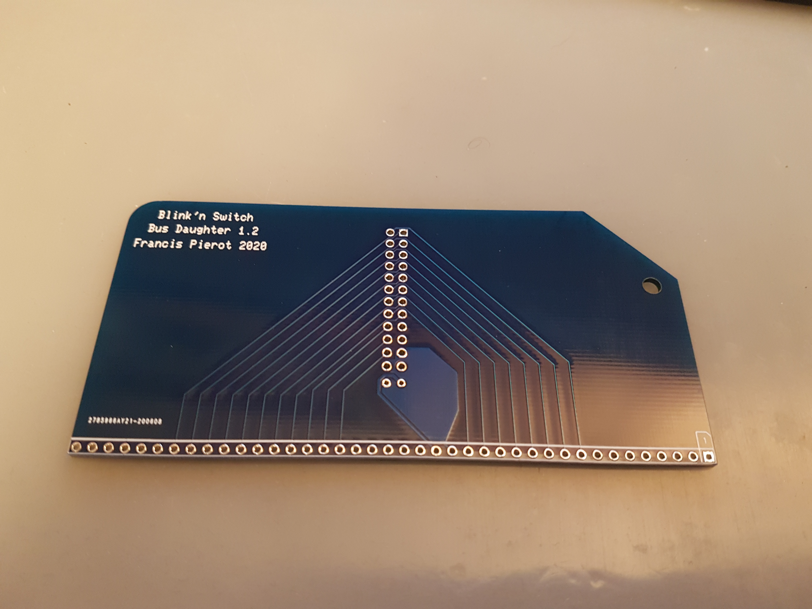
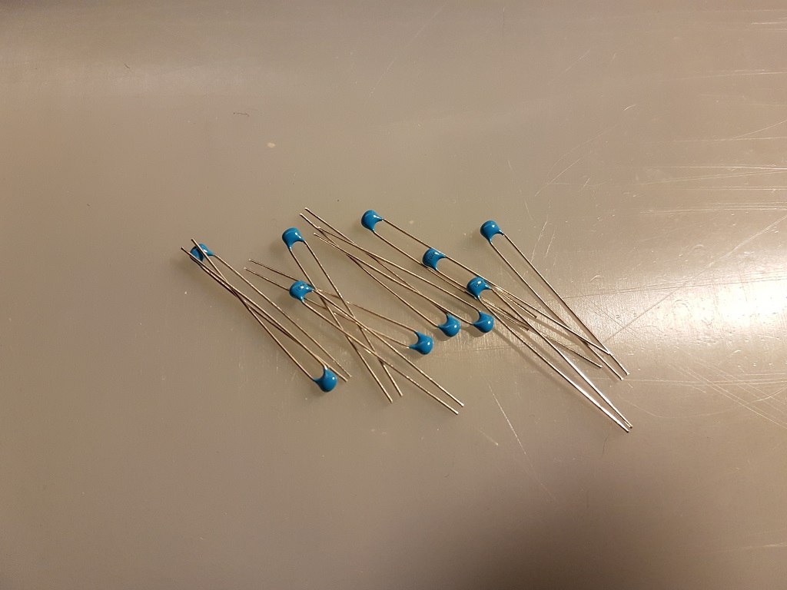
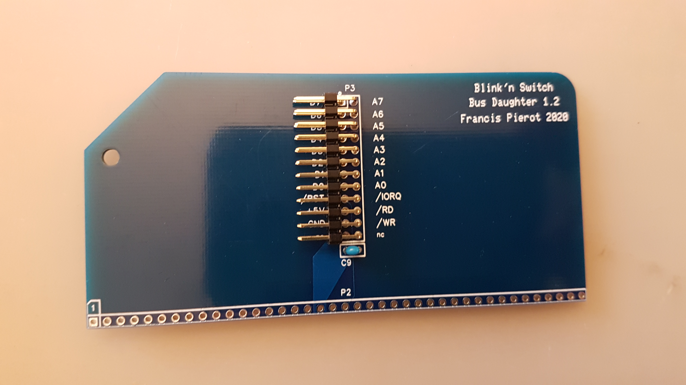

# Bluety

[TOC]

Bluety est un ensemble de circuits imprimés pour un boitier destiné à recevoir un ordinateur compatible RC2014. 

L'ensemble se compose de plusieurs éléments :

* Une façade avant avec des ouvertures pour un écran LCD et de nombreux connecteurs, LEDs et interrupteurs.
* Une façade arrière avec des connecteurs, interrupteurs et ouvertures pour faciliter les branchements.
* *Blink'n Switch*, une carte d'entrée-sortie avec deux ports d'entrée/sortie complets et un port de contrôle en sortie.
* *Bus Daughter*, une carte compatible RC2014 pour connecter *Blink'n Switch* au bus RC2014.
* Un écran LCD 4x20 avec adaptateur I2C.

La conception de Bluety est basée sur un boitier bleu que l'on peut se procurer sur un site marchand chinois. La couleur de ce boitier a donné son nom à Bluety, ainsi que la taille des façades. Les circuits imprimés et si possible les composants ont également été choisis de la couleur bleue. Mais Bluety conviendra à tout autre boitier de dimensions supérieures (pour les façades) et d'une profondeur suffisante pour l'ordinateur choisi, cependant l'utilisateur devra pratiquer une ouverture sur les façades de son boitier pour pouvoir y fixer les façades de Bluety.

Bluety est également conçu pour accueillir le kit SC126 de Stephen S. Cousins et la carte *PiZero Terminal* qui possède une sortie HDMI. Il s'agit d'un ordinateur équipé d'un processeur Z-180 à 18 MHz (compatible Z-80), de deux ROM Flash de 512 Ko permettant le choix entre les logiciels de contrôle *Small Computer Monitor* et *RomWBW*, d'une RAM Flash de 512 Ko, ainsi que de nombreux contrôleurs de périphériques intrégrés tels que deux ports série, un port SD et un port I2C. 

Bluety est également utilisable avec le RC2014 de Spencer Owens et de nombreux ordinateurs respectant le bus RC2014, bien que l'écran LCD ne soit pas directement utilisable en raison de l'absence de bus I2C. Le logiciel de contrôle en cours de développement est actuellement destiné à l'interface I2C. 

Je vous souhaite un bon assemblage et beaucoup de plaisir avec Bluety.

> **Extension de bus**
>
> L'ordinateur SC126 possède 2 connecteurs de bus seulement mais il a également un connecteur d'extension latéral, conçu pour recevoir par exemple le kit SC113 qui propose 5 connecteurs de bus (ainsi qu'un nouveau connecteur d'extension).
> 
>La carte SC113 est trop longue pour le boitier de Bluety, aussi j'en ai dérivé une version SC113-Tiny qui propose 3 connecteurs de bus au lieu de 5 et convient aux dimensions du boitier. Il présente lui aussi un connecteur d'extension pour ajouter un SC113 à l'extérieur du boitier.
> 
>Notez que cette carte SC113-Tiny n'est pas supportée par Stephen S. Cousins, et je fournis uniquement le circuit imprimé en option avec Bluety. Je vous conseille de commander un SC113 officiel auprès de Stephen (https://www.tindie.com/products/tindiescx/sc113-modular-backplane-kit-for-rc2014/) et d'utiliser ses composants sur la carte SC113Tiny. Quelques composants du kit SC113 seront inutilisés mais le fonctionnement et l'assemblage sont identiques.
> 
>

> **Interrupteur marche/arrêt SC126**
>
> Bluety possède son propre bouton marche/arrêt. Si vous n'avez pas encore assemblé votre SC126, vous pouvez remplacer l'interrupteur par un connecteur à trois broches et placer un jumper sur les deux broches éloignées du bord de la carte afin de remplacer l'interrupteur en position ON.
>
> 
>

## Contenu du kit

Vérifiez le contenu du kit, et contactez moi en cas d'erreur. Vous pouvez aussi intervenir dans le groupe de discussion https://groups.google.com/forum/#!forum/rc2014-z80.

Avant toute chose, une précaution importante.

<TABLE><TR><TD></TD><TD><B>Ne touchez pas les circuits intégrés et l'écran LCD sans être équipé d'un bracelet antistatique relié à une masse</B>. De préférence, laissez les à l'abri dans leur étui anti-statique jusqu'au moment de la fixation de la façade avant sur le boitier pour éliminer le risque de les endommager avec de l'électricité statique. Dans tous les cas, ne les placez pas sur le circuit avant d'avoir procédé aux vérifications électriques.</TD></TR></TABLE>

<TABLE><TR><TD></TD><TD> Dans le processus d'assemblage, les étapes où vous devrez procéder à une vérification ou à un assemblage particulier seront indiquées par ce panneau. <B>N'ignorez pas ces étapes</B>, elles garantissent le bon résultat de l'assemblage.</TD></TR></TABLE>

### Cartes et circuits imprimés

Veillez à protéger les deux façades de toute rayure, brulure, ou projection de flux lors des soudures. Ce sont les faces visibles donc conservez les à l'écart lorsqu'elles ne sont pas nécessaires. Les façades ne nécessitent aucune soudure.

Les façades peuvent être légèrement incurvées mais ceci disparaitra après fixation sur le boitier

| Nombre | Carte          |                                                              |
| ---| -------------- | -----------------------------------------------------------: |
| 1 | Bus Daughter   |  |
| 1 | Blink'n Switch |  |
| 1 | Façade avant   |  |
| 1 | Façade arrière |  |

### Composants

| Nombre | Composants                                                   |                                                              |
| --- | --------------------------------------------------------- | -----------------------------------------------------------: |
| 40 | 8 LED 3mm bleues 16 LED 3mm vertes 16 LED 3mm jaunes |  |
| 11 | Condensateurs céramique 100nF (marqués 104) |  |
| 1 | Condensateur électrolytique 100uF |  |
| 3 | Réseaux résistance 10 KOhms (marqués 103) |  |
| 5 | Réseaux résistance 470 Ohms (marqués 471) |  |
| 10 | Circuits intégrés : - 3x 74HCT273N - 2x 74HCT245N - 3x 74HCT688 - 2x 74HCT32 |  |
| 1 | Ecran LCD 4x20 rétroéclairé                                |  |

### Connecteurs et supports

| Nombre | Connecteurs et supports de circuits intégrés |                                                              |
| --- | ----------------------------------------- | -----------------------------------------------------------: |
| 1 | Connecteur 40P angle droit                 |  |
| 1 | Connecteur 2x12P mâle angle droit          |  |
| 4 | Supports CI 16P                            |  |
| 2 | Supports CI 14P                            |  |
| 8 | Supports CI 20P                            |  |
| 2 | Connecteurs femelle 2P pattes de 11mm      |  |
| 4 | Connecteurs femelle 8P pattes de 11mm      |  |
| 1 | Connecteur mâle 2x12P droit                |  |
| 1 | Connecteur d'alimentation                  |  |
| 1 | Connecteur HDMI                        |  |

### Interrupteurs

| Nombres | Interrupteurs                          |                                                              |
| --- | ----------------------------------- | -----------------------------------------------------------: |
| 4 | Interrupteurs ON/ON ou ON/OFF |  |
| 16 | Interrupteurs ON-OFF-ON |  |
| 2 | Interrupteurs dipswitch 8 positions  |  |
| 1 | Micro interrupteur avec câble 2 fils |  |
| 2 | Micro interrupteur avec câble 3 fils |  |

NOTE : La couleur des interrupteurs et des câbles peut varier.

### Boutons

| Nombre | Boutons                         |                                                              |
| --- | ---------------------------- | -----------------------------------------------------------: |
| 1 | Bouton Reset                 |  |
| 1 | Bouton marche/arrêt avec LED |  |

### Visserie

| Nombre | Visserie et Supports                                |                                                              |
| --- | ------------------------------------------------ | -----------------------------------------------------------: |
| 6 | Boulons M2x8 (interrupteurs façade arrière) |  |
| 2 | Boulons M3x8 (connecteur HDMI)              |  |
| 5 | Supports 12mm avec vis et écrou (façade avant)    |  |
| 4 | Supports 10mm avec vis et écrou (écran LCD)       |  |
| 6 | Supports 15mm avec vis et écrou (fond de boitier) |  |

NOTE : la couleur et la matière des supports 15mm peut varier.

### Câbles

Bluety est livré avec des câbles sur mesure dont la longueur convient pour le boitier de référence d'une profondeur de 190 mm. Si vous utilisez un boitier plus profond vous devrez utiliser des rallonges de type Dupont, ou sertir vous mêmes des câbles à la bonne longueur.

| Nombre | Câbles                                   |                                                              |
| --- | ------------------------------------- | -----------------------------------------------------------: |
| 1 | Câble HDMI/microHDMI              |            |
| 1 | Câble bouton marche/arrêt avec 3 connecteurs |  |
| 1 | Câble alimentation principale rouge    |  |
| 1 | Câble alimentation principale noir     |  |
| 1 | Câble reset 2 fils |  |
| 1 | Câble I2C 4 fils |  |
| 2 | Câbles Dupont 12 fils                  |  |

## Préparatifs

Préparez votre équipement. 

### Boitier

Bluety est conçu pour un boitier bleu que l'on peut trouver sur la plupart des sites marchands : AliExpress, Banggood, Amazon, eBay. Dans le champ de recherche de votre site préféré, entrez "**Blue Metal Electronic Enclosures**" et choisissez le boitier de dimensions **250 x 190 x 110** (mm) dans les résultats. 

<TABLE><TR><TD></TD><TD>Il existe d'autres boitiers d'aspect similaire mais de dimensions inférieures qui ne conviendront pas à Bluety, donc vérifiez bien les dimensions.</TD></TR></TABLE>

|  |  |
| ------------------------------------------------------------ | ------------------------------------------------------------ |
|  |  |

Le coût est d'environ 20 à 40 euros / dollars livraison comprise. Les coûts de livraison en provenance de chine sont très bas par rapport à ceux au départ de France, aussi je ne propose pas le boitier dans le kit car son poids augmenterait considérablement le coût de livraison de Bluety.

Il y a une autre raison pour laquelle je ne propose pas le boitier : vous devez vous attendre à ce que les coins des cadres plastifiés blancs puissent être abimés durant le transport : j'ai eu ce problème sur  3 exemplaires que j'ai commandés. 

C'est aussi parce que je ne peux pas garantir le bon état des angles que je ne propose pas le boitier avec le kit Bluety. Toutefois avec un peu de travail au cutter et du papier de verre très fin, on peut arrondir les angles et leur redonner un bel aspect. Par ailleurs les deux cadres sont  identiques et symétriques, donc on peut les démonter pour placer le meilleur en façade avant, ou retourner un cadre si les coins du bas sont en meilleur état que ceux du haut. Au final ces défauts sont peu visibles.

Si vous possédez une imprimante 3D de taille sufffisante vous pouvez reproduire ces cadres, mais je ne propose pas de modèle. N'hésitez pas à me contacter si vous pouvez fabriquer ces cadres ou leur modèle.

Si vous souhaitez utiliser un autre boitier, vous devez vous assurer que ses dimensions seront d'au moins 250 mm de largeur par 110 mm de hauteur, avec une profondeur d'au moins 190 mm. Ces dimensions  conviennent au SC126 et à toutes les versions du RC2014 y compris la version Pro avec 8 connecteurs de bus.

### Inventaire des outils

Ce tableau liste les outils dont vous aurez besoin pour assembler le kit.

| Outil                                                        |                                                              |
| ------------------------------------------------------------ | -----------------------------------------------------------: |
| Station de soudure, de préférence avec température réglable  |  |
| Fil à soudure (diamètre 0.6mm ou 0.8mm recommandé)           |  |
| Pince fine                                                   |  |
| Pince fine coudée                                            |  |
| Pince coupante coudée                                        |  |
| Pompe à soudure                                              |  |
| Tapis silicone (ou protection isolante du plan de travail). Ce tapis protège votre plan de travail des brulures mais aussi des rayures, et isole le circuit. Nettoyez régulièrement la surface afin d'éviter que les résidus de métal ou de soudure rayent les circuits imprimés ou les façades. Débarrassez les bouts de métal et de soudure, passez le tapis sous l'eau du robinet et séchez le. Faites cette opération régulièrement pendant l'assemblage, ne laissez pas les débris s'accumuler sur le tapis. |                           |
| Bracelet anti-statique. Reliez la pince à une masse. Ne reliez pas la pince directement à une prise de terre, vous seriez au contact avec la terre de tout votre réseau électrique et risqueriez de vous charger d'électricité au lieu de l'inverse. Si vous n'avez pas de boitier spécial vous pouvez relier la pince à la sortie négative d'un transformateur 5V ou au boitier métallique d'un ordinateur. |  |
| Nécessaire de nettoyage de pane de fer à souder (brosse métallique et flux) |  |
| Clés ALLEN 2 et 1.4mm (Pour vis M2x8 et M3x8)                |  |
| Tournevis avec têtes cruxiforme, plat, allen                 |  |
| Multimètre avec mesure de voltage et résistance, éventuellement test de continuité |  |

### Conseils 

Respectez les consignes d'assemblage pour obtenir une belle façade avec les composants bien alignés.

L'ordre des branchements et des assemblages est destiné à vous faciliter le travail : ne sautez pas les étapes.

<TABLE><TR><TD></TD><TD>Pour les soudures, voici une méthode qui limite les dégâts en cas d'erreur : 
<LI> souder une seule patte avec peu de soudure</LI>
<LI> vérifier que le composant a été mis au bon endroit et dans le bon sens</LI>
<LI> en cas d'erreur, retirer la soudure et replacer correctement le composant</LI>
<LI> quand tout est correct, souder toutes les autres pattes</LI>
<LI> compléter la soudure de la première patte</TD></TR></TABLE>

Si vous placez trop de soudure ou soudez toutes les pattes, il sera difficile voire impossible de réparer une erreur comme un interrupteur ou une LED à l'envers. Avoir une seule patte légèrement soudée permet de vérifier l'alignement mais aussi la polarité lorsque celle-ci est importante.

Je recommande en particulier cette méthode pour tous les composants apparaissant en façade avant.

## Carte Bus Daughter

Cette carte se connecte sur n'importe quel emplacement de bus d'un ordinateur RC2014 et véhicule les signaux utiles jusqu'à la carte Blink'n Switch d'entrée / sortie. Son assemblage ne présente pas de difficulté majeure mais vous devrez faire attention à l'orientation des connecteurs.

| Etape | Description                                                        |                                                              |
| --- | --------------------------------------------------------- | ------------------------------------------------------------ |
| 1 | Soudez le condensateur C9, marqué "104" (100 nF). L'orientation n'a pas d'importance. Coupez les pattes au dos |  |
| 2 | Soudez le connecteur 2x12P P3. Attention à souder le petit côté coudé |  |
| 3 | Soudez le connecteur 40P P2. Soudez le petit côté. Ne chauffez pas trop sinon le plastique ramollit  et les pattes peuvent pivoter. Si cela arrive, réchauffez la soudure et remettez la patte en position à l'aide d'une pince |  |

## Carte Blink'n Switch

Cette carte offre deux ports d'entrée/sortie complets, avec des LEDs témoins et des interrupteurs pour contrôler les entrées, ainsi que 8 LEDs en façade pour le port de contrôles 13 (0Dh) de l'ordinateur SC126 de Stephen S. Cousins. Ce port peut également être utilisé par un ordinateur RC2014 pour afficher 8 bits sur les LEDs de la façade avant avec un `OUT` sur le port 13.

<TABLE><TR><TD></TD><TD>Le montage de cette carte nécessite plusieurs assemblages temporaires avec la façade avant pour que les composants apparaissant sur cette dernière soient correctement alignés. <B>Respectez l'ordre de montage et les consignes</B> pour avoir les meilleurs chances d'obtenir une belle façade.</TD></TR></TABLE>

### Dos du circuit imprimé (partie 1)

Placez le **dos** visible, (le trou du bouton marche arrêt en bas à gauche)

| Etape  | Description                                                       |                                                              |
| --- | --------------------------------------------------------- | -----------------------------------------------------------: |
| 1 | Soudez les 10 condensateurs 100nF C1 à C4 et C6 à C11.       |   |
| 2 | Soudez les 8 supports 20P et les 2 supports 14P, encoches vers le *haut* ou la *gauche* selon le cas. |   |
| 3 | Soudez les 3 réseaux de résistance **10K** RN1 RN4 RN7.      |  |
| 4 | Attention à *ne pas confondre avec les 470* : le composant est marqué *103*,ce qui signifie 10 x 10^3, soit 10 Kilo Ohms . |  |
| 5 | Soudez d'abord une seule patte, vérifiez la position et le point de référence à gauche, correspondant au petit carré imprimé sur le circuit.   Une fois la position vérifiée soudez les autres pattes. |  |
| 6 | Soudez les 5 réseaux de résistance **470** RN2 RN3 RN5 RN6 RN8. |  |
| 7 | Le composant est marqué 471, ce qui signifie 47 x 10^1, soit 470 Ohms. |  |
| 8 | Attention au sens : alignez le point du composant avec le petit carré imprimé à gauche sur le circuit |  |

<TABLE>
<TR>
<TD width="100px"> </TD><TD>Pour les composants le nécessitant, coupez l'excédent des pattes au fur et à mesure pour ne pas être gêné.</TD>
</TD><TR>
<TD width="100px"> </TD><TD><EM>Ne soudez pas</EM> le connecteur P1 et le condensateur C5 maintenant : ils gêneraient la suite de l'assemblage.</TD>
</TR></TABLE>

Voici l'allure de la carte à ce stade. 

### Avant : supports des dip-switch

<TABLE>
<TR>
<TD> </TD><TD>Tous les éléments soudés sur l'avant apparaissent en façade à travers une ouverture, aussi une grande partie de l'assemblage consiste à souder *une seule patte*, puis placer la façade pour vérifier et corriger l'alignement. Ainsi il est possible de réchauffer la soudure pour bouger l'élément en cas de problème d'alignement. Une fois celui-ci correct on peut souder le reste des pattes.</TD>
</TR></TABLE>

Tournez la carte pour voir l'**avant**, le trou du bouton power étant maintenant en bas à droite. 

| Etape  | Description                                                       |                                                   |
| ---- | -------------------------------------------------------- | ------------------------------------------------: |
| 1 | Soudez *une patte* de chacun des 2 supports CI 16P (SW10 et SW21), encoche vers la gauche. Ils serviront de base aux DIP-Switchs de sélection du numéro de port. |  |
| 2 | Vissez les 5 supports 12mm sur la carte : support sur le dessus, boulon au dos. |  |
| 3 | Ils vont servir à plusieurs assemblages provisoires afin de bien aligner les composants de la façade, donc ne les démontez pas tout le long de cette étape. L'espace de certains boulons est restreint une fois les composants en place, aussi il est préférable de maintenir le boulon et tourner le support plutôt que l'inverse. |   |
| 4 | Si un composant nécessite à un moment de tourner un boulon, dévissez légèrement le support, tournez un peu le boulon et revissez le support. |                                                   |
| 5 | Emboitez un second support 16P et un DIP-Switch sur chacun des deux supports. |   |
| 6 | Fixez la façade avant avec deux ou trois supports en passant les dipswitch à travers leurs ouvertures. Si un switch n'est pas bien aligné, faites chauffer la soudure de la patte et réalignez l'ensemble pour qu'il soit bien aligné avec l'ouverture de la façade. |   |
| 7 | Retournez l'ensemble et terminez la soudure des supports.    |                                                   |
| 8 | Dévissez les vis de la façade, démontez la ainsi que les ensembles support+dip-switch emboités pour qu'il ne reste que les deux supports soudés. |                                                   |

### Avant : Connecteurs E/S et Alimentation

| Etape | Description                                                        |                                                              |
| ---- | -------------------------------------------------------- | ------------------------------------------------------------ |
| 1 | Posez le circuit imprimé, face avant sur le dessus, sur des supports de préférence non métalliques afin qu'il soit au dessus du plan de travail et permette aux composants de glisser dans leurs emplacements. Veillez à assurer une hauteur d'environ 10 mm. |              |
| 2 | Positionnez les 4 connecteurs femelles 8P à longues pattes et les 2 connecteurs femelles 2P à longues pattes |              |
| 3 | Fixez la façade. Ne mettez pas la vis centrale, elle gênerait le positionnement des connecteurs. |              |
| 4 | Posez la façade arrière sur la façade avant et perpendiculairement de manière à recouvrir les ouvertures des connecteurs. Vous pouvez placer une feuille de papier entre les deux pour ne pas risquer d'abimer leur revêtement. |              |
| 5 | Retournez délicatement l'ensemble et posez le à l'envers sur le plan de travail. |              |
| 6 | A l'aide d'une pince, placez les connecteurs dans les ouvertures de la façade.   C'est un peu délicat, ne forcez pas pour ne pas tordre les pattes. Si cela arrive, démontez la façade, sortez le connecteur, redressez les pattes et recommencez l'opération. |              |
| 7 | Les connecteurs doivent être bien placés dans les encoches de la façade. |  |
| 8 | Lorsque tout est bien en place, soudez *une patte* de chacun des 6 connecteurs. |              |
| 9 | Retournez l'ensemble pour vérifier l'alignement.             |              |
| 10 | Lorsque tout est correctement placé, retournez et terminez la soudure des pattes restantes. |                                                              |
| 11 | Coupez l'excédent de pattes. Attention aux projections éventuelles des petits bouts de métal car ces pattes sont très ridgides : protégez vos yeux. |                                                              |
| 12 | Dévissez la façade.                                          |                                                              |
### Avant : interrupteurs

Préparez les 16 interrupteurs à trois positions ON-OFF-ON et 4 interrupteurs à deux positions ON-OFF ou ON-ON.

<TABLE><TR><TD width="100px"></TD><TD>Séparez les tas pour ne pas vous tromper. Le kit présente normalement deux couleurs différentes mais cela peut dépendre du stock.</TD></TR></TABLE>

| Etape | Description                                                        |                                                              |
| --- | --------------------------------------------------------- | ------------------------------------------------------------ |
| 1 | Positionnez les 8 interrupteurs à **trois positions ON-OFF-ON** du port A, SW1 à SW8. Attention à placer l'encoche située sur le pas de vis vers le bas *pour chaque interrupteur*. Ils doivent être tous orientés de la même façon car ils ne sont  généralement pas totalement symétriques. |              |
| 2 | Positionnez les 8 interrupteurs à **trois positions ON-OFF-ON** SW17 à SW24. Même précaution pour l'encoche du pas de vis qui doit être en bas. |                                                              |
| 3 | Positionnez les 4 interrupteurs à **deux positions ON-OFF ou ON-ON** SW9, SW11, SW20, SW22, encoche du pas de vis vers le bas. |              |
| 4 | Placez tous les boutons en position basse ou centrale (pour ceux à trois positions) |                                                              |
| 5 | Glissez et fixez la façade à l'aide des vis.                 |                                                              |
| 6 | Assurez vous que tout est bien aligné et qu'aucun bouton ne s'est délogé, sinon replacez le et refaites la fixation de la façade. Vérifiez que les interrupteurs situés les plus à droite sont bien à deux positions et non trois. |                                                              |
| 7 | Retournez la carte, et soudez *un seul point* de chacun des 20 interrupteurs avec une petite quantité de soudure. |                                                              |
| 8 | Soulevez légèrement l'extrémité de la carte côté LCD afin que les interrupteurs soient bien plaqués contre le circuit, et que les pattes à souder dépassent bien du circuit |              |
| 9 | Vérifiez l'alignement en retournant l'ensemble. Alignez les leviers à l'aide d'une règle ou d'un bord de la façade avant. Au besoin, chauffez le point de l'interrupteur mal aligné pour le replacer correctement. |  |
| 10 | Quant tout est bien aligné, soudez les autres pattes, remettez de la soudure sur la première selon besoin. Faites ceci pour les 20 interrupteurs. N'hésitez pas à charger en soudure, pour que l'ensemble assure une bonne solidité en plus du contact électrique. |              |
| 11 | Remettez les interrupteurs en position basse                 |                                                              |
| 12 | Dévissez et enlevez la façade.                               |                                                              |
### Avant : LEDs

Préparez les LEDs :

* 16 vertes pour les ports d'entrée
* 16 jaunes pour les ports de sortie
* vous pouvez inverser les couleurs vertes et jaunes selon votre goût
* 8 bleues pour le port de contrôle
* si vous préférez avoir des LED remplaçables, vous pouvez souder des supports femelles à deux broches à la place des LEDs, mais l'ajustement des LEDs à la bonne longueur sera sensiblement plus compliqué. Cette possibilité est laissée à votre appréciation et les supports ne sont pas fournis dans le kit.

| Etape | Description                                                  |                                                  |
| ----- | ------------------------------------------------------------ | -----------------------------------------------------------: |
| 1      | Posez le circuit imprimé, face avant sur le dessus, sur des supports de préférence non métalliques afin qu'il soit au dessus du plan de travail et permette aux LEDs de glisser dans leurs emplacements. Veillez à assurer une hauteur d'environ 10 mm. |                                                              |
| 2     | Placez les 16 LEDs vertes (ou jaunes) des ports d'entrée LED1 à LED8 et LED17 à LED24. La patte la plus courte est l'anode et se place en haut sur le signe (-) du circuit imprimé. |  |
| 3      | Placez les 16 LEDs jaunes (ou vertes) des ports de sortie LED9 à LED16 et LED25 à LED32. La patte la plus courte est l'anode et se place en haut sur le signe (-) du circuit imprimé. |                                                              |
| 4      | Placez les 8 LED bleues du port de contrôle LED33 à LED40. La patte la plus courte est l'anode et se place en haut sur le signe (-) du circuit imprimé. |                                                              |
| 5     | Vérifiez une dernière fois que les pattes les plus courtes sont bien situées sur le haut, ainsi que l'applat de la LED. |                                                              |
| 6      | Fixez de nouveau la façade à l'aide des 5 vis. Pensez à bien visser la vis unique à côté du trou du bouton marche/arrêt : elle assurera le bon alignement des LED situées sous le LCD. |             |
| 7      | Soulevez l'ensemble : les LEDs glissent dans leur logement et se plaquent sur le circuit imprimé. |                                                              |
| 8      | Retournez délicatement l'ensemble pour que les LEDs glissent en sens inverse et se placent dans leur ouverture sur la façade. Une grande partie d'entre elles va s'y positionner directement, pour les autres agissez avec une pince sur les pattes pour les placer dans leur ouverture en façade. Posez l'ensemble retourné sur le plan de travail, en appui sur les interrupteurs. |                                                              |
| 9      | Si une LED est mal positionnée, utilisez ses pattes et une pince pour la replacer correctement. Procédez délicatement pour ne pas tordre les pattes. |            |
| 10      | Vérifiez bien que toutes les LEDs sont  placées dans leur logement sur la façade en la regardant par en dessous. Elles doivent toutes dépasser de la même hauteur. |            |
| 11      | Vérifiez une dernière fois que les pattes les plus courtes sont bien sur le symbole (-) du circuit. |            |
| 12      | En cas d'erreur, vous devez retourner la carte, dévisser et ôter la façade, remettre la LED dans le bon sens, revisser la façade et reprendre le bon positionnement des LEDs dans les logements. |                                                              |
| 13      | Une fois tout bien positionné et vérifié, soudez les pattes des LEDs. |                                                              |
| 14      | Coupez l'excédent des pattes.                                |                                                              |
| 15      | Dévissez la façade.                                          |                                                              |

### Dos du circuit imprimé (partie 2)

| Etape  | Description                                                       |                                                  |
| --- | --------------------------------------------------------- | ------------------------------------------------ |
| 1 | Retournez le circuit.                                        |                                                  |
| 2 | Soudez le condensateur C5, attention à la polarité la patte la plus courte est sur le (-). La bande noire avec le signe '-' doit être face au demi cercle hachuré sur le circuit imprimé. Coupez les pattes de l'autre côté. |  |
| 3 | Soudez le connecteur mâle 2x12P P1.                          |  |

### Finition

* Nettoyez soigneusement la façade avec un chiffon doux ou microfibre.

<TABLE><TR><TD></TD><TD><B>N'utilisez aucun produit détergent, solvant ou alcoolique</B>
  
 Les produits spéciaux pour écran plat sont acceptables.
  
 Si vous souhaitez utiliser un produit, faites un essai sur un petit endroit au dos de la façade ou sur la carte Bus Daughter pour vérifier qu'il n'abime pas le vernis.</TD></TR></TABLE>

<TABLE><TR><TD></TD><TD><B>IMPORTANT : Mettez votre bracelet anti-statique</B></TD></TR></TABLE>

| Etape  | Description                                                       |                                                              |
| --- | --------------------------------------------------------- | ------------------------------------------------------------ |
| 1 | Installez les circuits intégrés dans leurs emplacements : 3x 74HCT273N 3x 74HCT688 2x 74HCT245N 2x 74HCT32 |                                                              |
| 2 | Revissez la façade.                                          |                                                              |
| 3 | Emboitez les dip-switch sur leurs supports 16P puis emboitez les ensembles sur le circuit imprimé à travers l'ouverture en façade. |                                                              |
| 4 | Branchez les 2 cables 12 fils sur le connecteur P1. Repérez le fil A7 par sa couleur ou avec un petit autocollant placé à l'extrémité libre. |  |

## Façade avant

Pour assembler l'écran LCD et le bouton d'alimentation vous devez une dernière fois dévisser la façade pour écarter Blink'n Switch.

### Ecran LCD 4x20

| Etape  | Description                                                           |                                                           |
| --- | --------------------------------------------------------- | --------------------------------------------------------: |
| 1 | Dévissez la façade.                                          |                                                           |
| 2 | Fixez les 4 supports 10mm à l'écran, support sur l'avant et boulon au dos. |           |
| 3 | Fixez le câble 4 fils sur le connecteur I2C. Note : il est plus difficile de brancher le câble après la fixation de l'écran sur la façade. |  |
| 4 | Vissez l'ensemble sur la façade à l'aide des vis.            |           |

### Bouton d'alimentation

A ce stade la façade est séparée de Blink'n Switch.

| Etape  | Description                                                       |                                                              |
| ------------------------------------------------------------ | ------------------------------------------------------------ | ------------------------------------------------------------ |
| 1 | Si ce n'est pas fait, dévissez la façade.                    |                                                              |
| 2 | Vissez le bouton d'alimentation à l'aide de l'écrou. Si vous désirez utiliser le joint, placez le sur le pas de vis à l'intérieur du bouton pour qu'il aille s'appuyer sur l'extérieur de la façade, mais ce joint est facultatif |             |
| 3 | Revissez la façade sur Blink'n Switch. |  |
| 4 | Repérez les bornes du bouton : **+** et **-** à l'extérieur alimentent la LED, **NO** est l'entrée 5V, **C** est le fil de sortie 5V et **NC** ne sera pas connecté. |  |
| 5 | Branchez le fil rouge long sur la borne centrale **C**       |  |
| 6 | Branchez le câble 3 fils : - les deux fils rouges sur les bornes **+** et **C** - le fil noir sur la borne **-** |   |

<TABLE><TR><TD></TD><TD>Les extrémités des câbles qui n'ont pas encore été branchées vont rester libres jusqu'à ce que la façade arrière soit fixée au boitier.</TD></TR></TABLE>

## Façade arrière

Cette façade arrière offre :

* des micro-interrupteurs pour contrôler les mémoires FLASH de l'ordinateur SC126
* un connecteur HDMI et une ouverture permettant de passer un cable USB pour une liaison directe vers un PiZero Terminal RC2014 et de relier la prise HDMI de celui-ci
* un connecteur d'alimentation pour un transformateur 5V à prise jack
* un bouton reset
* une ouverture en bas de la façade pour passer les cables vers les connecteurs arrière du SC126

Les micro interrupteurs sont livrés soudés avec un cable de longueur convenant à un SC126. Si vous utilisez un boitier plus grand ou un autre ordinateur, vous pouvez utiliser des cables Dupont male/femelle comme rallonge ou sertir vos propres câbles, les branchements restent identiques. Notez que les autres ordinateurs RC2014 ne proposent pas forcément le choix entre deux ROMs.

Cette étape de l'assemblage ne concerne que le placement des éléments, les branchements seront effectués ultérieurement.

| Etape | Description                                                        |                                                              |
| --- | --------------------------------------------------------- | -----------------------------------------------------------: |
| 1 | Vissez le connecteur HDMI à l'aide des deux vis M3x8.        |                                                              |
| 2 | Vissez le micro interrupteur avec 2 fils sur la position verticale "flash select" à l'aide des vis M2x8 et d'une clé Allen ou d'un tournevis à tête hexagonale (non fourni).  ATTENTION : si vous avez placé la RomWBW en U1 sur SC126, vous devez mettre les deux fils en bas. Si par contre vous avez placé la rom SCM en U1 vous devez mettre les deux fils en haut. |  |
| 3 | Vissez les deux interrupteurs avec 3 fils aux positions "flash protect" horizontales à l'aide de 4 vis M2x8. |                                                              |
| 4 | Vissez le connecteur d'alimentation, patte la plus longue en bas (c'est le '-') |                   |
| 5 | Vissez le bouton reset, la position des pattes n'a pas d'importance. Branchez le cable Reset avec les exxtrêmités jaunes. |                              |

La façade arrière présente alors l'aspect suivant.

## Installation et branchements

Tous les composants sont fixés ou soudés, il reste maintenant à effectuer les branchements et l'installation de l'ordinateur dans le boitier.

### Installation SC126

| Etape | Description |      |
| ----- | ----------- | ---: |
| 1    | Dévissez les pieds du fond du boitier et mettez à l'abri les pieds et leurs vis pour plus tard. |  |
| 2    | Placez le gabarit de perçage (drilling template) au fond du  boitier et scotchez le pour le maintenir en place. Vous pouvez jouer légèrement sur la position mais n'avancez pas trop le gabarit vers la façade avant, l'interrupteur avant du SC126 risque de buter contre Blink'n Switch ou la façade. Ne le reculez pas trop non plus car ce sera alors le connecteur HDMI qui risquera de buter contre des composants d'une carte située sur le RC2014. Si vous avez assemblé votre SC126 sans l'interrupteur |  |
| 3    | Percez le fond du boitier à l'emplacement des marques sur le gabarit avec une mèche de 3mm. Pour percer ces trous, la technique est de donner un coup de pointeau au centre du trou, puis d'utiliser une perceuse à colonne pour faire un trou bien vertical et bien centré. On peut faire un avant-trou avec une mèche de 1mm si on le souhaite mais le fond du boitier n'étant pas très épais une mèche de 3mm ne rencontrera pas de difficulté particulière. Vous pouvez huiler légèrement pour éviter que le papier du gabarit brûle. |  |
| 4 | Seuls 3 trous sont nécessaires pour le SC126 car un des supports est en face d'un pied du boitier et ne sera pas vissé, mais il assurera un rôle pour la stabilité du circuit imprimé. |  |
| 5 | FACULTATIF : Vous pouvez percer un trou supplémentaire pour le SC113Tiny qui procure 3 connecteurs de bus supplémentaires. Lui aussi ne sera fixé que par une vis, mais pour la stabilité du tout la carte utilise deux supports. |  |
| 6 | FACULTATIF : Vous pouvez faire une ouverture sur le côté droit du boitier (vu de l'arrière) pour que le port d'extension du SC113Tiny soit accessible à l'extérieur. |  |
| 7 | Branchez le câble I2C, l'accès sera moins aisé une fois la façade arrière mise en place. Prenez soin de respecter la correspondance des fils : repérez le fil GND sur l'écran LCD pour le brancher sur la broche 0V du connecteur I2C sur le SC126 et faites de même pour les trois autres câbles, l'ordre reste le même donc vous ne devez pas avoir de fil croisé. |   |
| 8 | FACULTATIF : Branchez un câble Dupont (*non fourni*) sur le port série 1 si vous souhaitez l'utiliser plus tard, là aussi l'accès sera moins aisé une fois la façade arrière en place. |  |
| 9 | Vissez les supports sur le SC126 : **4** pour SC126, et **2** pour SC113Tiny si vous l'utilisez. |  |
| 10 | Fixez le SC126 à l'aide des supports boulons vis. Notez qu'avec le gabarit fourni, seuls 3 supports du SC126 et 1 support du SC113 Tiny seront vissés. Si vous souhaitez visser les 6 supports vous devrez avancer légèrement la carte en direction de l'avant mais l'interrupteur situé sur SC126 peut vous en empêcher. Les vis des supports iront sous le boitier, et les boulons sont normalement déjà vissés sur le dessus de la carte. |  |
| 11 | A cet instant vous allez fixer les deux façades définitivement afin de terminer les derniers branchements. • Fixez la façade avant • Fixez la façade arrière. Si vous avez branché un câble série, passez le à travers l'ouverture du bas avant de visser la façade. |  |

### Branchement BusDaughter  Blink'n Switch

| Etape | Description                                                  |                                                              |
| ----- | ------------------------------------------------------------ | -----------------------------------------------------------: |
| 1     | Branchez les deux cables 12 fils sur la BusDaughter en prenant soin de respecter le repérage du fil A7 effectué lors du branchement sur Blink'n Switch. |             |
| 2     | Installez la carte BusDaughter dans l'emplacement bus de votre choix |                                                              |
| 3     | Attention à l'orientation de la carte : le coin biseauté de la carte se présente sur l'avant de l'ordinateur |  |
| 4     | Attention à enficher la carte sur le côté droit du connecteur de bus de 2x40 prises (vu de l'arrière vers l'avant), la première broche (vers l'avant) se place dans le trou marqué "1" sur le circuit imprimé. Normalement, les deux câbles doivent rester parallèles. Le plus à droite sur Blink'n Switch sera aussi le plus à droite sur BusDaughter. Si ce n'est pas le cas, vérifiez le branchement. |             |

### Façade avant

Ls branchements sont facilités si vous avez connecté les câbles de l'écran LCD et du bouton marche/arrêt *avant* de visser la façade :

* Si vous n'avez pas déjà fixé le câble I2C sur l'écran LCD, dévissez l'écran de la façade, branchez le câble puis revissez l'écran. Reportez-vous à la section *Façade avant* pour le branchement.
* Si vous n'avez pas fixé les câbles sur le bouton d'alimentation, dévissez la façade, effectuez les branchements comme indiqué dans la section *Façade avant* puis revissez la façade.

### Façade arrière

Le connecteur d'alimentation sert le bouton marche/arrêt de la façade et l'alimentation du SC126. Le bouton Reset est particulièrement utile pour les utilisateurs de la carte PiZero Terminal qui nécessite un reset après la mise en marche.

Les interrupteurs de sélection permettent de choisir entre les deux ROM du SC126 et d'autoriser leur écriture pour une mise à jour.

Le connecteur HDMI se branche par une rallonge directement sur la carte PiZero Terminal, permettant d'avoir une sortie écran couleur via le logiciel PiGfx.

L'orifice à côté de la prise HDMI permet de passer une rallonge USB pour brancher un clavier USB sur un PiZero Terminal. Cette ouverture a été préférée à une prise USB en raison des difficultés à trouver un connecteur approprié.

En bas de la façade, une ouverture permet de passer les câbles utiles pour les nombreux connecteurs du SC126, par exemple la prise série pour contrôler l'ordinateur via une machine de bureau ou portable (si vous avez suivi les indications, un câble est déjà installé et passe à travers cette ouverture).

| Etape | Description                                                  |                                                              |
| ----- | ------------------------------------------------------------ | -----------------------------------------------------------: |
| 1     | Branchez le raccord HDMI sur le connecteur intérieur de la façade arrière, puis sur votre PiZeroTerminal |             |
| 2     | Branchez les deux interrupteurs 3 fils sur les connecteurs JP1 et JP2 du SC126 : attention à placer le bon cable sur le bon connecteur selon que vous avez placé RomWBW en U1 et SCM en U2 ou l'inverse. Les fils ne doivent pas se croiser ou subir de torsion : le fil le plus à droite sur l'interrupteur est aussi à droite sur la carte SC126 et correspond à la position "PROTECT" |  |
| 3     | Branchez l'interrupteur 2 fils sur le connecteur P9 : si vous avez RomWBW en U1, les deux fils doivent se situer en bas. Branchez le cable du bouton reset avec les fiches jaunes sur le connecteur P8 et le bouton de la façade. Pour ces deux cablages, la position des fils n'a pas d'importance. |  |

Pour l'interrupteur "SELECT" : le connecteur P9 du SC126 sélectionne la mémoire 1 ou 2 selon qu'il est fermé (interrupteur de la façade arrière face aux deux fils) ou ouvert (interrupteur sur la position où seul le fil central est connecté). Veillez à placer l'interrupteur de façon à ce que les fils sélectionnent bien la ROM qui se trouve à l'emplacement concerné. Le modèle d'installation fourni dans cette documentation convient pour RomWBW situé en U1. Si vous avez inversé les ROMs par rapport à ce modèle vous devrez inverser  l'interrupteur de sélection verticalement et les câbles à trois fils en fonction des indications de la façade arrière.

### Bouton Power

Le bouton de la façade avant contrôle l'alimentation du SC126 via le connecteur J2. Pour que ce dernier puisse alimenter le SC126 il faut placer l'interrupteur de la carte SC126 en position ON, afin de déporter la fonction ON/OFF sur le bouton de la façade avant. 

| Etape | Description                                                  |                                                              |
| ----- | ------------------------------------------------------------ | -----------------------------------------------------------: |
| 1     | FACULTATIF : si vous avez remplacé l'interrupteur du SC126 par un connecteur à trois broches, placez un jumper sur les deux broches les plus éloignées du bord de la carte. |       |
| 2     | Branchez le fil rouge de la broche **C** du bouton on/off sur la borne 5V du bornier J2 du SC126 |  |
| 3     | Branchez le fil noir de la broche **-** et le câble noir séparé sur la borne GND du bornier J2 |  |
| 4     | Branchez le fil **rouge** provenant du bouton marche/arrêt sur la cosse **la plus courte** du connecteur d'alimentation  Branchez le fil **noir** provenant du bornier J2 sur la cosse **la plus longue** du connecteur d'alimentation |  |

## Utilisation

Les ports d'entrée-sortie sont contrôlés par des instructions IN et OUT du Z-80 ou du BASIC. L'écran LCD se contrôle via l'interface I2C à l'aide d'une librairie à intégrer dans vos programmes, ou à l'aide de versions de SCM et BASIC en cours de développement.

### Port de contrôle (13/0Dh)

Le port de contrôle est câblé sur le numéro de port 13 (0Dh), ceci correspond aux deux logiciels de l'ordinateur SC126 : le moniteur SCM affiche l'état de ses tests à l'allumage sur ce port, et le boot de RomWBW affiché également l'avancement de son démarrage sur ce port.

Tout programme peut allumer ou éteindre ces 8 LEDs en envoyant une donnée 8-bits sur le port 13. La LED la plus à gauche représente le bit de poids fort.

<TABLE><TR><TD></TD><TD>Remarque : le port 13 retient sa dernière donnée, donc pour éteindre les LEDs il faut explicitement écrire un 0.</TD></TR></TABLE>

### Ports d'entrée sortie

Les 2 ports d'entrée et de sortie possèdent chacun 8 LEDs qui représentent les 8 bits de données, le bit de poids fort étant représenté par la LED la plus à gauche.

#### Utiliser le port A ou B *en entrée*

| Etape | Description                                                  |                                                        |
| ----- | :----------------------------------------------------------- | -----------------------------------------------------: |
| 1     | Choisissez le numéro de port avec le DIPswitch, le bit de poids fort du numéro est représenté par l'interrupteur le plus à gauche. Par exemple, pour utiliser le port 7, on place les trois interrupteurs les plus à droite en position haute et les cinq autres en position basse. |  |
| 2     | Placez les interrupteurs en position médiane et connectez vos fils sur le port d'entrée |           |
| 3     | Les interrupteurs peuvent être placés en position haute pour forcer un bit à 1, ou basse pour le forcer à 0 |           |
| 4     | L'interrupteur supérieur à droite des LEDs les active ou désactive. Elles affichent l'état de l'entrée qui leur correspond |           |
| 5     | utiliser les instructions IN pour lire l'état du port        |                                                        |

#### Utiliser le port A ou B *en sortie*

| Etape | Description                                                  |                                             |
| ----- | ------------------------------------------------------------ | ------------------------------------------: |
| 1     | Choisissez le numéro de port avec le DIPswitch               |  |
| 2     | Connectez vos fils sur le port de sortie                     |  |
| 3     | L'interrupteur inférieur à droite des LEDs active ou désactive les LEDs |  |
| 4     | Utiliser les instructions OUT pour écrire sur le port : 5V sont placés sur les sorties des bits placés à 1 |  |

<TABLE><TR><TD></TD><TD>Remarque : Chaque port de sortie retient sa dernière donnée, donc pour éteindre les LEDs il faut explicitement écrire un 0.</TD></TR></TABLE>

### Ecran LCD

L'écran LCD est contrôlé par le bus I2C sur le port 0Ch du SC126. Un logiciel spécifique est en cours de finition ainsi qu'une version de SCM et du BASIC en cours de développement capables d'afficher du texte sur l'écran LCD.
