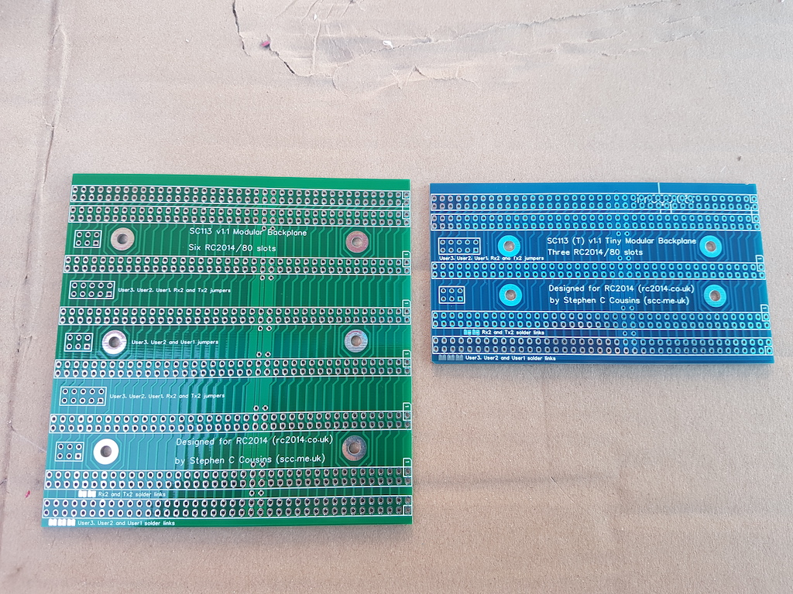

# I) Présentation

Bluety est un ensemble de circuits imprimés pour un boîtier destiné à recevoir un ordinateur de type RC2014, en particulier le kit SC126
de Stephen S. Cousins et le RC2014 Pro de Spencer Owens.

## I-1) Contenu du kit

L'ensemble se compose des éléments suivants :

- Une façade avant, avec des ouvertures pour un écran LCD et des nombreux connecteurs, LEDs et interrupteurs ainsi qu'un bouton marche/arrêt.
- Une façade arrière avec un connecteur d'alimentation, une sortie HDMI, des interrupteurs de contrôle des ROMs du SC126, des ouvertures
  pour faciliter les branchements et un bouton Reset.
- *Blink'n Switch*, une carte d'entrée-sortie avec deux ports d'entrée/sortie sélectionnables et un port de  sortie fixe utilisé par le
  SC126 pour afficher le status lors du démarrage. Cette carte équivaut à deux carte I/O mais ses contrôleurs en façades en rendent
  l'utilisation beaucoup plus simple et elle présente des possibilités supplémentaires.
- *Bus Daughter*, une carte compatible RC2014 pour connecter *Blink'n Switch* au bus RC2014.
- Un écran LCD 4x20 rétro éclairé, *avec ou sans adaptateur I2C*.
- Tous les câbles nécessaires pour les branchements.

La conception du kit et son design sont basés sur un boîtier bleu que l'on peut se procurer sur la plupart des sites marchands proposant
de l'électronique (voir [Boitier](#boîtier)). La couleur de ce boîtier a donné son nom et son design à Bluety et a dicté la taille des
façades. Les circuits imprimés et si possible les composants ont été choisis de couleur bleue. Mais Bluety conviendra à tout autre
boîtier de dimensions supérieures (pour les façades) et d'une profondeur suffisante pour l'ordinateur choisi. L'utilisateur devra
pratiquer une ouverture sur les façades de son boîtier pour pouvoir y fixer les façades de Bluety et éventuellement fabriquer des câbles
si la profondeur est trop grande pour ceux fournis.

Bluety est particulièrement conçu pour accueillir le kit [SC126](https://www.tindie.com/products/tindiescx/sc126-z180-sbc-motherboard-kit/)
de Stephen S. Cousins et la carte *[PiZero Terminal](https://www.tindie.com/products/semachthemonkey/raspberry-pi-zero-serial-terminal-for-rc2014/?pt=ac_prod_search)*
qui possède une sortie HDMI ou la carte [BusRaider](https://www.tindie.com/products/robdobson/play-retro-games-rc2014-graphics-kit/) de Rob Robson.
Le SC126 est un ordinateur équipé d'un processeur Z-180 à 18 MHz (compatible Z-80), de deux ROM Flash de 512 Ko permettant le choix entre les
logiciels de contrôle [*Small Computer Monitor*](https://smallcomputercentral.wordpress.com/small-computer-monitor/) et
[RomWBW](https://github.com/wwarthen/RomWBW), d'une RAM Flash de 512 Ko, ainsi que de nombreux contrôleurs de périphériques
intégrés tels que deux ports série, un port SD et un port I2C. Ce dernier permet d'accéder à l'écran LCD.

Bluety est également utilisable avec le [RC2014](https://www.tindie.com/stores/Semachthemonkey/) de Spencer Owens dans toutes ses
versions jusqu'à la version [RC2014 Pro](https://www.tindie.com/products/Semachthemonkey/backplane-pro-for-rc2014-z80-homebrew-computer/)
équipée du [Backplane Pro](https://www.tindie.com/products/Semachthemonkey/backplane-pro-for-rc2014-z80-homebrew-computer/) avec 12
connecteurs de bus, ainsi que de nombreux ordinateurs respectant le bus RC2014, bien que l'écran LCD de Bluety ne soit utilisable
qu'avec un bus I2C.

Je vous souhaite un bon assemblage et beaucoup de plaisir avec Bluety.

F. Piérot, 2020/12

## I-2) Extension de bus

L'ordinateur SC126 possède 2 connecteurs de bus et un connecteur d'extension latéral, conçu pour recevoir par exemple le kit
[SC113](https://www.tindie.com/products/tindiescx/sc113-modular-backplane-kit-for-rc2014/?pt=ac_prod_search) qui propose 6
connecteurs de bus et un nouveau connecteur d'extension.

La carte SC113 est cependant trop longue pour le boîtier de Bluety, aussi Bluety peut être équipé d'une version raccourcie,
SC113-Tiny, qui propose 3 connecteurs de bus au lieu de 6 et convient aux dimensions du boîtier. Il présente lui aussi un
connecteur d'extension pour ajouter un SC113 à l'extérieur du boîtier.

Le circuit imprimé SC113 Tiny est disponible en option avec le kit Bluety, sans ses composants.

Notez que *cette carte SC113-Tiny n'a pas été conçue par Stephen S. Cousins* et n'est donc pas supportée par lui mais
par moi-même en cas de problème. Je fournis *uniquement le circuit imprimé* en option avec Bluety : je vous conseille
de commander un [SC113](https://www.tindie.com/products/tindiescx/sc113-modular-backplane-kit-for-rc2014/) et d'utiliser
ses composants sur la carte SC113 Tiny. Quelques composants du kit SC113 sont inutilisés mais en dehors de cela le
fonctionnement et l'assemblage sont identiques.

## I-3) Interrupteur marche/arrêt SC126

Bluety possède son propre gros bouton bleu marche/arrêt. Si vous n'avez pas encore assemblé votre SC126, vous pouvez remplacer
son interrupteur par un connecteur à trois broches et placer un jumper sur les deux broches éloignées du bord de la carte afin
de remplacer l'interrupteur en position ON comme indiqué sur l'image ci-dessous. Si en revanche votre SC126 est déjà assemblé,
il vous suffira de placer l'interrupteur en position ON. Le bouton de Bluety lui-même est relié à un autre endroit du SC126.

alt="Remplacement on/off" style="zoom:50%;" />
