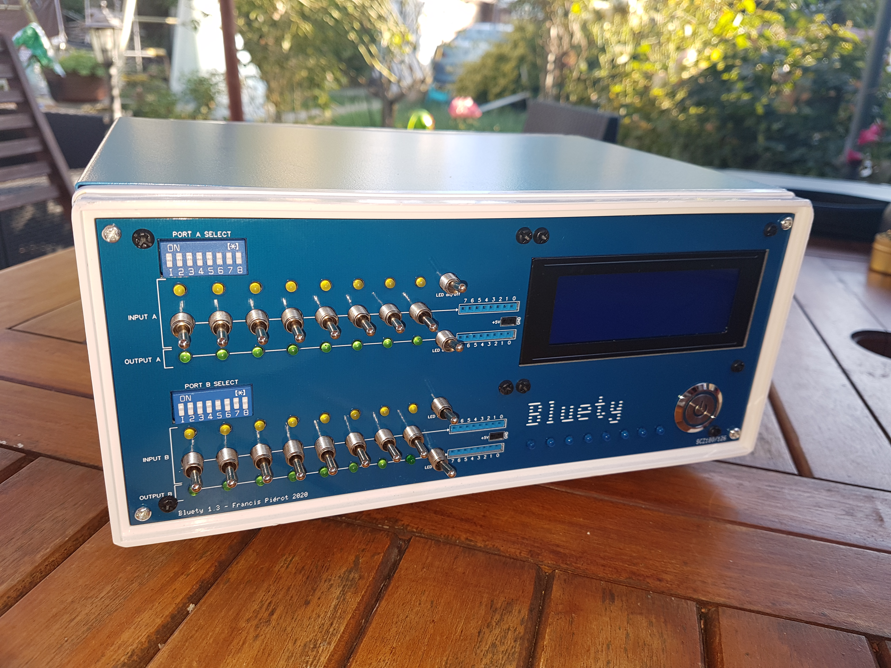
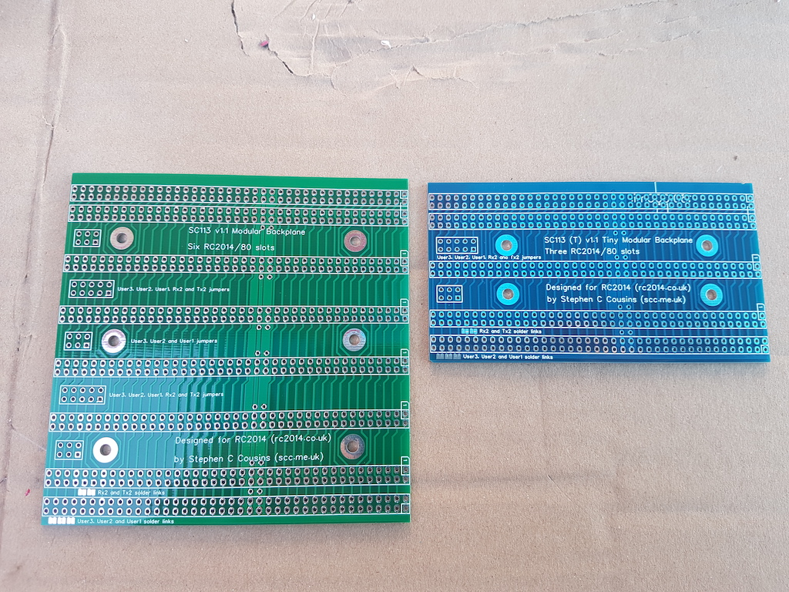

# Presentation

Bluety is a set of printed electronic boards for a case hosting an RC2014 class computer, particularly aimed at the SC126 kit
from Stephen S. Cousins and the RC2014 Pro from Spencer Owens, who created the original RC2014.

## Kit Content

The kit contains the following elements:

- A Front Panel with an opening for an LCD display, lots of connectors, LEDs and switches, and a power button.
- A Back Panel with a power connector, an HDMI connector, ROM control switches for the SC126, openings for external cabling
  and a reset button.
- *Blink'n Switch*, an input/output board with two selectable I/O ports and one fixed output port used by the
  SC126 to display status during startup. This board is like two I/O boards but features front panel switches, connectors and
  control LEDs.
- *Bus Daughter*, an RC2014 compatible board to link *Blink'n Switch* the the RC2014 bus.
- A LCD 4x20 backlit display, with or without I2C adapter.
- Cabling and swcrewing.

The kit design and look are based on a blue case that can be bought from most merchant sites featuring an electronics hobby section.
(See [Case](#boitier).) The blue color of this case gave its name and design to Bluety and dictated the size of electronic boards
and front / back panels. Both the boards and when possible the components are blue colored. But Bluety can be hosted by any case with
correctly sized front and back panel, as well as sufficient depth for the hosted computer. The user will have to practice a rectangular
cutout in front and back panel in order to fix Bluety panels on them, and if depth is too big, build a few cables.

Bluety has been specifically designed to receive Stephen's Cousins [SC126](https://www.tindie.com/products/tindiescx/sc126-z180-sbc-motherboard-kit/)
computer kit and Spencer Owens's *[PiZero Terminal](https://www.tindie.com/products/semachthemonkey/raspberry-pi-zero-serial-terminal-for-rc2014/?pt=ac_prod_search)*
RC2014 module or Rob Robson's [BusRaider](https://www.tindie.com/products/robdobson/play-retro-games-rc2014-graphics-kit/) card on a RC2014.
The SC126 is a computer gifted with a fast 18 MHz Z-180 processor mostly compatible with the Z-80, equipped with two 512KB flash ROMs
giving choice between two control softwares : [*Small Computer Monitor*](https://smallcomputercentral.wordpress.com/small-computer-monitor/) and
[RomWBW](https://github.com/wwarthen/RomWBW), one 512KB Flash RAM and numerous integrated devices like two serial ports, one SD-card port and one I2C port
which is used by Bluety LCD Screen.

Bluety can also be used with Spencer Owens [RC2014](https://www.tindie.com/stores/Semachthemonkey/) computer kit in all versions
up to the [Backplane Pro](https://www.tindie.com/products/semachthemonkey/rc2014-pro-homebrew-z80-computer-kit/) with 12
bus connectors, as well as other computers based on the RC2014, although Bluety only handles I2C connexion for the LCD display.
A non I2C can also be used using one I/O parallel port but this has not been designed yet.

I wish you a lot of pleasure in assembling and using Bluety.

F. Piérot, 2020/12

## Bus expansion

The SC126 computer has 2 bus connectors and one lateral expansion connector which can receive an expansion board like
[SC113](https://www.tindie.com/products/tindiescx/sc113-modular-backplane-kit-for-rc2014/?pt=ac_prod_search)
featuring 6 more bus connectors and another more expansion connector to expand furthermore.

However the SC113 board is too long for Bluety casing, so I have derived a shorted version of Stephen S. Cousins board which
I called SC113-Tiny, giving 3 bus connectors instead of 6 and fits in the Bluety casing. It also features an expansion connector
which can be aligned to the case left side panel.

The SC113-Tiny board is available as an option with the Bluety kit for a cheap value, without components.

Notice this SC113-Tiny board has not been designed nor realized by Stephen S. Cousins and won't be supported by him
but me in case of problems. I sell only the PCB as a Bluety option: to get components I recommend Stephen's SC113 official
kit which is inexpensive and features quality components. You can order it here:
[SC113](https://www.tindie.com/products/tindiescx/sc113-modular-backplane-kit-for-rc2014/) and then use parts of its
components to fill SC113-Tiny, which is built almost identically only with 3 bus connectors instead of 6.

## SC126 power switch

Bluety has its own big blue power button. If the computer is not assembled yet, the original power switch can be
replaced by a 3, 4 or 5 pins header in order to link the Bluety button to the power circuitry. On the SC126, a 3-pin header
can be used instead of the power switch and a jumper put on the two internal pins to act as if the power switch was present
and turned on. If the computer is already soldered then simply put the power switch on the ON position. The Bluety button
itself is wired elsewhere on the SC126.

