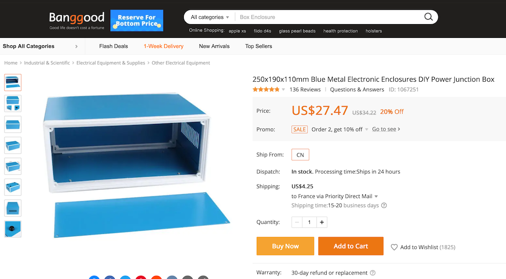
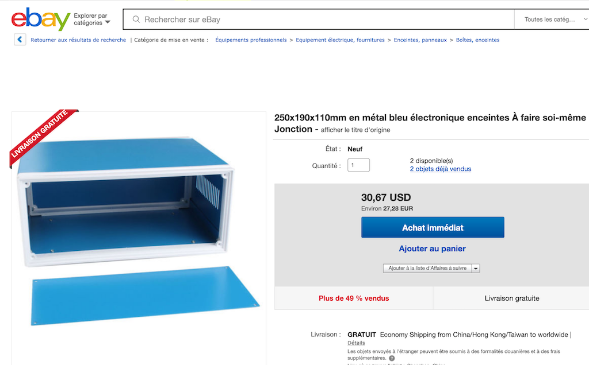
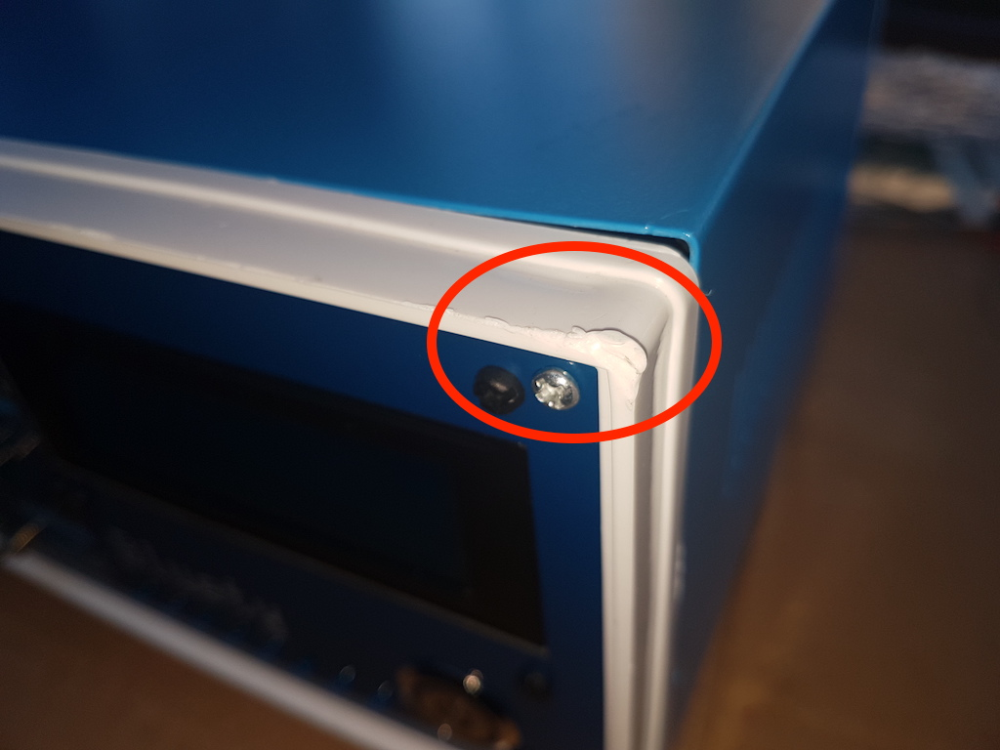
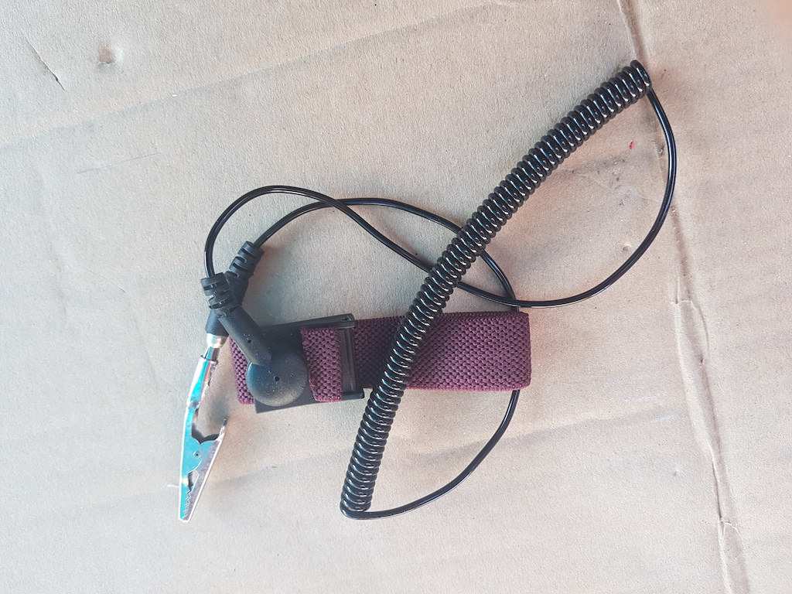
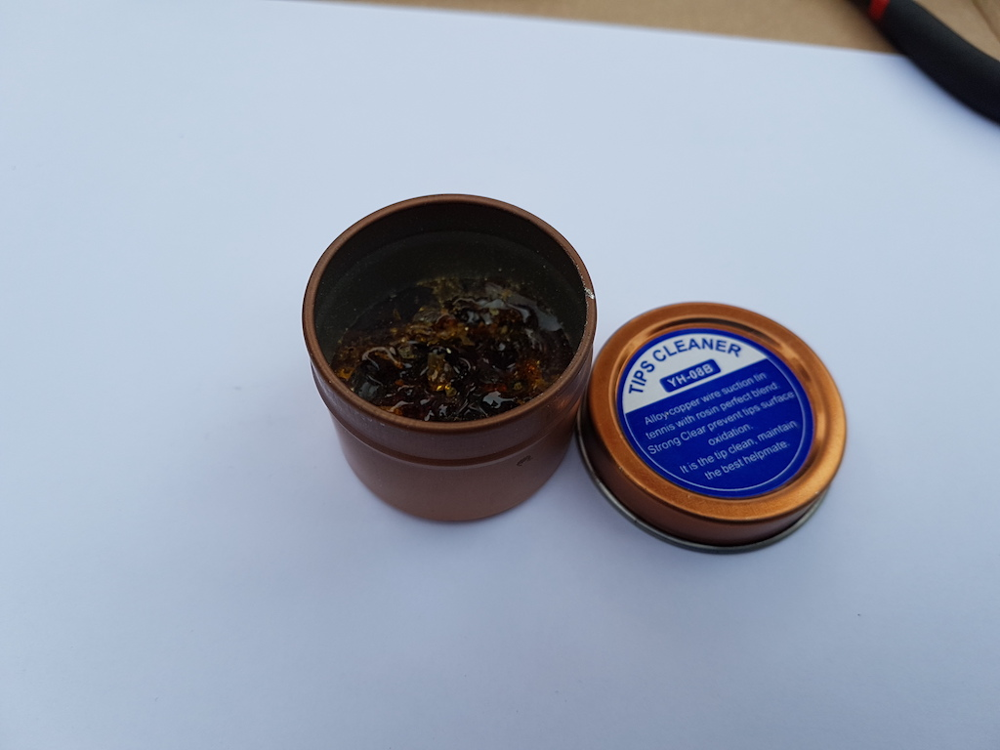
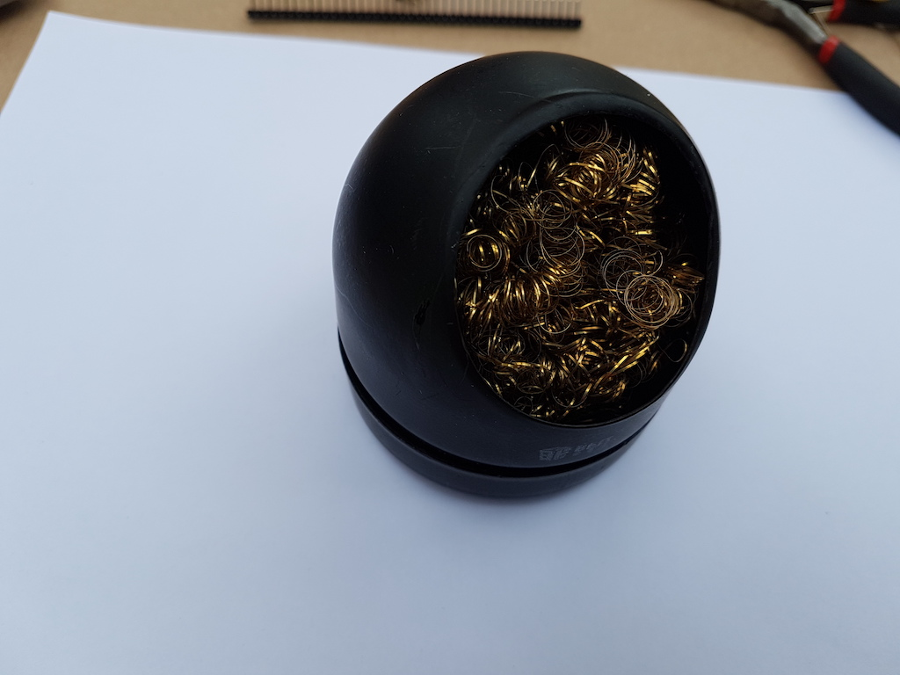
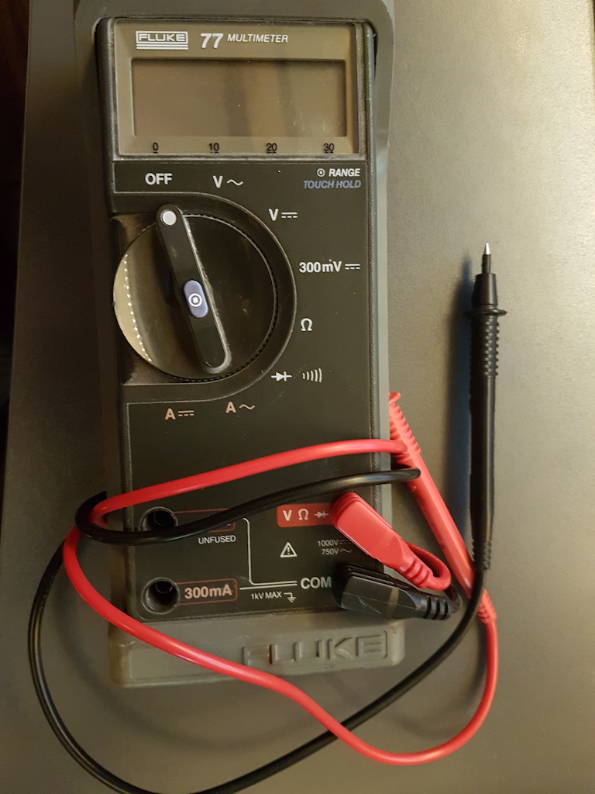

# Préparatifs

Dans ce chapitre nous allons préparer l'équipement nécessaire.

## Boitier

Bluety est conçu pour un boîtier métallique bleu que l'on peut trouver sur la plupart des sites marchands :
AliExpress, Banggood, Amazon, eBay. Dans le champ de recherche de votre site préféré, entrez
**"Blue Metal Electronic Enclosures"** et choisissez le boîtier de dimensions **250 x 190 x 110** (mm)
dans les résultats. 

<TABLE><TR><TD></TD><TD>Il existe d'autres boitiers d'aspect similaire
mais de dimensions inférieures qui ne conviendront pas à Bluety, donc vérifiez bien les dimensions.</TD></TR></TABLE>

|  |  |
| ------------------------------------------------------------------- | ----------------------------------------------------------------- |
|      |      |

Le coût est d'environ 20 à 40 euros / dollars livraison comprise. Les coûts de livraison en provenance de chine sont très bas par rapport
à ceux au départ de France, aussi je ne propose pas le boîtier dans le kit car son poids augmenterait considérablement le coût de livraison
de Bluety.

Il y a une autre raison pour laquelle je ne propose pas le boîtier : il est possible que les coins des cadres
plastifiés blancs soient abîmés durant le transport. J'ai eu ce problème sur 3 exemplaires que j'ai commandés.

Si vous souhaitez utiliser un autre boîtier, vous devez vous assurer que ses dimensions seront d'au moins 250 mm de largeur
par 110 mm de hauteur, avec une profondeur d'au moins 190 mm. Ces dimensions  conviennent au SC126 et à toutes les versions
du RC2014 y compris la version Pro avec ses 12 connecteurs de bus. Vous devrez également peut-être fabriquer certains câbles
si la longueur de ceux fournis avec le kit n'est pas suffisante.

Le kit contient deux gabarits de perçage pour fixer le SC126 ou le RC2014 Pro sur le fond du boîtier.

## Inventaire des outilss

Ce tableau liste les outils dont vous aurez besoin pour assembler le kit.

| Outil                                                        |                                                              |
| ------------------------------------------------------------ | -----------------------------------------------------------: |
| Station de soudure, de préférence avec température réglable  |  |
| Fil à soudure (diamètre 0.6mm ou 0.8mm recommandé)           |  |
| Pince fine                                                   |  |
| Pince fine coudée                                            |  |
| Pince coupante coudée                                        |  |
| Pompe à soudure                                              |  |
| Tapis silicone (ou protection isolante du plan de travail). Ce tapis protège votre plan de travail des brûlures mais aussi des rayures, et isole les circuits les uns des autres lorsque les circuits imprimés sont posés dessus. Nettoyez régulièrement la surface afin d'éviter que les résidus de métal ou de soudure rayent les façades ou les circuits imprimés, avec le risque d'abimer des pistes. Débarrassez les bouts de métal et de soudure, passez le tapis sous l'eau du robinet et séchez le. Faites cette opération régulièrement pendant l'assemblage, ne laissez pas les débris s'accumuler sur le tapis. |                           |
| Bracelet anti-statique. Reliez la pince à une masse. Ne reliez pas la pince directement à une prise de terre, vous seriez au contact avec la terre de tout votre réseau électrique et risqueriez de vous charger d'électricité au lieu de l'inverse. Si vous n'avez pas de boîtier spécial vous pouvez relier la pince à la sortie négative d'un transformateur 5V ou au boîtier métallique d'un ordinateur. |  |
| Accessoires de nettoyage de pane de fer à souder (brosse métallique et flux) |  |
| Clés ALLEN pour vis M2x8 et M3x8                             |  |
| Tournevis avec têtes cruxiformes, plates, Allen si vous n'avez pas de clés Allen. |  |
| Multimètre avec mesure de voltage et résistance, éventuellement test de continuité (diodes) |  |
| Perceuse à colonne pour le fond du boîtier (par exemple Dremel) avec une mèche de 3mm |                                |

## Conseils

Respectez les consignes d'assemblage pour obtenir une belle façade avec les composants bien alignés.

L'ordre des branchements et des assemblages est destiné à vous faciliter le travail : ne sautez pas les étapes.

<TABLE><TR><TD></TD><TD>Pour les soudures, voici une méthode qui limite les dégâts en cas d'erreur : 
<LI> souder <EM>une seule patte</EM> avec peu de soudure</LI>
<LI> vérifier que le composant a été mis au bon endroit et dans le bon sens</LI>
<LI> en cas d'erreur, retirer la soudure et replacer correctement le composant</LI>
<LI> quand tout est correct, souder les autres pattes normalement</LI>
<LI> compléter la soudure de la première patte</TD></TR></TABLE>

Si vous placez trop de soudure ou soudez toutes les pattes, il sera difficile voire impossible de réparer une erreur
comme un interrupteur ou une LED à l'envers. Avoir une seule patte légèrement soudée permet de vérifier l'alignement
mais aussi la polarité lorsque celle-ci est importante.

Je recommande en particulier cette méthode pour tous les composants apparaissant en façade avant.
