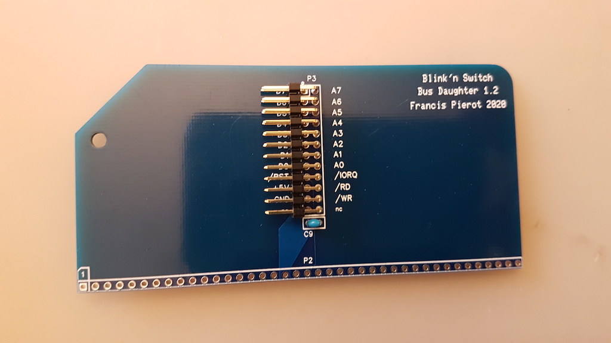
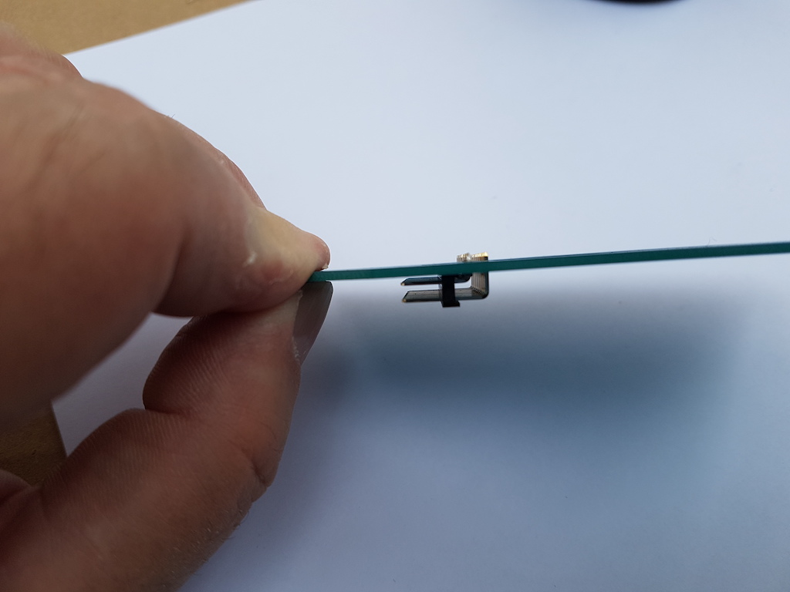

# IV) Carte Bus Daughter

Cette carte se connecte sur n'importe quel emplacement de bus d'un ordinateur RC2014 et véhicule les signaux utiles jusqu'à
la carte Blink'n Switch d'entrée / sortie. Son assemblage ne présente pas de difficulté majeure mais vous devrez faire
attention à l'orientation des connecteurs.

| Etape | Description                                                        |                                                              |
| ----- | -------------------------------------------------------------------- | ------------------------------------------------------------ |
| 1     | Soudez le condensateur C9, marqué "104" (100 nF). L'orientation n'a pas d'importance. Coupez les pattes au dos. |  |
| 2     | Soudez le connecteur 2x12P P3. Attention à souder le petit côté coudé, et orientez les broches vers le côté biseauté de la carte. |  |
| 3     | Soudez le connecteur 40P P2. Soudez le petit côté, le grand côté doit être en avant lorsque l'angle biseauté de la carte est à gauche (cf image ci-contre). Ne chauffez pas trop sinon le plastique ramollit et les pattes peuvent pivoter. Si cela arrive, réchauffez la soudure et remettez la patte en position à l'aide d'une pince. |  |
