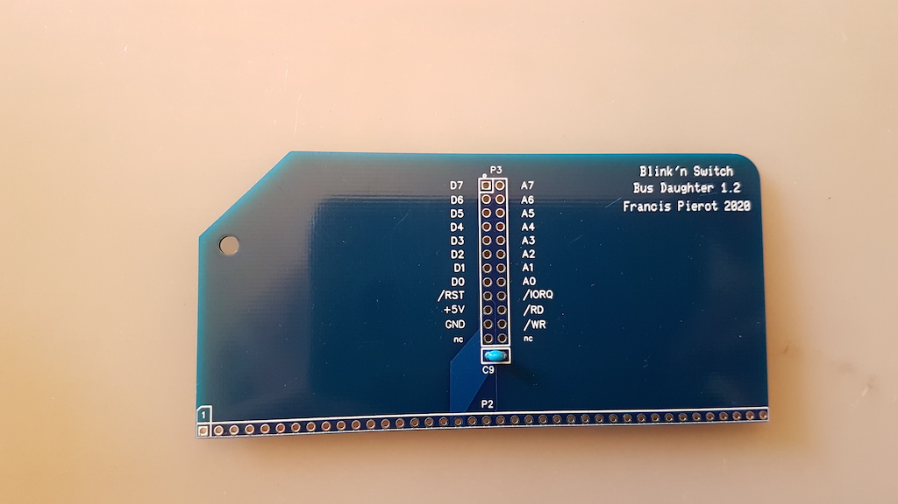
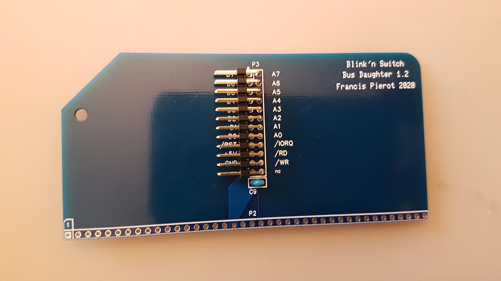
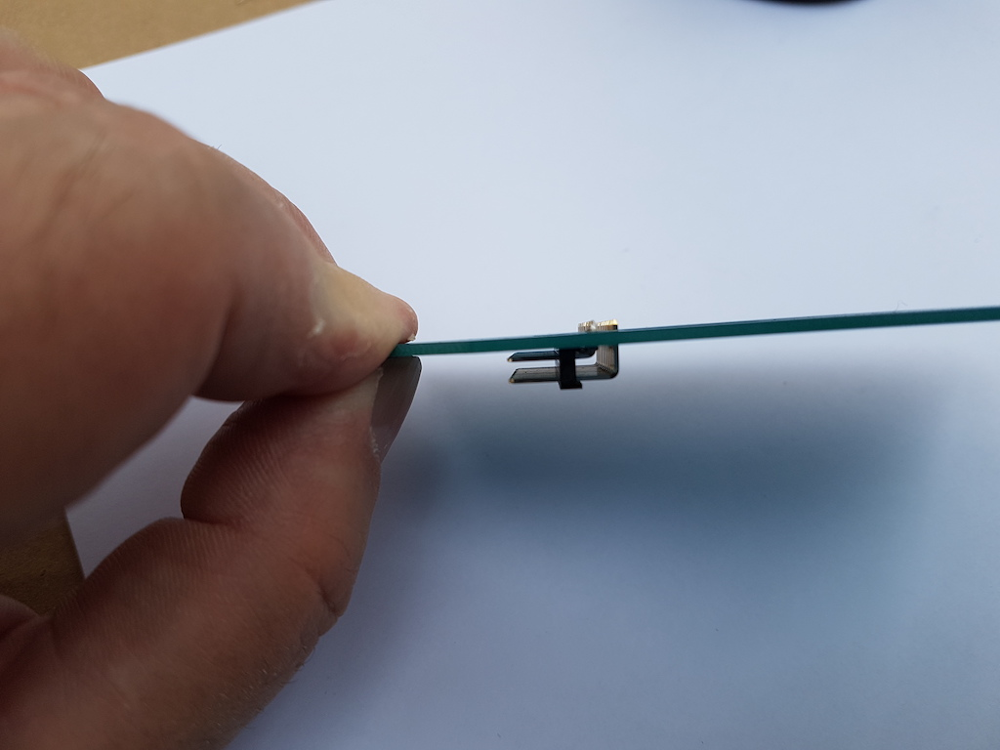
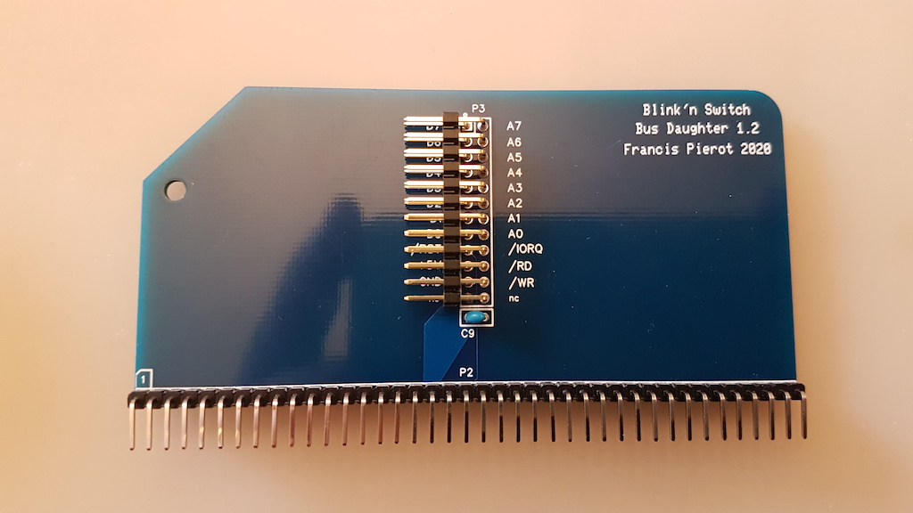

# Assembling Bus Daughter

This board takes place in any RC2014 bus connector and drives the needed signals to the Blink'n Switch
input/output board. Assembly is not difficult but you should take care of the connectors orientation.

| Step  | Description                                                        |                                                              |
| ----- | -------------------------------------------------------------------- | ------------------------------------------------------------ |
| 1     | Solder the C9 capacitor marked "104" (meaning 100 nF). Orientation has no importance. Cut the legs on the back once soldered.  |  |
| 2     | Solder the 2x12P P3 connector. Beware you must solder the little angled side and orient the pins toward the top angled side of the board. |  |
| 3     | Solder the 40P P2 connector. Solder the little side, the big side must be front when the angled corner is on the left. Do not overheat or plastic will soften and pins could move out of alignement. If this happens, heat the solder again and move the pins back in correct position with a plier then hold this while it cools. |  |
