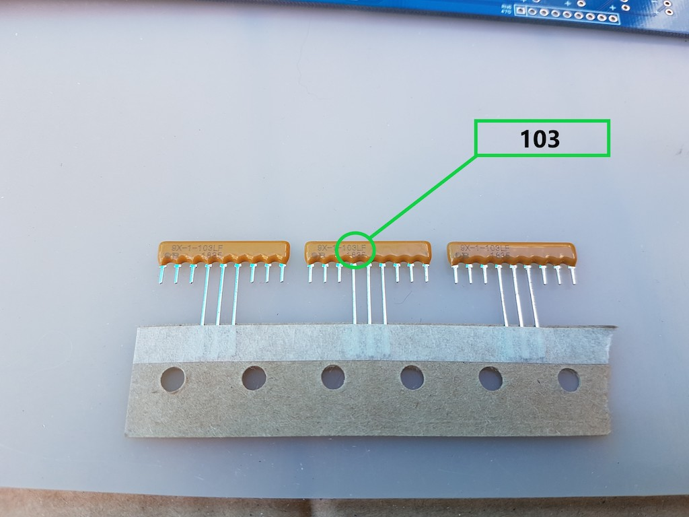

# Carte Blink'n Switch

Cette carte offre deux ports d'entrée/sortie avec des LEDs témoins et des interrupteurs pour contrôler les entrées, ainsi que
8 LEDs en façade pour le port de contrôles 13 (0D hexa) de l'ordinateur SC126 de Stephen S. Cousins. Ce port peut être utilisé par
n'importe quel ordinateur RC2014 pour afficher 8 bits sur les LEDs de la façade avant avec une instruction Z-80 `OUT` sur le port 13. 

<TABLE><TR><TD></TD><TD>Le montage de cette carte nécessite plusieurs assemblages
temporaires avec la façade avant pour que les composants apparaissant sur cette dernière soient correctement alignés. <B>Respectez
l'ordre de montage et les consignes</B> pour avoir les meilleurs chances d'obtenir une belle façade.</TD></TR></TABLE>

## Arrière (partie 1) : supports et composants

Placez le **dos** visible (l'orifice du bouton marche arrêt en bas à gauche)

| Etape | Description                                                                                           |                                                              |
| ----- | ----------------------------------------------------------------------------------------------------- | -----------------------------------------------------------: |
| 1     | Soudez les 10 condensateurs 100nF C1 à C4 et C6 à C11. Ces condensateurs sont marqués *104*.          |   |
| 2     | Soudez les 8 supports 20P et les 2 supports 14P, encoches vers le *haut* ou la *gauche* selon le cas. |   |
| 3     | Soudez les 3 réseaux de résistance **10K** RN1 RN4 RN7.                                               |  |
| 4     | Attention à *ne pas confondre avec les 470* : le composant est marqué *103*,ce qui signifie 10 x 10^3^, soit 10 Kilo Ohms. |  |
| 5     | Soudez d'abord une seule patte, vérifiez la position et le point de référence à gauche, correspondant au petit carré imprimé sur le circuit.   Une fois la position vérifiée soudez les autres pattes. |  |
| 6     | Soudez les 5 réseaux de résistance **470** RN2 RN3 RN5 RN6 RN8.                                       |  |
| 7     | Le composant est marqué 471, ce qui signifie 47 x 10^1^, soit 470 Ohms.                               |  |
| 8     | Attention au sens : alignez le point du composant avec le petit carré imprimé à gauche sur le circuit |  |

<TABLE><TR>
<TD width="100px"> </TD>
<TD>Pour les composants le nécessitant, coupez l'excédent des pattes au fur et à mesure pour ne pas être gêné.</TD>
</TR><TR>
<TD width="100px"> </TD>
<TD><EM>Ne soudez pas</EM> le connecteur P1 et le condensateur C5 pour l'instant : ils gêneraient la suite de l'assemblage.</TD>
</TR></TABLE>

Voici l'allure de la carte à ce stade.

## Avant : supports des dip-switch

<TABLE><TR>
<TD></TD>
<TD>Tous les éléments soudés sur l'avant apparaissent en façade à travers une ouverture, aussi une grande partie de l'assemblage consiste à souder
<EM>une seule patte</EM>, puis placer la façade pour vérifier et corriger l'alignement. Ainsi il est possible de réchauffer la soudure pour bouger
l'élément en cas de problème d'alignement. Une fois celui-ci correct on peut souder le reste des pattes.
</TD>
</TR></TABLE>

Tournez la carte pour voir l'**avant**, le trou du bouton power étant maintenant en bas à droite.

"Avant carte" style="zoom:50%;" />

| Etape | Description                                                       |                                                   |
| ------| -------------------------------------------------------- | ------------------------------------------------: |
| 1     | Soudez *une patte* de chacun des 2 supports CI 16P (SW10 et SW21), encoche vers la gauche. Ils serviront de base aux DIP-Switchs de sélection du numéro de port. |  |
| 2     | Vissez les 5 supports 12 mm sur la carte : support sur le dessus, boulon au dos. |  |
| 3     | Les supports vont servir à plusieurs assemblages provisoires afin de bien aligner les composants de la façade, donc ne les démontez pas tout le long de cette étape. L'espace de certains écrous est restreint une fois les composants en place, aussi il est préférable de maintenir l'écrou et tourner le support plutôt que l'inverse. |   |
| 4     | Si un composant nécessite à un moment de tourner un boulon, dévissez légèrement le support, tournez un peu l'écrou et revissez le support. |                                                   |
| 5     | Emboitez un second support 16P et un DIP-Switch sur chacun des deux supports. |   |
| 6     | Fixez la façade avant avec au moins deux ou trois des supports en passant les dipswitch à travers leurs ouvertures. Si un switch n'est pas bien aligné, faites chauffer la soudure de la patte et réalignez l'ensemble pour qu'il soit bien aligné avec l'ouverture de la façade. |   |
| 7     | Une fois que tout est bien aligné, retournez l'ensemble et terminez la soudure des supports, en n'oubliant pas de finir par un ajout de soudure sur la première patte. |                                                   |
| 8     | Dévissez les vis de la façade, démontez la et mettez là à l'abri ainsi que les ensembles support+dip-switch emboités. Vous les remettrez en place plus tard. |                                                   |

## Avant : connecteurs E/S et Alimentation

| Etape | Description                                                        |                                                              |
| ----- | -------------------------------------------------------- | ------------------------------------------------------------ |
| 1     | Posez le circuit imprimé, face avant sur le dessus, sur des supports de préférence non métalliques afin qu'il soit au dessus du plan de travail et permette aux composants de glisser dans leurs emplacements. Veillez à assurer une hauteur d'environ 10 mm. Des rouleaux de ruban adhésifs conviennent comme illustré sur l'image ci-contre. |              |
| 2     | Positionnez les 4 connecteurs femelles 8P à longues pattes (11mm) et les 2 connecteurs femelles 2P à longues pattes (11mm) |              |
| 3     | Fixez la façade *en évitant de fixer la vis centrale* elle gênerait le positionnement des connecteurs. |              |
| 4     | Posez la façade arrière sur la façade avant et perpendiculairement de manière à recouvrir les ouvertures des connecteurs. Vous pouvez placer une feuille de papier entre les deux si vous craignez d'abimer leur revêtement, la feuille de papier de soie qui les protège lorsque vous recevez le kit convient parfaitement à cet usage. |              |
| 5     | Retournez délicatement l'ensemble et posez le à l'envers sur le plan de travail. |              |
| 6     | A l'aide d'une pince, placez les connecteurs dans les ouvertures de la façade.  Ne forcez pas pour ne pas tordre les pattes. Si cela arrive, démontez la façade, sortez le connecteur, redressez les pattes et recommencez l'opération. |              |
| 7     | Les connecteurs doivent être bien placés dans les encoches de la façade. Utilisez une petite pince pour les repositionner jusqu'à ce que les six soient bien placés dans leur ouverture de la façade. |  |
| 8     | Lorsque tout est bien en place, soudez *une patte* de chacun des 6 connecteurs. |              |
| 9     | Retournez l'ensemble pour vérifier l'alignement. En cas de besoin, rechauffez la soudure pour repositionner le conencteur. |              |
| 10    | Lorsque tout est correctement placé, retournez et terminez la soudure des pattes restantes. |                                                              |
| 11    | Coupez l'excédent de pattes. Attention aux projections éventuelles des petits bouts de métal car ces pattes sont très ridgides : protégez vos yeux. |                                                              |
| 12    | Dévissez la façade.                                          |                                                              |

## Avant : interrupteurs

Préparez les 16 interrupteurs à trois positions ON-OFF-ON et 4 interrupteurs à deux positions ON-OFF ou ON-ON. Ils sont de couleurs différentes donc vous ne devirez pas 
pouvoir les confondre.

Pour pouvoir utiliser le port d'entrée correctement vous ne devez pas vous tromper de type.

<TABLE><TR><TD width="100px"></TD><TD>Séparez les tas pour ne pas vous tromper. Le kit présente
normalement deux couleurs différentes mais cela peut dépendre du stock. Les interrupteurs sont livrés dans des sachets différents pour vous aider à les trier, mais une
vérification manuelle des positions est aussi efficace.</TD></TR></TABLE>

| Etape | Description                                                        |                                                              |
| ----- | --------------------------------------------------------- | ------------------------------------------------------------ |
| 1     | Positionnez les 8 interrupteurs à **trois positions ON-OFF-ON** du port A, SW1 à SW8. Attention à  *l'encoche située sur le pas de vis* : vous pouvez la placer vers le bas ou vers le haut mais assurez-vous d'utiliser la même orientation *pour chaque interrupteur*. Ils doivent être placés de la même façon car ils ne sont pas totalement symétriques. Je recommande le bas car les encoches seront ainsi moins visibles.|              |
| 2     | De la même manière, positionnez les 8 interrupteurs à **trois positions ON-OFF-ON** SW17 à SW24 en prêtant attention à l'encoche. |                                                              |
| 3     | Positionnez les 4 interrupteurs à **deux positions ON-OFF ou ON-ON** SW9, SW11, SW20, SW22, encoche du pas de vis vers le bas. |              |
| 4     | Placez tous les boutons en position basse ou centrale (pour ceux à trois positions) |                                                              |
| 5     | Glissez et fixez la façade à l'aide des vis.                 |                                                              |
| 6     | Assurez vous que tout est bien aligné et qu'aucun bouton ne s'est délogé, sinon replacez le et refaites la fixation de la façade. En principe vous ne pourrez pas fixer la façade si un interrupteur n'est pas bien en place dans son logement. |                                                              |
|  | Vérifiez que les quatre interrupteurs situés les plus à droite sont bien ceux à deux positions et non trois. En cas d'erreur, dévissez la façade, rectifiez et revissez la façade. | |
| 7     | Retournez la carte, et soudez *un seul point* de chacun des 20 interrupteurs avec une petite quantité de soudure. |                                                              |
| 8     | Soulevez légèrement l'extrémité de la carte côté LCD afin que les interrupteurs soient bien plaqués contre le circuit, et que les pattes à souder dépassent bien du circuit. Sur l'image ci-contre, l'interrupteur le plus à gauche n'est pas assez enfoncé dans son logement parce que l'extrêmité côté LCD de la carte est plus basse. En la soulevant on rétablit l'horizontalité de la carte et les interrupteurs seront tous enfoncés de la même longueur dans leur logement. |              |
| 9     | Vérifiez l'alignement en retournant l'ensemble. Alignez les leviers à l'aide d'une règle ou d'un bord de la façade avant. Au besoin, chauffez le point de l'interrupteur mal aligné pour le replacer correctement. |  |
| 10    | Quant tout est bien aligné, soudez les autres pattes, remettez de la soudure sur la première selon besoin. Faites ceci pour les 20 interrupteurs. N'hésitez pas à charger en soudure, pour que l'ensemble assure une bonne solidité en plus du contact électrique. |              |
| 11    | Remettez les interrupteurs en position basse ou médiane.     |                                                              |
| 12    | Dévissez et enlevez la façade.                               |                                                              |

## Avant : LEDs

Préparez les LEDs :

- 16 vertes pour les ports d'entrée
- 16 jaunes pour les ports de sortie
- vous pouvez inverser les couleurs vertes et jaunes selon votre goût
- 8 bleues pour le port de contrôle
- si vous préférez avoir des LED remplaçables, vous pouvez souder des supports femelles à deux broches à la place des LEDs, mais l'ajustement des LEDs à la bonne longueur sera sensiblement plus compliqué. Cette possibilité est laissée à votre appréciation et les supports ne sont pas fournis dans le kit.

| Etape | Description                                                  |                                                  |
| ----- | ------------------------------------------------------------ | -----------------------------------------------------------: |
| 1     | Posez le circuit imprimé, face avant sur le dessus, sur des supports de préférence non métalliques afin qu'il soit au dessus du plan de travail et permette aux LEDs de glisser dans leurs emplacements. Veillez à assurer une hauteur d'environ 10 mm. |                                                              |
| 2     | Placez les 16 LEDs vertes (ou jaunes) des ports d'entrée LED1 à LED8 et LED17 à LED24. La patte la plus courte est l'anode et se place en haut sur le signe (-) du circuit imprimé. |  |
| 3     | Placez les 16 LEDs jaunes (ou vertes) des ports de sortie LED9 à LED16 et LED25 à LED32. La patte la plus courte est l'anode et se place en haut sur le signe (-) du circuit imprimé. |                                                              |
| 4     | Placez les 8 LED bleues du port de contrôle LED33 à LED40. La patte la plus courte est l'anode et se place en haut sur le signe (-) du circuit imprimé. |                                                              |
| 5     | Vérifiez une dernière fois que les pattes les plus courtes sont bien situées sur le haut, ainsi que l'applat de la LED. |                                                              |
| 6     | Fixez de nouveau la façade à l'aide des 5 vis. Pensez à bien visser la vis unique à côté du trou du bouton marche/arrêt : elle assurera le bon alignement des LED situées sous le LCD. |             |
| 7     | Soulevez l'ensemble : les LEDs glissent dans leur logement et se plaquent sur le circuit imprimé. |                                                              |
| 8     | Retournez délicatement l'ensemble pour que les LEDs glissent en sens inverse et se placent dans leur ouverture sur la façade. Une grande partie d'entre elles va s'y positionner directement, pour les autres agissez avec une pince sur les pattes pour les placer dans leur ouverture en façade. Posez l'ensemble retourné sur le plan de travail, en appui sur les interrupteurs. |                                                              |
| 9     | Si une LED est mal positionnée, utilisez ses pattes et une pince pour la replacer correctement. Procédez délicatement pour ne pas tordre les pattes. |            |
| 10    | Vérifiez bien que toutes les LEDs sont  placées dans leur logement sur la façade en la regardant par en dessous. Elles doivent toutes dépasser de la même hauteur. |            |
| 11    | Vérifiez une dernière fois que les pattes les plus courtes sont bien sur le symbole (-) du circuit. |            |
| 12    | En cas d'erreur, vous devez retourner la carte, dévisser et ôter la façade, remettre la LED dans le bon sens, revisser la façade et reprendre le bon positionnement des LEDs dans les logements. |                                                              |
| 13    | Une fois tout bien positionné et vérifié, soudez les pattes des LEDs. |                                                              |
| 14    | Coupez l'excédent des pattes.                                |                                                              |
| 15    | Dévissez la façade.                                          |                                                              |

## Arrière : composants (partie 2)s

| Etape | Description                                                       |                                                  |
| ----- | --------------------------------------------------------- | ------------------------------------------------ |
| 1     | Retournez le circuit.                                        |                                                  |
| 2     | Soudez le condensateur C5, attention à la polarité la patte la plus courte est sur le (-). La bande noire avec le signe '-' doit être face au demi cercle hachuré sur le circuit imprimé. Coupez les pattes de l'autre côté. |  |
| 3     | Soudez le connecteur mâle 2x12P P1.                          |  |

## Finition

- Nettoyez précautionneusement la façade avec un chiffon doux ou microfibre propre.

<TABLE><TR><TD></TD><TD>
  <B>N'utilisez aucun produit détergent, solvant ou alcoolique.</B>
  
L'eau chaude et les produits de nettoyage pour écran plat sont acceptables.
  
Si vous souhaitez utiliser un produit, faites un essai sur un petit endroit au dos de la façade ou sur la carte Bus Daughter pour vérifier qu'il n'abime pas le vernis.
</TD></TR></TABLE>

IMPORTANT : Mettez votre bracelet anti-statique maintenant.</B></TD></TR></TABLE>

| Etape | Description                                                       |                                                              |
| ----- | --------------------------------------------------------- | ------------------------------------------------------------ |
| 1     | Installez les circuits intégrés dans leurs emplacements. Leur nom est indiqué sur le circuit imprimé, et prenez garde à placer l'encoche en face de celle du support : à gauche ou en haut selon l'orientation du circuit. ● 3x 74HCT273N ● 3x 74HCT688 ● 2x 74HCT245N ● 2x 74HCT32 |                                                              |
| 2     | Revissez la façade. Elle sera démontée encore une fois dans l'étape suivante, aussi ne la vissez pas trop fortement.                                          |                                                              |
| 3     | Emboitez les dip-switch sur leurs supports 16P puis emboitez les ensembles sur le circuit imprimé à travers l'ouverture en façade. |                                                              |
| 4     | Branchez les 2 cables 12 fils sur le connecteur P1, de préférence en inversant un des câbles pour que les couleurs soient différenciables : sur l'image ci-contre, le câble de gauche a ses fils marron-rouge-orange en haut et noir-marron-rouge en bas, sur le câble de droite c'est l'inverse. Si besoin, repérez le fil A7 par sa couleur (ici : marron en haut du câble de gauche) ou avec un petit autocollant placé à l'extrémité libre. |  |

Vous avez ainsi terminé la partie la plus difficile de l'assemblage.
