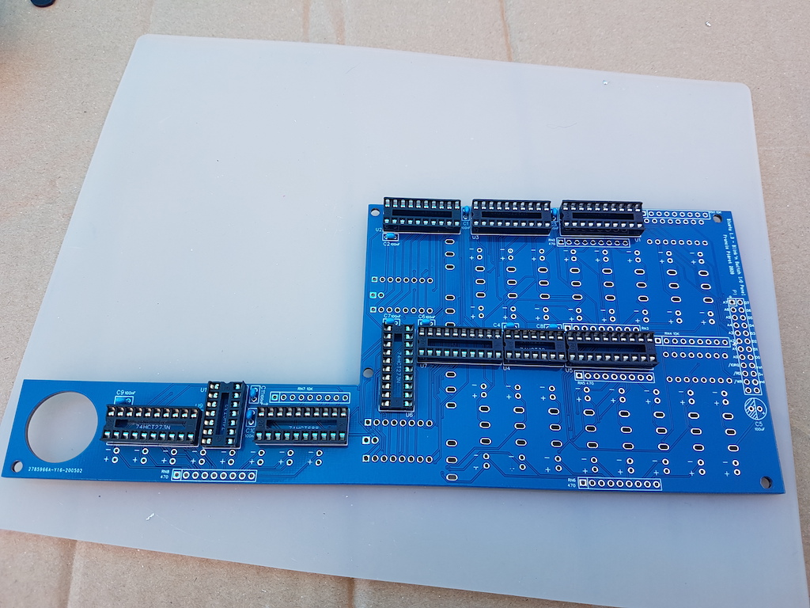
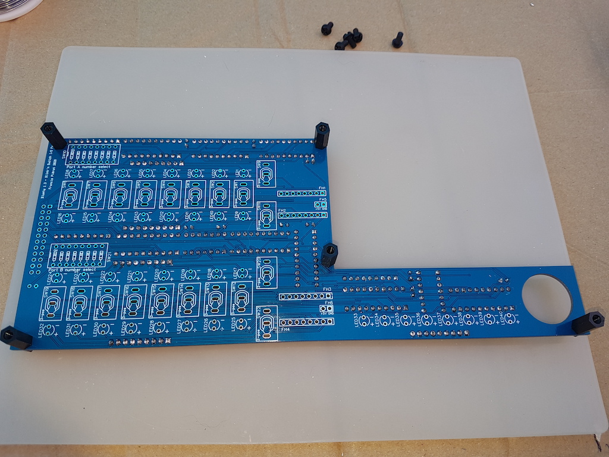
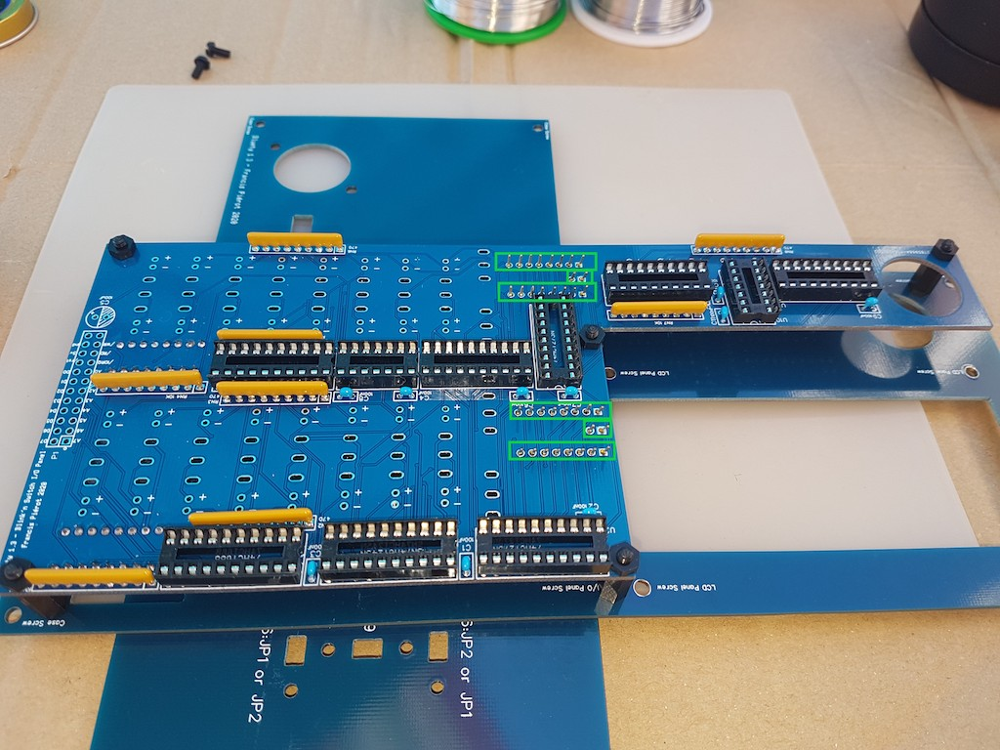
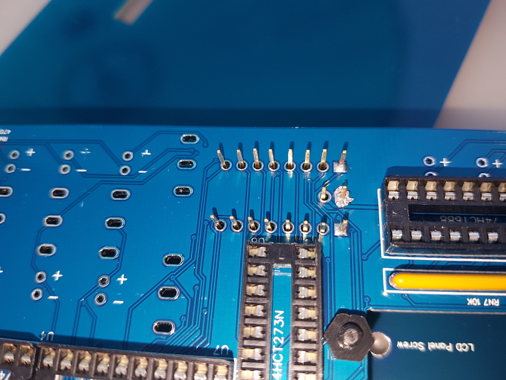
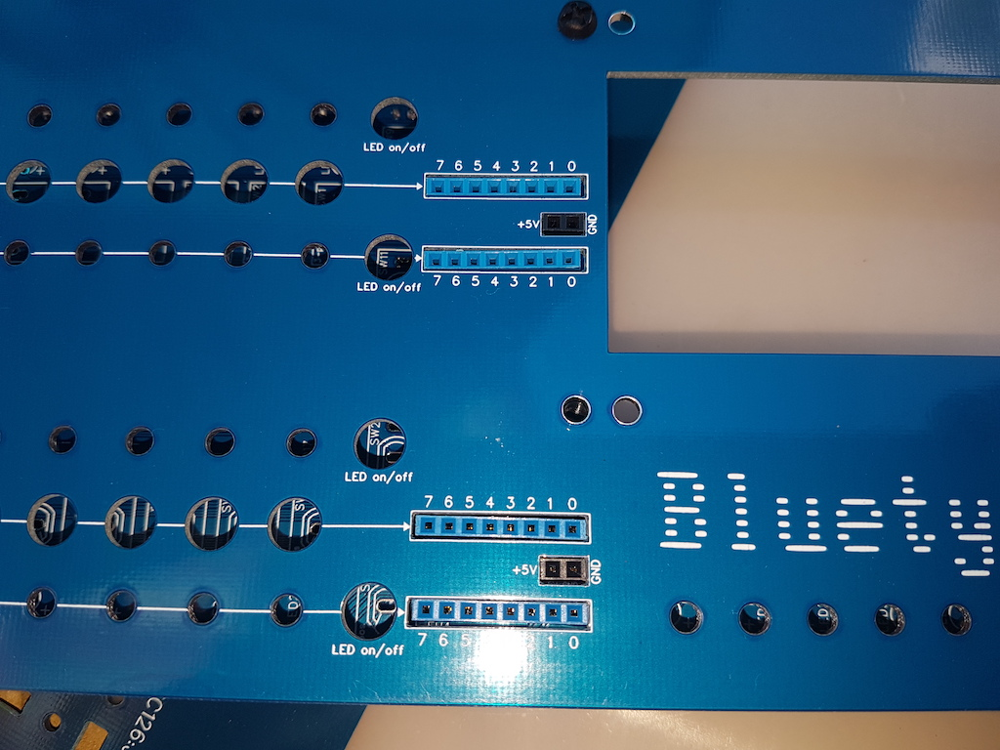
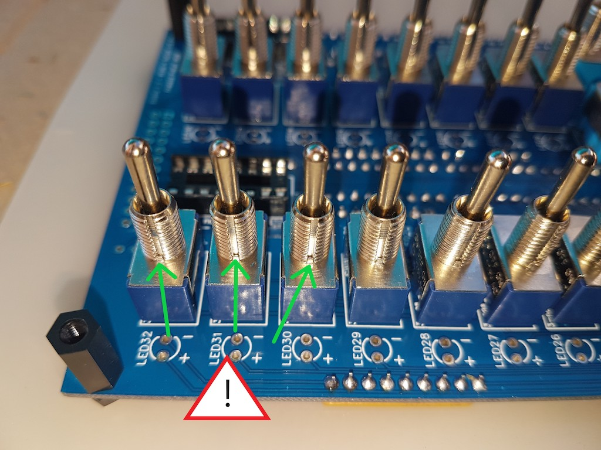
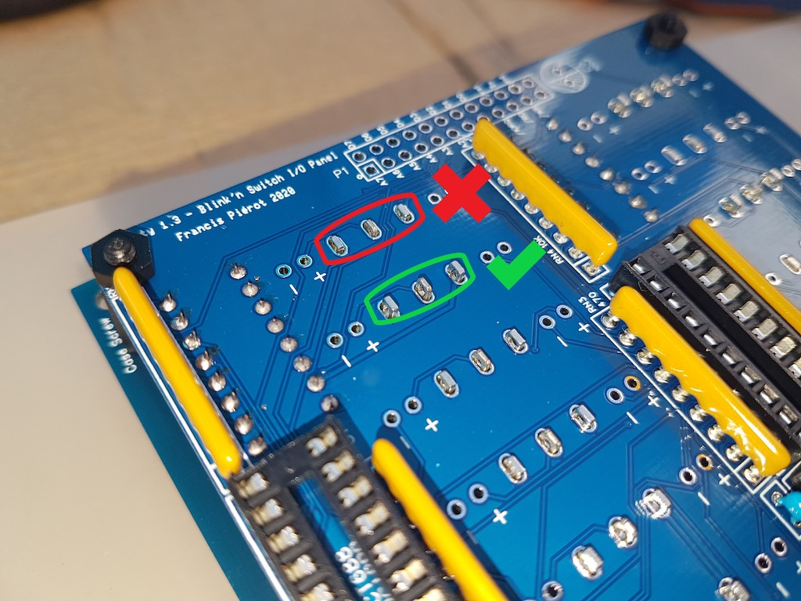
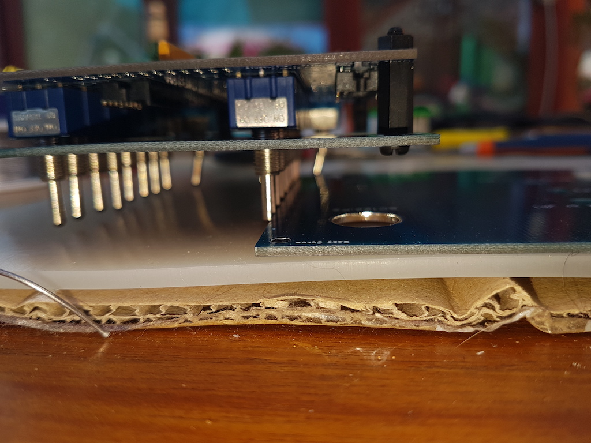
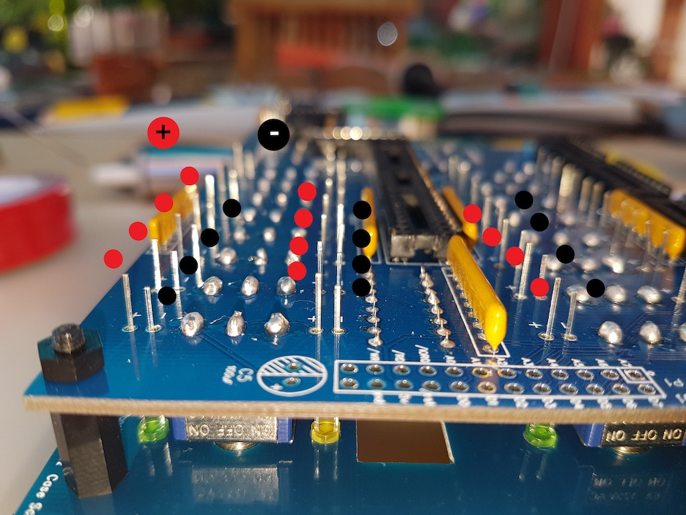

# Assembling Blink'n Switch

This board offers two input/ouput ports with indicator LEDs and control switches, as well as 8 front panel LEDs for the 13
(0D hexa) control port for the SC126 computer from Stephen S. Cousins. This port can be used by any RC2014 computer to display 8 bits
on the front panel 8 LEDs using an `OUT` Z-80 instruction on port 13.

<TABLE><TR><TD></TD><TD>This board assembly requires a few temporary assemblies
with the front panel to make sure that the components appearing on the front view  are well aligned. <B>Make sure you respect
the assembly order and advices</B> to ensure the front panel will offer a nice view on all visible controls.</TD></TR></TABLE>

## Back (part 1): sockets and components

Place the **back** visible. (The opening for power button must be on the bottom left.)

| Step  | Description                                                                                           |                                                              |
| ----- | ----------------------------------------------------------------------------------------------------- | -----------------------------------------------------------: |
| 1     | Solder the ten 100nF capacitors C1 to C4 and C6 to C11. These capacitors are marked *104*.            |   |
| 2     | Solder the eight 20-pins sockets and the two 14-pins sockets, with the little notch on the *top* or on the *left* depending on the orientation. |   |
| 3     | Solder the three **10K** resitors networks RN1 RN4 RN7.                                               |  |
| 4     | Take care: *do not mismatch with the 470 Ohms resistors*: the 10K component is marked *103*, which means 10 x 103, hence 10 Kilo Ohms. |  |
| 5     | First, lightly solder one leg, then check position and the reference dot mark on the left which should match the little printed square on the circuit board.   When everything is correct, finish soldering with the other legs and add sufficient solder on the first leg. |  |
| 6     | Solder the five **470** resistors networks RN2 RN3 RN5 RN6 RN8.                                       | Resistors" style="zoom: 33%;" /> |
| 7     | The component is marked *471*, which means 47 x 101, hence 470 Ohms.                                |  |
| 8     | Make sure you align the component dot mark on the left with the little printed square on the circuit board. |  |

<TABLE><TR>
<TD width="100px"> </TD>
<TD>When necessary, cut the components legs exceedent while progressing so they don't get in the way.</TD>
</TR><TR>
<TD width="100px"> </TD>
<TD><EM>Do not solder</EM> the P1 connector and C5 capacitor yet, they would hamper the next assembly steps.</TD>
</TR></TABLE>

Here's a view of the board at this step.

## Front: dip-switch sockets

<TABLE><TR>
<TD></TD>
<TD>All the elements soldered on the front face will appear on the front panel through an opening, so a great part
of the assembly will be soldering <EM>only one leg</EM> at first with very few solder, put the front panel on
your assembly to check alignement, heat again the leg and fix in case of problems, and when everything is correctly
aligned solder the other legs and finally add solder again to the first leg.</TD>
</TR></TABLE>

Reverse the board to see the **front** side, with the power button opening now appearing on the bottom right. 

| Step  | Description                                                       |                                                   |
| ------| -------------------------------------------------------- | ------------------------------------------------: |
| 1     | Solder *one leg* of each of the two 16-pins IC sockets (SW10 and SW21), notch on the left. They will host the port select DIP-switches. |  |
| 2     | Screw the five 12mm bolts on the board: bolt on the front, nut on the back. |  |
| 3     | The bolts will help for many temporary assemblies with front panel to ensure correct alignement, so you'll keep them screwed for this whole process step. There is little space on the back for some nuts when components are in place, so it is best to maintain the nut and turn the bolt than the contrary. |   |
| 4     | If a component requires that you turn a nut, lightly unscrew the bolt, turn the nut a little, then screw again the bolt. |                                                   |
| 5     | Put another 16-pin IC socket into the soldered ones, then a DIP-switch on each second socket.   |   |
| 6     | Screw the front panel using at least 3 of the bolts and make sure the DIP-switches are correctly aligned and go through the openings. If a switch is not aligned correctly, heat the socket leg on the board back and realign the DIP-switch within it's opening while sodler is hot. |   |
| 7     | Once both DIP-switches are correctly aligned, return the set and finish soldering the sockets other legs, finishing by adding solder to the first leg. |                                                   |
| 8     | Unscrew the front panel, put it apart and safe as well as the sloted sockets and DIP-switches. You'll put them back in place later. |                                                   |

## Front: I/O connectors and power

| Step  | Description                                                        |                                                              |
| ----- | -------------------------------------------------------- | ------------------------------------------------------------ |
| 1     | Put the printed board, front face on top, on some supports so it lies well above the working bench and let components slide in their position. Ensure a minimal height of 10 mm. Rolls of tape for example are perfect as shown on the picture. |              |
| 2     | Place the 4 8-pins female connectors with 11mm long legs and the 2 2-pins female connectors with 11mm long legs. |              |
| 3     | Attach the front panel but *do not use the central screw* as it would hinder the connectors positionning. |              |
| 4     | Put the back panel perpendicularly on the front panel so it covers the connectors openings. Put a piece of paper between both panels if you fear scratching their surface. |              |
| 5     | Return both together on the bench. |              |
| 6     | Helped by a fine plier, place each connector in its front panel opening.  Don't force to avoid bending the legs. If this happens, unscrew the front panel, pull the connector, unbend the legs, and restart the operation. |              |
| 7     | The connectors must be placed correctly in the front panel openings. Use a small plier to place them so the six are well aligned in their openings. |  |
| 8     | When everything is in place, solder *one leg* on each of the six connectors. |              |
| 9     | Return the assembly to double check alignment. In case of need, heat again the leg solder to move a connector. |              |
| 10    | When everything looks fine, return the whole again and finish soldering on all the other legs, ending with more solder on the first leg. |                                                              |
| 11    | Cut the legs exceedent when your soldering is well. Take care of protecting your eyes, as the legs are rather rigid and little parts of metal can be projected in any direction. |                                                              |
| 12    | Unscrew the front panel.                                          |                                                              |

## Front: switches

Prepare the 16 ON-OFF-ON 3-positions switches and the 4 ON-OFF or ON-ON 2-positions switches.

To use the input port correctly you must not mismatch the switches types.

<TABLE><TR><TD width="100px"></TD><TD>Group the switches by type.

| Step  | Description                                                        |                                                              |
| ----- | --------------------------------------------------------- | ------------------------------------------------------------ |
| 1     | Place 8 ON-OFF-ON 3-positions switches for port A in SW1 to SW8. Take care of *the little notch on the screw thread*:  you can place it top or bottom but make sure you orient all switches consistently as they are not absolutely symetrical with respect to this notch. I recommend bottom as the notch will be less visible. |              |
| 2     | Do the same with the 8 ON-OFF-ON switches of port B at SW17 to SW24, again placing the little notch consistently for the 16 ON-OFF-ON switches. |                                                              |
| 3     | Place the 4 ON-OFF or ON-ON 2-positions switches at SW9, SW11, SW20 and SW22, with the little notch oriented like the other switches. |              |
| 4     | Put all switches in the bottom (for 2-positions switches) or center (for 3-positions switches) position |                                                              |
| 5     | Gently place the front panel by sliding each switch lever through its opening, and screw the front panel.                 |                                                              |
| 6     | Make sure everything is well aligned and no switch got out of its place. If this happens, unscrew the front panel, place the switch correctly and restart. Normally you should not be able to screw the panel if any switch is not correctly placed. |                                                              |
|  | Make sure the 4 right most switches are 2-positions and not 3. In case of mistake, unscrew the front panel, fix the problem and screw the panel again.  | |
| 7     | Return the whole and solder *only one leg* of each of the 20 switches with as little solder as possible. |                                                              |
| 8     | Slightly lift the the board at the LCD opening border so the switches are well placed against the board and their legs are well exceeding on the other side. On this adjacent picture, the left-most switch is not pushed enough in its location because the LCD side is too low. By lifting it, the board is again horizontal and all switches will be aligned vertically. |              |
| 9     | Check the whole by returning it. Align the levers with a ruler or the fron Alignez lest panel border. If needed, heat the soldered leg on switches to move them correctly aligned. |  |
| 10    | When everything is well aligned, sodler the other legs and finish by adding solder to the first leg. DO this for the 20 switches. Make sure you heat well and add enough solder, as the openings are quite large and the solder will be the only thing holding the switches in place when you'll move their lever.|              |
| 11    | Put the switches in bottom or center position.    |                                                              |
| 12    | Unscrew the front panel and put it apart, safe from projections.                               |                                                              |

## Front: LEDs

Prepare the LEDs:

- 16 green pour input ports
- 16 yellow for output ports
- you can reverse colors if you like
- 8 blues pour the control port
- if you prefer having replaceable LEDs, you can solder 2-position sockets instead of LEDs and then insert LEDs in the sockets but having the LEDs all at the same depth and well aligned on the front panel will be substantially more difficult. This is left to your appreciation. 

| Step  | Description                                                  |                                                  |
| ----- | ------------------------------------------------------------ | -----------------------------------------------------------: |
| 1     | Put the printed board on non metallic supports, front face on the top so it lies above the working bench and will let the LEDs slide in their opening. Make sure it is at least 10 mm above the working surface. |                                                              |
| 2     | Put the 16 green (or yellow) LEDs of input ports in LED1 to LED8 and LED17 to LED24. The shorter leg is the anode and is placed on the board top (-) mark. |  |
| 3     | Put the 16 yellow (or green) LEDs of output ports in LED9 to LED16 and LED25 to LED32. The shorter leg is the anode and is placed on the board top (-) mark. |                                                              |
| 4     | Put the 8 blue LEDS of control port in LED33 to LED40. The shorter leg is the anode and is placed on the board top (-) mark.|                                                              |
| 5     | Check that the 40 shorter legs are all on the top side, as well as the LEDs plastic flat side. |                                                              |
| 6     | Screw again the front panel with the 5 screws. Make sure you strongly screw the unique screw beside the on/off power button: it ensures the correct alignment of the LEDs below the LCD opening. | |
| 7     | Lift the whole: the LEDs will slide in their openings and take place on the printed board. |                                                              |
| 8     | Gently reverse the whole so the LEDs slide in reverse direction and take place in their front panel openings. Most of them will take place easily, help the others with a fine plier to their opening. Put the reversed whole on the working bench, supported by the switches. |                                                              |
| 9     | If a LED is not well positionned, use its legs with a plier to move it correctly. Proceed gently to avoid bending legs or you'll have to unscrew the front panel and restart. |            |
| 10    | Check that all LEDs are well placed in their front panel opening by looking from the bottom. They should all have the same visible height. |            |
| 11    | For the last time, check that all the short legs are on the (-) mark of the printed board. |            |
| 12    | In case of mistake, return the board, unscrew the front panel, replace the LED in the correct orientation, check, screw the front panel and reposition all LEDs. |                                                              |
| 13    | Once you're absolutely sure everything is well placed and aligned, you can solder the 80 LED legs. |                                                              |
| 14    | Cut the legs exceedent.                                |                                                              |
| 15    | Unscrew the front panel.                                          |                                                              |

## Back: components (part 2)

| Step  | Description                                                       |                                                  |
| ----- | --------------------------------------------------------- | ------------------------------------------------ |
| 1     | Return the board.                                        |                                                  |
| 2     | Solder the C5 capacitor, take care of polarity: the shorter leg must be on the (-) mark. The black strip marked `-` must match the hatched half-circle on the printed board. Cut legs on the other side. |  |
| 3     | Solder the male 2x12-pins connector P1.                          |  |

## Finishing

- Gently clean the front panel with a clean soft or microfiber cloth. 

<TABLE><TR><TD></TD><TD>
  <B>Don't use detergent, solvers or alcoholic products.</B>
  
Hot water or flat screens cleaning products are acceptable but make sure to dry everything thereafter.
  
If you want to use a cleaning product, test it on a little non-visible part like Bus Daughter or the front panel back side and make sure it doesn't damage the vernish.
</TD></TR></TABLE>

<TABLE><TR><TD></TD><TD><B>
IMPORTANT: put your anti-static bracelet NOW.</B></TD></TR></TABLE>

| Step  | Description                                                       |                                                              |
| ----- | --------------------------------------------------------- | ------------------------------------------------------------ |
| 1     | Install the integrated circuits in their socket. The name is printed on board, make sure you put the notch on the left or top side of the socket, matching the printed mark. ● 3x 74HCT273N ● 3x 74HCT688 ● 2x 74HCT245N ● 2x 74HCT32 |                                                              |
| 2     | Screw the front plate. It will be unscrewed a last time in the next assembly steps so don't screw too strongly.                                          |                                                              |
| 3     | Put the dip-switches in their 16-pin socket, then put the whole on the soldered socket through the front panel opening. |                                                              |
| 4     | Connect the 2 12-wires cables on the P1 connector, preferably inverting one cable so the colors can be differentiated. On the adjacent, the left cable has brown-red-orange on top and black-brown-red on bottom, while the right cable has the contrary. If needed, notice the A7 color or put a little tape on its other extremity to identify it easily. |  |

You have now finished the most difficult part of assembly.
