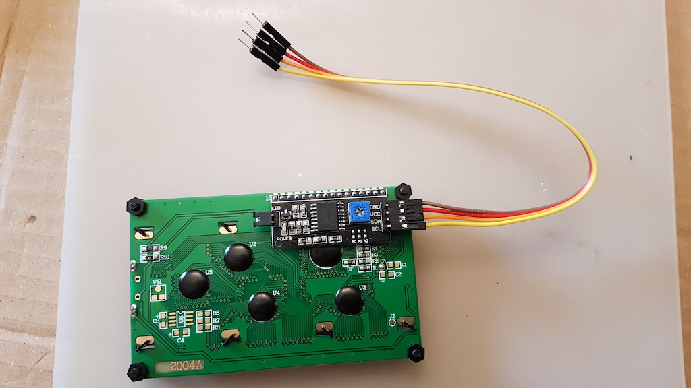
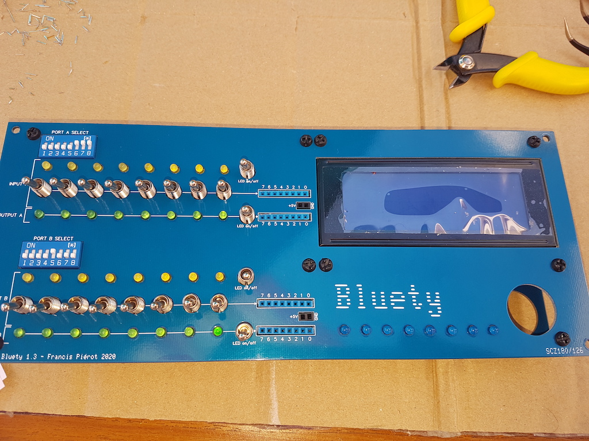

# VI) Façade avant

La façade avant possède des ouvertures pour les interrupteurs, switches, connecteurs et LEDs de la carte Blink'n Switch.
Elle possède aussi un écran LCD de 4x20 caractères rétro éclairé et un bouton marche/arrêt lumineux.

Pour assembler l'écran LCD et le bouton d'alimentation vous devez une dernière fois dévisser la façade pour écarter Blink'n Switch.

## VI-1) Ecran LCD 4x20

| Etape | Description                                                  |                                                           |
| ----- | ------------------------------------------------------------ | --------------------------------------------------------: |
| 1     | Dévissez la façade.                                          |                                                           |
| 2     | Fixez les 4 supports 10 mm à l'écran, support sur l'avant et boulon au dos. Ne vous trompez pas de supports, sinon l'écran sera en retrait ou en avant de la façade. |           |
| 3     | Fixez le câble 4 fils sur le connecteur I2C. L'intérêt de le faire à ce stade est qu'il sera plus difficile de le brancher après que l'écran aura été fixé sur la façade à cause de la proximité de circuits intégrés. |  |
| 4     | Vissez l'écran sur la façade à l'aide des vis des supports.  |           |

## VI-2) Bouton d'alimentation

Notez qu'à ce stade la façade est encore séparée de Blink'n Switch, sinon vous ne pouvez pas visser le bouton marche/arrêt sur la façade. 
Si ce n'est pas le cas, dévissez donc la façade.

| Etape | Description                                                                     |                                                                              |
| ------| ------------------------------------------------------------------------------- | ---------------------------------------------------------------------------- |
| 1     | Si ce n'est pas fait, dévissez la façade.                                       |                                                                              |
| 2     | Vissez le bouton d'alimentation à l'aide de l'écrou. Si vous désirez utiliser le joint, placez le sur le pas de vis à l'intérieur du bouton pour qu'il aille s'appuyer sur l'extérieur de la façade, mais ce joint n'a pas d'utilité pratique. |             |
| 3     | Revissez la façade sur Blink'n Switch. Vous pouvez visser solidement car cette fois est la dernière.                       |                                                                              |
| 4     | Repérez les bornes du bouton : **+** et **-** à l'extérieur alimentent la LED, **NO** est l'entrée +5V, **C** est le fil de sortie +5V quand le bouton est enfoncé, et **NC** ne sera pas connecté. |  |
| 5     | Branchez le long fil rouge serti aux deux extrémité sur la borne centrale **NO**. |  |
| 6     | Branchez le câble 3 fils : ● le gros fil rouge sur la borne **C** et le petit fil rouge sur la borne **+** ● le gros fil noir sur la borne **-** |   |

"Conseil" width="75px" /></TD><TD>

Les extrémités des câbles qui n'ont pas encore été branchées vont rester libres jusqu'à ce que la façade arrière soit
fixée au boîtier.

</TD></TR></TABLE>
