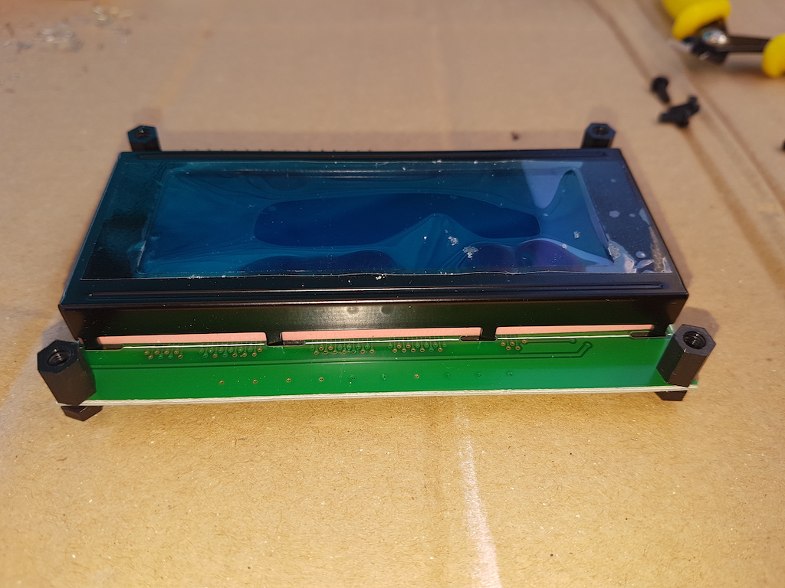
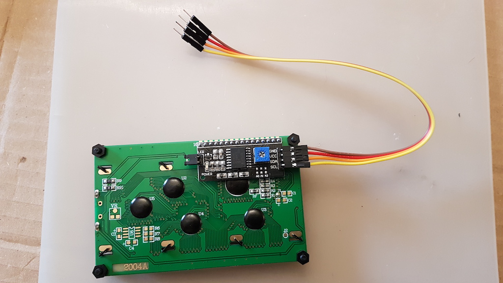
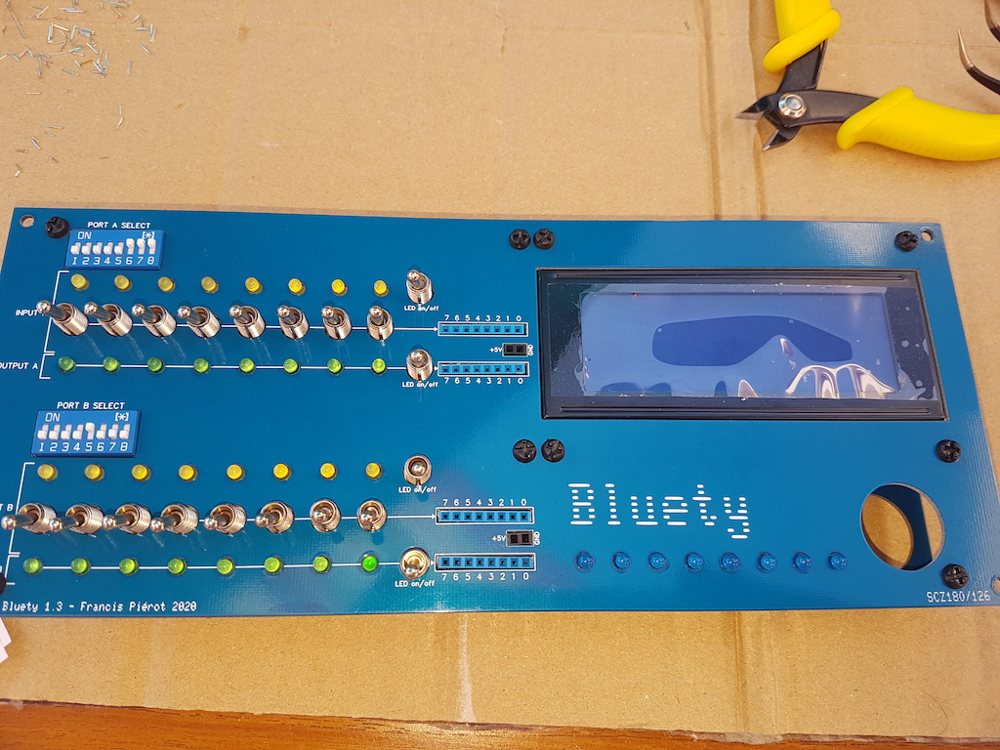
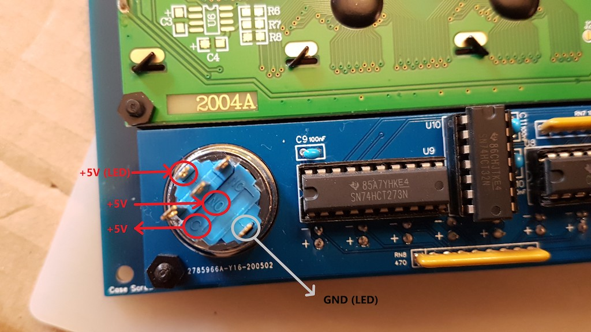
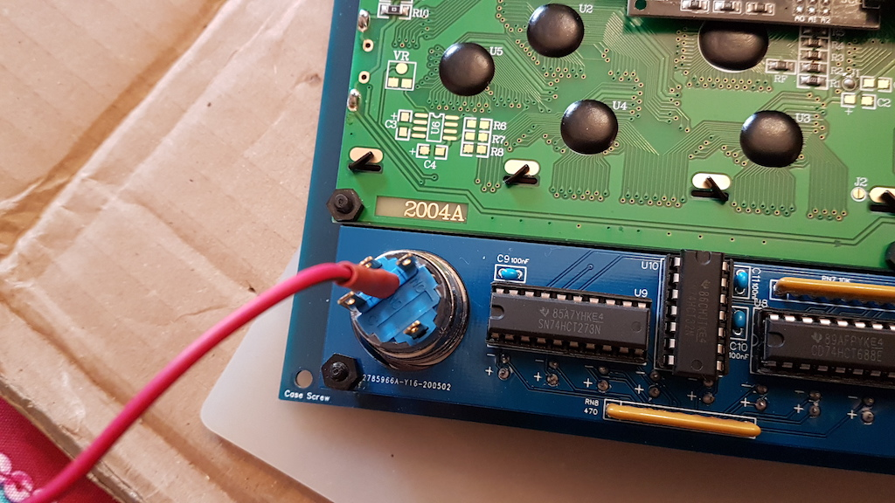
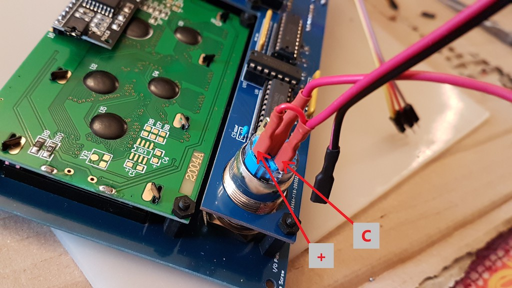
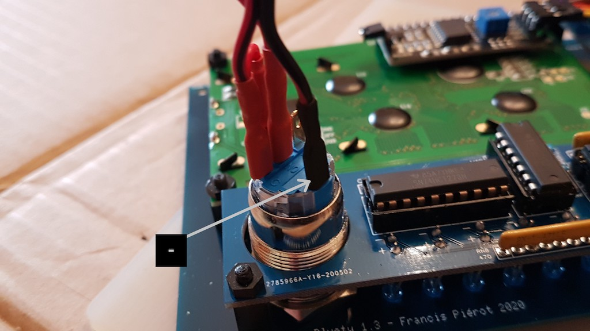

# VI) Assembling the front panel

The front panel has opening for the switches, connectors and LEDs of the Blink'n Switch board.
It also features a 4x20 LCD retro lighted display and a power button with LED.
.)

To assemble the LCD screen and the power button,  you must unscrew the front panel from Blink'n Swicth a last time.

## VI-1) LCD 4x20 display

| Step  | Description                                                  |                                                           |
| ----- | ------------------------------------------------------------ | --------------------------------------------------------: |
| 1     | Unscrew the front panel.                                          |                                                           |
| 2     | Fix 4 10mm supports on the screen, with the bolt on front and the nut on the back. Do not use the wrong supports or the screen will be too far from the front panel. |           |
| 3     | Attach the 4 wires cable on the display I2C connector. It is best to do this at this step as it will be more difficult after the display has been fixed on the front panel because of the neighboring circuits. |  |
| 4     | Screen the screen on the front panel using the supports screws on the attached bolts. |           |

## VI-2) Power button

Notice that at this time the front panel is still separated from Blink'n Switch, or you won't be able to fix the power button on the front panel.
So if it's not done, unscrew the front panel.

| Step | Description                                                                     |                                                                              |
| ------| ------------------------------------------------------------------------------- | ---------------------------------------------------------------------------- |
| 1     | If needed, unscrew the front panel.                                       |                                                                              |
| 2     | Screw the power button using the nut on the back screw thread. If you want to use the rubber joint, put it on the thread before putting the button in its hole, so it lies on the front of the panel, but this joint has no pratical use. |             |
| 3     | Screw the front panel on Blink'n Switch. This is the last time, so you can screw it solidly.                        |                                                                              |
| 4     | Notice the buttons pins marks: **+** et **-** on the outside are powering the button LED, **NO** is the input +5V, **C** is the output +5V when the button is switched on, and **NC** will stay unconnected. |  |
| 5     | Connect the longest red wire on the central **NO** pin. |  |
| 6     | Connect the 3 wires cable: ● the long red wire on the **C** pin and the short red wire on the **+** pin ● the long black wire on the **-** pin |   |

<TABLE><TR><TD></TD><TD>

The free cables extremities will stay free until the back panel is fixed on the case. 
</TD></TR></TABLE>
