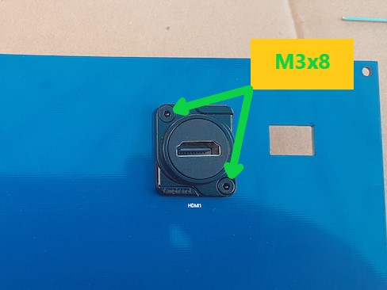
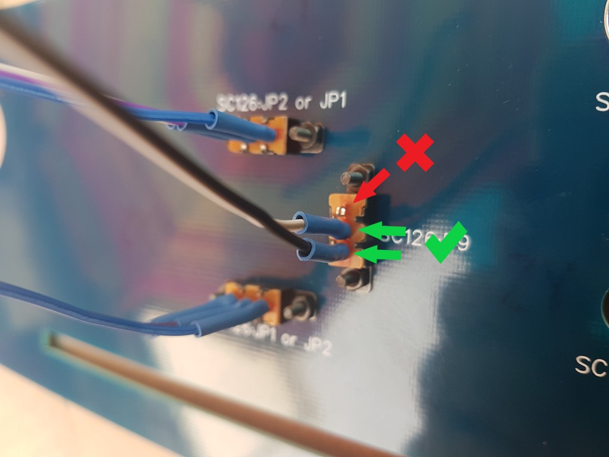
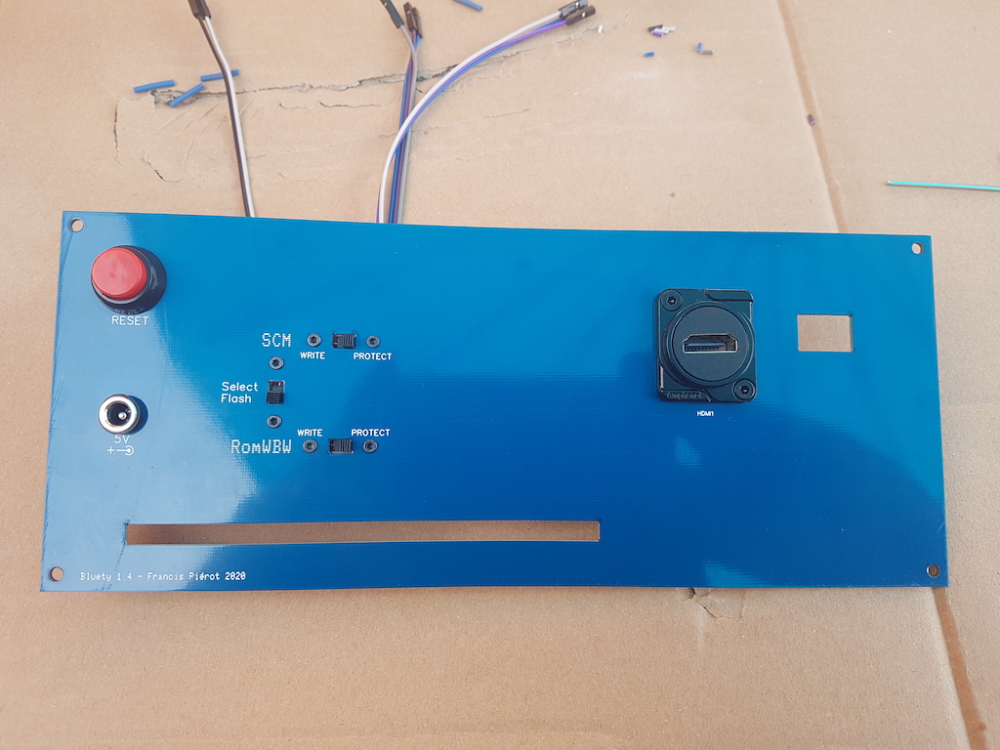

# VII) Façade arrière

La façade arrière offre :

- des micro-interrupteurs pour contrôler les mémoires FLASH de l'ordinateur SC126
- un connecteur HDMI et une ouverture permettant de passer un câble USB pour une liaison directe vers un PiZero Terminal
  RC2014 et de relier la prise HDMI de celui-ci
- un connecteur d'alimentation pour un transformateur 5V à prise jack
- un bouton reset
- une ouverture en bas de la façade pour passer les cables vers les connecteurs arrière du SC126

Les micro interrupteurs sont livrés soudés avec un câble de longueur convenant à un SC126. Si vous utilisez un boîtier
plus grand ou un autre ordinateur, vous pouvez utiliser des cables Dupont male/femelle comme rallonge ou sertir vos
propres câbles, les branchements restent identiques. Pour les câbles de l'alimentation principale qui relient
le connecteur d'alimentation, le bouton marche/arrêt et le bornier J2, utilisez de préférence du fil de
section 1,5 mm^2^ car ce câble véhiculera le courant pour l'ordinateur lui-même, mais aussi tous ses
périphériques, les LEDs, l'écran LCD etc. 

Notez que les autres ordinateurs RC2014 ne proposent pas forcément le choix entre deux ROMs.

Cette étape de l'assemblage ne concerne que le placement des éléments, les branchements seront effectués ultérieurement.

## VII-1) Connecteur HDMI

Ce connecteur est destiné à servir de relai entre la façade arrière et une carte RC2014 disposant d'une sortie HDMI Mini.
Grâce à ce connecteur, le branchement d'un câble HDMI est beaucoup moins fragilisant pour la carte RC2014 qui le reçoit.

Il existe au moins deux cartes proposant une sortie vidéo HDMI :

- [PiZero Terminal](https://www.tindie.com/products/Semachthemonkey/raspberry-pi-zero-serial-terminal-for-rc2014/)
  de Spencer Owens, utilisant un PiZero comme terminal série et qui envoie également sa sortie vidéo sur la prise HDMI
  Mini du PiZero. Le logiciel interne PiGfx est en cours de développement actif, et vous pouvez récupérer les releases
  [à partir de GitHub](https://github.com/fbergama/pigfx/releases) pour mettre à jour la carte SD livrée avec le kit
  qui contient une ancienne version.
- [BusRaider](https://www.tindie.com/products/robdobson/play-retro-games-rc2014-graphics-kit/) de Rob Dobson, une carte
  étonnante qui prend le contrôle du bus et du processeur d'un ordinateur RC2014 pour émuler un TRS-80, un ZX Spectrum
  ou d'autres ordinateurs à l'aide d'une image de leur ROM. Cette carte utilise également un PiZero pour sa sortie vidéo
  sur prise HDMI Mini.

Il existe également des cartes avec des sorties VGA et un affichage graphique, mais elles ne vous permettront pas
 d'afficher les entrées/sorties des logiciels de contrôle BASIC, CP/M ou SCM comme le font les cartes PiZero.

| Etape | Description                                                  |                                                              |
| ----- | ------------------------------------------------------------ | -----------------------------------------------------------: |
| 1     | Vissez le connecteur HDMI à l'aide des deux vis M3x8.        |  |

## VII-2) Interrupteurs ROM Select et Protect

Ces 3 interrupteurs correspondent directement à des jumpers sur la carte du SC126 et n'ont pas d'usage avec d'autres kits
d'ordinateurs mais vous pouvez les utiliser pour n'importe quels jumpers et placer des étiquettes sur le panneau arrière pour indiquer
leur véritable fonction. Le chpoix vous appartient.

| Etape | Description                                               |                                                              |
| ----- | --------------------------------------------------------- | -----------------------------------------------------------: |
| 2     | Vissez le micro interrupteur avec 2 fils sur la position verticale "flash select" à l'aide des vis M2x8 et d'une clé Allen ou d'un tournevis à tête hexagonale (non fourni). |  |
|      | Attention : si vous avez placé la RomWBW en U1 sur SC126, vous devez mettre les deux fils en bas. Si par contre vous avez placé la rom SCM en U1 vous devez mettre les deux fils en haut. |  |
| 3     | Vissez les deux interrupteurs avec 3 fils aux positions "flash protect" horizontales à l'aide de 4 vis M2x8. |           |
| 4     | Vissez le connecteur d'alimentation. L'orientation n'a pas d'importance mais retenez que la patte la plus *longue* est la masse (GND) et la patte la plus *courte* est le +5V, contrairement à la convention des LEDs et condensateurs. |   |
| 5     | Vissez le bouton reset, la position des pattes n'a pas d'importance. Branchez le cable Reset avec les extrémités jaunes. |                              |

La façade arrière présente alors l'aspect suivant.

