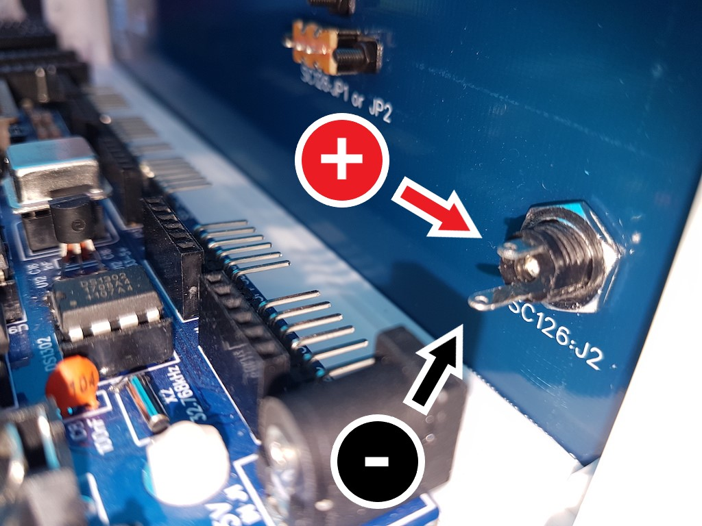
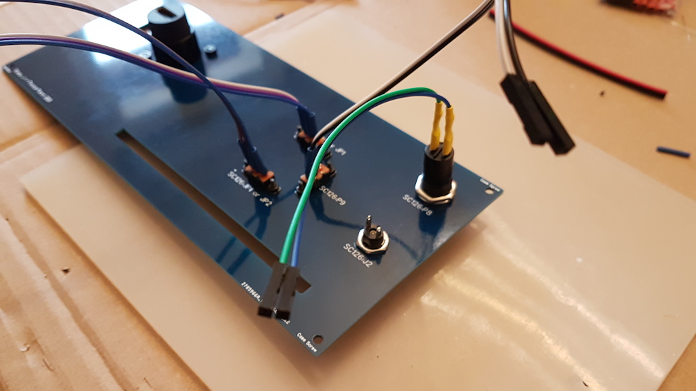

# Assembling the back panel

The back panel receives the following:

- micro switches to control the flash memories on SC126 computer
- one HDMI connector and an opening for an USB cable for connecting to an RC2014 PiZero Terminal
- a power connector for a 5V jack
- a reset button
- an opening on the panel bottom for cables to the many back connectors on SC126

The micro switches must be cabled with wires length adjusted for a SC126. If you use a bigger case or 
another computer, you might use Dupont male/female cables as extensions or build longer cables. For the main power
cables linking the back panel power connector, the power button on front panel and the J2 terminal on SC126, you'd use
1.5mm2 wires as this cable will drive the current not only for the computer but also its peripherals, LEDs,
LCD screen etc. Any section will be fine for the low current it has to drive but a larger one will help to stabilize the current. 

Notice that most RC2014 do not necessarily give a ROM choice and micro switches would be useless for them.

This assembly step is only about placing the elements, as connecting will be done later.

## HDMI connector

This connector is a relay between the back panel and an RC2014 PiZEro Terminal HDMI-mini output. It protects the Pi
HDMI plug and avoid tension on the RC2014 computer bus slot hosting the PiZero Terminal board.

Examples of RC2014 expansion boards with an HDMI output are:

- [PiZero Terminal](https://www.tindie.com/products/Semachthemonkey/raspberry-pi-zero-serial-terminal-for-rc2014/)
  from Spencer Owens, using a PiZero as a serial terminal and sending video output on the PiZero HDMI output.
  The internal software PiGfx is in active development and you can get new releases and put them on the SD card
  to update the official SD card which contains an old version. Get the releases
  [from GitHub](https://github.com/fbergama/pigfx/releases).
- [BusRaider](https://www.tindie.com/products/robdobson/play-retro-games-rc2014-graphics-kit/) from Rob Dobson, 
  a stunning card which takes control of the Z-80 and RC2014 bus to emulate a TRS-80, a ZX-Spectrum and other
  old computers using a ROM image. It also uses a PiZero to emulate the video display on the HDMI output.

There are also a number of cards with VGA outputs and a graphical display but they do not display the inputs and outputs
of control softwares as BASIC, CP/M or SCM like the PiZero boards do.

| Step  | Description                                                  |                                                              |
| ----- | ------------------------------------------------------------ | -----------------------------------------------------------: |
| 1     | Screw the HDMI connector using the two M3x8 screws.        |  |

## ROM Select and protect switches

These 3 switches are directly linked to corresponding jumpers on the SC126 board and have no practical use on other computers kits
but you can changed them for whatever jumper you want and place taped labels on the panel printing to witness their actual function.
Choice is yours.

| Step  | Description                                               |                                                              |
| ----- | --------------------------------------------------------- | -----------------------------------------------------------: |
| 2     | Screw the 2-wires micro-switch on the vertical position "flash select" using M2x8 screws and an Allen key or an hexagonal head screwdriver (not included in the kit). |  |
|      | Beware : if you've put the RomWBW flash in U1 on your SC126, put the two wires on the bottom position. If you placed the SCM flash in U1 then put the two wires on the top position. |  |
| 3     | Screw the two 3-wires micro-switches on the horizontal positions "flash protect" with M2x8 screws. |           |
| 4     | Screw the power connector. Orientation is not important but remember that the longest pin is for the ground (GND) and the shortest is for +5V, which is the contrary of capacitors and LEDs. |   |
| 5     | Screw the BRB reset (Big Red Button), pins orientation is not important. Plug the Reset cable on it, there is no + and GND poles on this button. |                              |

The back panel will then look like this.

