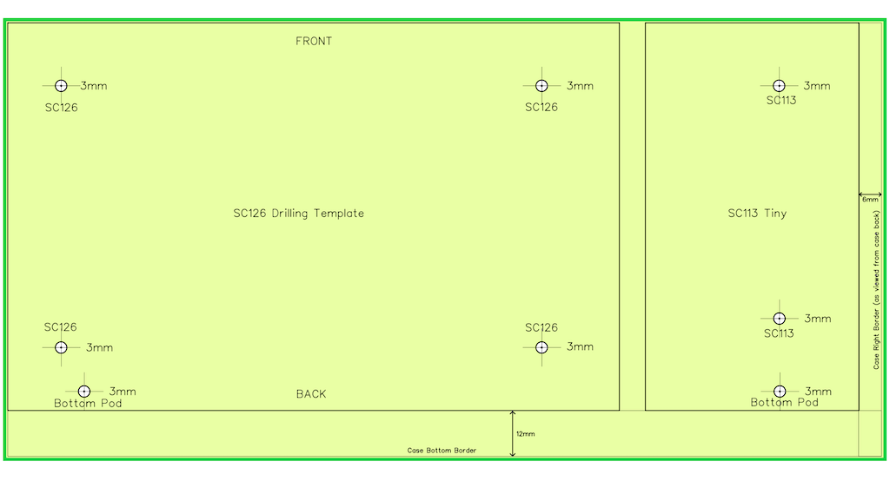
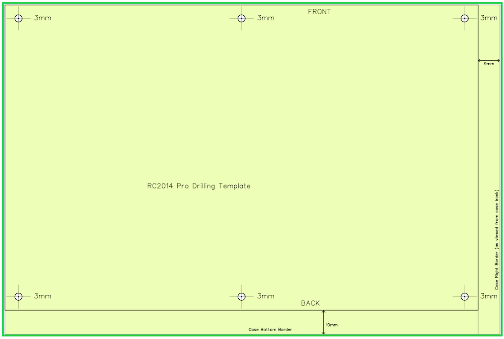

# Installation et branchements

Tous les composants sont fixés ou soudés, il reste maintenant à effectuer les branchements et l'installation de
l'ordinateur dans le boîtier.

## Installation SC126 / RC2014

Vous trouverez deux gabarits de perçage : un pour le SC126 de Stephen S. Cousins avec ou sans l'extension de bus FP113-Tiny, 
l'autre pour le RC2014 [Backplane Pro](https://www.tindie.com/products/Semachthemonkey/backplane-pro-for-rc2014-z80-homebrew-computer/) 
de Spencer Owens également disponible avec le kit RC2014 Pro.

| Etape | Description                                                                                                |                                                              |
| ----- | ---------------------------------------------------------------------------------------------------------- | -----------------------------------------------------------: |
| 1     | Dévissez le fond du boîtier. Il y a quatre vis avec des boulons sur les côtés, et deux vis sur le dessous. |  |
| 2     | Dévissez les quatre pieds du fond du boîtier et mettez à l'abri les pieds et leurs vis.                    |  |
| 3     | Découpez le gabarit de perçage qui vous concerne (drilling template) :                                     |                                                              |
|                                                  | ● Pour le **SC126 seul**, découpez le gabarit SC126 : le bord droit de la découpe correspond au bord gauche du FP113 Tiny et le bord inférieur est 10 mm en dessous du rectangle du SC126. |  |
|                                                  | ● Pour le **SC126 avec le FP113 Tiny**, découpez le gabarit SC126 : le bord droit de la découpe est 6 mm à droite du bord droit du FP113 Tiny et le bord inférieur est  10 mm en dessous du rectangle du SC126. |  |
|                                                  | ● Pour le RC2014 Pro et/ou le **Backplane Pro**, découpez le gabarit RC2014. Le bord droit de la découpe est 9 mm à droite du bord droit du Backplane Pro et le bord inférieur est 10 mm en dessous du rectangle du Backplane Pro. |  |
|                                          | Vous pouvez modifier légèrement la position du gabarit mais : ● N'avancez pas trop le gabarit vers la façade avant, l'interrupteur du SC126 risque de buter contre Blink'n Switch ou la façade. Si vous avez assemblé le SC126 sans l'interrupteur vous avez davantage de marge. ● Ne le reculez pas trop non plus car le connecteur HDMI risque de buter contre des composants d'une carte située sur le bus RC2014.  ● Ne l'éloignez pas trop du bord droit si vous voulez pratiquer une ouverture pour l'extension de bus du FP113 Tiny. Pour le RC2014, si vous le rapprochez trop à gauche vous risquez de buter contre le bouton marche/arrêt. |  |
| 4     | Scotchez le gabarit sur le fond du boitier pour qu'il ne se déplace pas pendant le perçage. | |
| 5     | Percez le fond métallique du boîtier à l'emplacement des marques sur le gabarit avec une mèche métal de **3&nbsp;mm**. Pour percer ces trous, la technique est de donner un coup de pointeau au centre du trou indiqué sur le gabarit, puis d'utiliser une perceuse à colonne (par exemple une Dremel) pour faire un trou vertical bien centré. On peut faire un avant-trou avec une mèche de 1 mm si on le souhaite mais le fond du boîtier n'étant pas très épais une mèche de 3 mm ne rencontrera pas de difficulté majeure. Vous pouvez huiler légèrement pour éviter que le papier du gabarit brûle. ● Pour **SC126 seul**, vous devrez percer **5 trous** : les 4 trous pour fixer SC126, et 1 trou pour déplacer un pied du fond de  boîtier.  ● Pour le **SC126 + FP113 Tiny**, vous devrez percer **8 trous** : les 4 trous du SC126, 2 pour le FP113 Tiny, et 2 pour déplacer des pieds du fond de  boîtier. ● Pour le **RC2014**, vous devrez percer **6 trous** pour le Backplane Pro, il n'y a pas besoin de déplacer de pieds pour cette configuration. |  |
| 6     | FACULTATIF : Vous pouvez faire une ouverture sur le côté droit du boîtier (vu de l'arrière) pour que le port d'extension du FP113 Tiny soit accessible à l'extérieur. Dans ce cas, calez le gabarit contre le bord droit pour que le connecteur d'extension soit au plus près de ce bord. C'est le réglage par défaut donc vous n'avez pas besoin de modifier le gabarit. Vous pouvez décaler de 2 mm à droite si vous souhaitez que l'extension de bus soit au ras de la surface extérieure. |  |
| 7     | Branchez le câble I2C sur le SC126, l'accès sera moins aisé une fois la façade arrière mise en place. Prenez soin de respecter la correspondance des fils : repérez le fil GND sur l'écran LCD pour le brancher sur la broche 0V du connecteur I2C sur le SC126 et faites de même pour les trois autres câbles, l'ordre est identique donc vous ne devez pas avoir de fil croisé. |   |
| 8     | FACULTATIF : Branchez un câble Dupont (*non fourni*) sur le port série 1 si vous souhaitez l'utiliser plus tard car  l'accès sera moins aisé une fois la façade arrière en place.  Notez que le genre du câble dépend des choix que vous avez adoptés lors de l'assemblage de votre SC126. Je vous conseille de le brancher sur le connecteur vertical car il sera moins susceptible de se décrocher du connecteur du SC126. |  |
| 9     | Vissez les supports sur le SC126 : **4** pour SC126, **6** pour la combinaison SC126 + FP113 Tiny, **6** pour le RC014 Backplane Pro.  Pour le FP113 Tiny, placez les supports sur les trous situés le plus à droite. |  |
| 10    | Fixez le SC126 ou le RC2014 à l'aide des supports boulons vis. Les vis des supports iront sous le boîtier, et les boulons sont normalement déjà vissés sur le dessus de la carte. |  |
| 11    | A cet instant vous allez fixer les deux façades définitivement avant de terminer les derniers branchements. • Fixez la façade avant • Fixez la façade arrière. Si vous avez branché un câble série, passez le à travers l'ouverture du bas avant de visser la façade. |  |

## Branchement BusDaughter Blink'n Switch

| Etape | Description                                                          |                                                              |
| ----- | -------------------------------------------------------------------- | -----------------------------------------------------------: |
| 1     | Branchez les deux cables 12 fils sur la BusDaughter en prenant soin de respecter le repérage du fil A7 effectué lors du branchement sur Blink'n Switch. |  |
| 2     | Installez la carte BusDaughter dans l'emplacement bus de votre choix |                                                              |
| 3     | Attention : le coin biseauté de la carte se présente sur l'avant de l'ordinateur |  |
| 4     | Attention : enficher la carte sur le côté droit du connecteur de bus de 2x40 prises (vu de l'arrière vers l'avant), la première broche (vers l'avant) se place dans le trou marqué "1" sur le circuit imprimé. Normalement, les deux câbles doivent rester parallèles. Le plus à droite sur Blink'n Switch sera aussi le plus à droite sur BusDaughter. Si ce n'est pas le cas, vérifiez le branchement. |   |

## Façade avant

L'écran LCD n'a pas de fonction prédéfinie sur un RC2014 Pro car il n'a pas de bus I2C, aussi les instructions
qui concernent le LCD ne s'appliquent qu'au SC126.

Les branchements sont facilités si vous avez connecté les câbles de l'écran LCD et du bouton marche/arrêt *avant* de visser la façade :

- Si vous n'avez pas déjà fixé le câble I2C sur l'écran LCD, dévissez l'écran de la façade, branchez le câble puis revissez l'écran.
  Reportez-vous à la section [Façade avant](06-Assembling Front Panel.fr.md) pour le branchement.
- Si vous n'avez pas fixé les câbles sur le bouton d'alimentation, dévissez la façade, effectuez les branchements comme indiqué dans
  la section [Façade avant](06-Assembling Front Panel.fr.md) puis revissez la façade.

## Façade arrière

En bas de la façade, une ouverture permet de passer les câbles utiles pour les nombreux connecteurs du SC126, par exemple la prise série
pour contrôler l'ordinateur via une machine de bureau ou portable (si vous avez suivi les indications, un câble est déjà installé et passe
à travers cette ouverture).

### HDMI (RC2014, SC126)

Le connecteur HDMI se branche par la rallonge fournie dans le kit directement sur une carte *PiZero Terminal* ou *BusRaider*, permettant
d'avoir une sortie écran couleur via le logiciel interne (PiGfx ou BusRaider).

L'orifice à côté de la prise HDMI permet de passer une rallonge USB pour brancher un clavier USB sur un PiZero Terminal. Cette ouverture
a été préférée à une prise USB en raison des difficultés à trouver un connecteur approprié.

| Etape | Description                                                                                                            |     |                                                   |
| ----- | ---------------------------------------------------------------------------------------------------------------------- | --- | ------------------------------------------------: |
| 1     | Branchez le raccord HDMI sur le connecteur intérieur de la façade arrière, puis sur votre PiZeroTerminal ou BusRaider. |     |  |

### Interrupteurs ROM (SC126 seulement)

Les interrupteurs de sélection permettent de choisir entre les deux ROM du SC126 et d'autoriser leur écriture pour une mise à jour. 
Ils se connectent directement sur des jumpers de configuration du SC126.

Ces interrupteurs n'ont pas de fonction pour une configuration RC2014 Pro.</TD></TR></TABLE>

| Etape | Description                                                  |      |                                                              |
| ----- | ------------------------------------------------------------ | ---- | -----------------------------------------------------------: |
| 1     | Branchez les **deux interrupteurs** **3 fils** sur les connecteurs **JP1** et **JP2** du SC126 : attention à placer le bon câble sur le bon connecteur selon que vous avez placé RomWBW en U1 et SCM en U2 ou l'inverse. L'interrupteur situé en haut va sur le connecteur de la ROM SCM, et celui du bas sur celle de RomWBW. Les fils ne doivent pas se croiser ou subir de torsion : vu de l'arrière, le fil le plus à droite sur l'interrupteur est aussi à droite sur la carte SC126 et correspond à la position "PROTECT" à la fois sur la carte et sur l'inscription de la façade arrière. |      |   |
| 2     | Branchez **l'interrupteur** **2 fils** sur le connecteur **P9** : si vous avez RomWBW en U1, les deux fils doivent se situer en bas. Si en revanche vous avez placé SCM en U1, les deux fils doivent se trouver en haut. |      |  |

### RESET

Le bouton Reset est particulièrement utile pour les utilisateurs de la carte PiZero Terminal qui nécessite parfois un reset après
la mise en marche, mais aussi lorsqu'une erreur de programme bloque l'ordinateur, ce qui arrive beaucoup plus facilement avec un Z-80 
qu'avec un processeur moderne.

### SC126

| Etape | Description                                                  |      |                                                              |
| ----- | ------------------------------------------------------------ | ---- | -----------------------------------------------------------: |
| 1     | Branchez le cable du bouton reset avec les **fiches jaunes** sur le connecteur **P8** et le bouton de la façade. Pour ce câble la position des fils n'a pas d'importance. |      |                                        |

### RC2014

**TDB**

## Bouton alimentation

### SC126

Le bouton de la façade avant est relié au connecteur d'alimentation de la façade arrière et contrôle l'alimentation du SC126 via le
connecteur **J2**. Pour que ce dernier puisse alimenter le SC126 il faut placer l'interrupteur de la carte SC126 en position ON, afin
de déporter la fonction ON/OFF sur le bouton de la façade avant.

| Etape | Description                                                  |                                                              |
| ----- | ------------------------------------------------------------ | -----------------------------------------------------------: |
| 1     | FACULTATIF : si vous avez remplacé l'interrupteur du SC126 par un connecteur à trois broches, placez un jumper sur les deux broches les plus éloignées du bord de la carte. Sinon, mettez simplement l'interrupteur rouge en position ON (vers la droite lorsque l'on regarde la carte SC126 de l'arrière). |       |
| 2     | Branchez le fil rouge de la broche **C** du bouton on/off sur la borne 5V du bornier J2 du SC126 |  |
| 3     | Branchez le fil noir de la broche **-** et le câble noir séparé sur la borne GND du bornier J2 |  |
| 4     | Branchez le fil **rouge** provenant du bouton marche/arrêt sur la cosse **la plus courte** du connecteur d'alimentation arrière  Branchez le fil **noir** provenant du bornier J2 sur la cosse **la plus longue** du connecteur d'alimentation arrière. |  |

### RC2014

**TBD**
