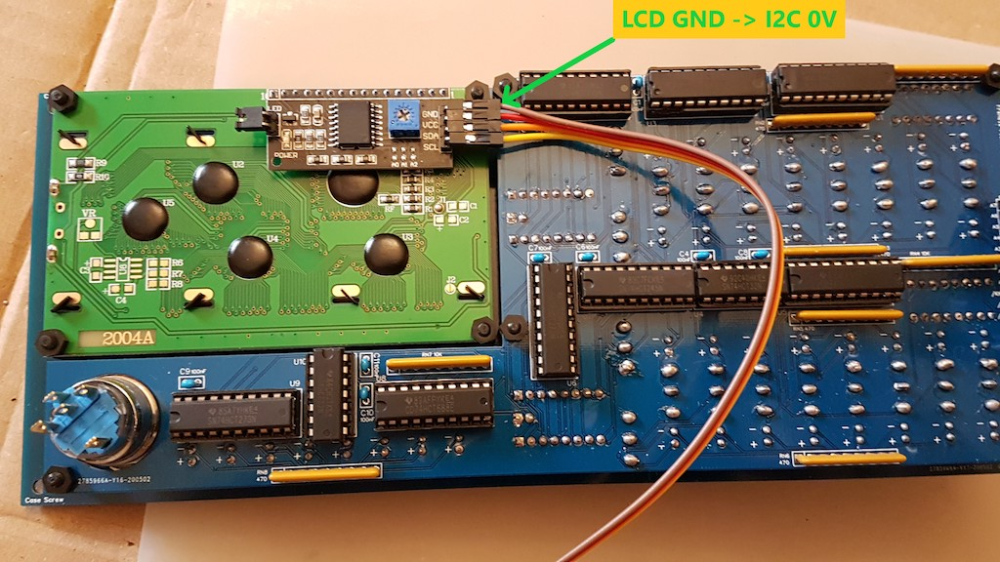
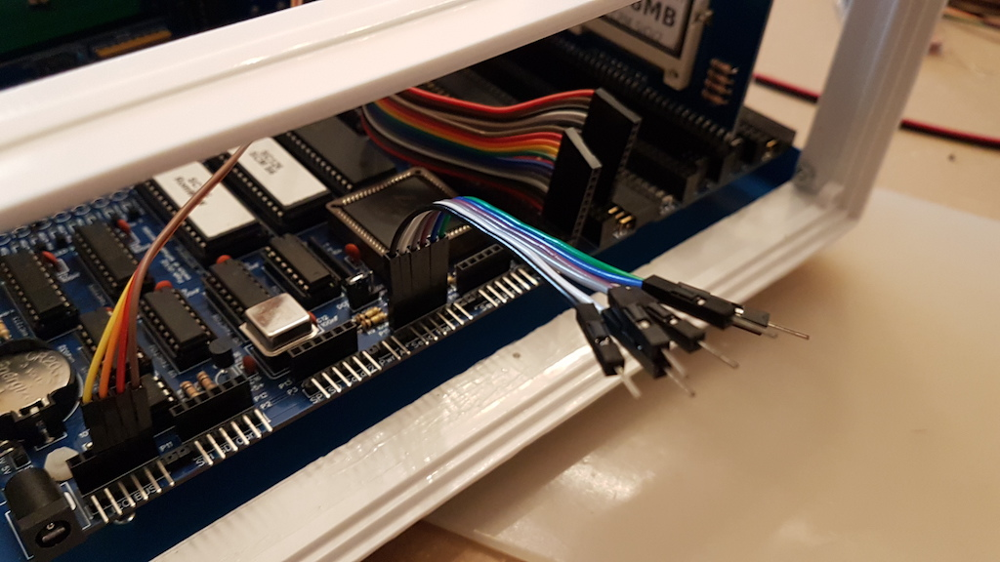
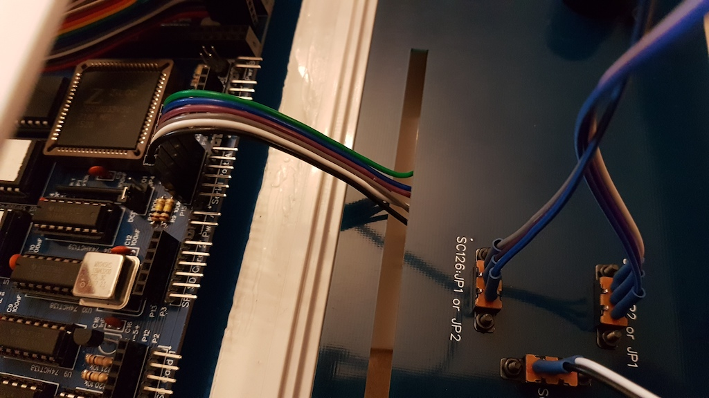
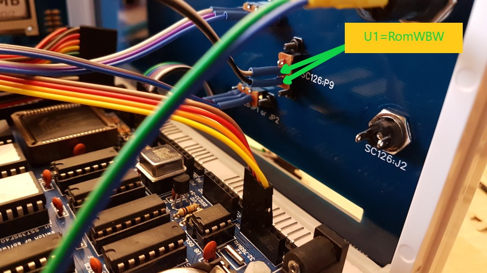
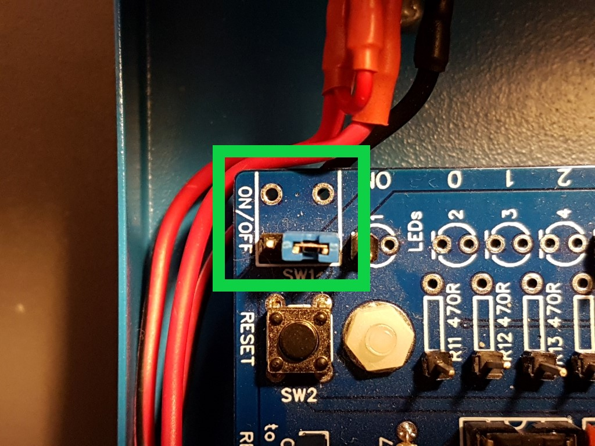
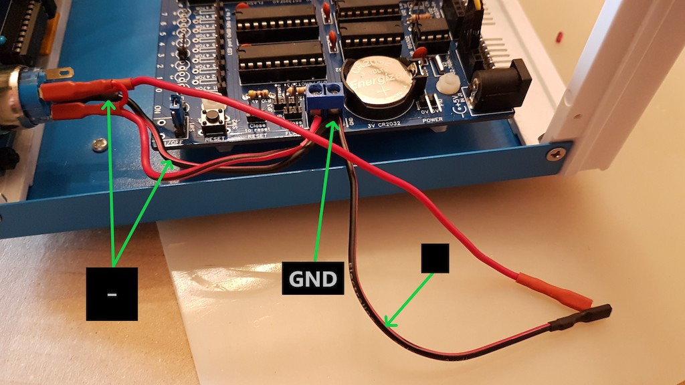

# Installing and wiring

Now that every component is soldered or screwed comes the time to connect wires and install the computer in its case.

## Installing an SC126 / RC2014

You will find two drilling templates: one for the SC126 from Stephen S. Cousins with or without the FP113-Tiny expansion,
the other for the RC2014 [Backplane Pro](https://www.tindie.com/products/Semachthemonkey/backplane-pro-for-rc2014-z80-homebrew-computer/)
from Spencer Owens which you can also get with his RC2014 Pro kit.

| Step  | Description                                                                                                |                                                              |
| ----- | ---------------------------------------------------------------------------------------------------------- | -----------------------------------------------------------: |
| 1     | Unscrew the case bottom. There are 4 screws with nuts on sides and 2 screws on the bottom. |  |
| 2     | Unscrew the 4 feets pads and put them apart in a safe container with their screws.                  |  |
| 3     | Cut the drilling template you need:                                     |                                                              |
|                                                  | ● For **SC126 alone**, cut the SC126 template: the right border cut matches with the left side of the FP113-Tiny position and the bottom border is 10mm below the SC126 rectangle. |  |
|                                                  | ● For **SC126 with FP113 Tiny**, cut the SC126 template: the cutting right border is 6mm to the right of the FP113-Tiny right border and gthe bottom border is 10mm below the SC126 rectangle. |  |
|                                                  | ● For **RC2014 Pro** or **Backplane Pro**, cut the RC2014 template. The cutting right border is 9mm to the right of Backplane Pro right border and the bottom border is 10mm below the Backplane Pro rectangle. |  |
|                                          | You may slightly move the template position but: ● don't put the template too close to front panel, the SC126 power switch could conflict with Blink'n Switch or the front panel. You have more available space if you didn't solder the SC126 power switch. ● Don't move it back too much or the HDMI connector could conflict with components of an RC2014 bus inserted board.  ● Don't put iot too far from the right side if you want to pratice an opening for further expansion of the FP113-Tiny with other SC113s or RC2014 bus expanders. For the RC2014, putting it too close on the left side could conflict with the power switch. |  |
| 4     | Tape the template at its position on the case bottom so it doesn't moive while drilling. | |
| 5     | Drill holes in the case bottom metal plate on the relevant template marks using a metal drill of **3&nbsp;mm**. To drill such holes in metal, first hit the center with a needle so the drill won't slip on the surface. Then use a column drill (e.g. a Dremel), gently pull the lever down so the drill nearly touches the sirface, place your plate so the drill is right over the template mark center, then power the drill and use the lever to drill a nive vertical hole. You can start with a 1mm drill to make a guiding hole first but this is not necessarily needed. Use a little oil to avoid the template paper burning if you want. ● For **SC126 alone**, you must drill **5 holes**: 4 to fix the SC126, and 1 to move one of the case foot pads from its original position.  ● For **SC126 + FP113-Tiny**, you must drill **8 holes**: 4 to fix the SC126, 2 for the FP113-Tiny, and 2 to move bottom foot pads to another position. ● For **RC2014**, you must simply drill **6 holes** to fix the Backplane Pro, there's no need to move any case foot pad. |  |
| 6     | OPTIONAL: You may practice an opening on the right side of the case (as seen from back) if you want FP113-Tiny expansion connector to be accessible from exterior. FP113 Tiny soit accessible à l'extérieur. To do so, push the template against the right border so the connector will be as far to the right as possible. This is the default position so you don't need to modify the template. You can push 2mm more to the right if you want the connector to be exactly aligned with the exterior surface. |  |
| 7     | SC126 ONLY: Connect the I2C cable coming from LCD to the SC126, access will be less easy after back panel has been fixed. Take care of the wires orientation: follow the LCD GND wire and connect it to the 0V I2C header on SC126, then repeat for the other wires. The order is identical so there should be no wire crossing. |   |
| 8     | OPTIONAL: Connect a Dupont cable (not included in kit) on serial port 1 if you want to access it later, as access will be more difficult after back panel has been fixed. Notice the cable sex depends on the choice you made when assembling SC126 : please consult Stephen S. Cousins documentation about the SC126 back headers various possibilities. My advice is to use a vertical header as the cable will less likely jump out of the header. |  |
| 9     | Screw the support bolts on the computer main board: : **4** for SC126, **6** for SC126 + FP113 Tiny, **6** for RC014 Backplane Pro.  For the FP113 Tiny, place the bolts on the rightmost holes. |  |
| 10    | Screw SC126 or RC2014. The support screws will go under the bottom plate, and nuts should already be screwed on top of the main board. |  |
| 11    | At this time you will finally fix the front and back panels before last connections. • Screw the front panel. • Screw the back panel. If you connectedf a serial cable, pull it through the bottom side opening before screwing the back panel. |  |

## Connecting BusDaughter and Blink'n Switch

| Step  | Description                                                          |                                                              |
| ----- | -------------------------------------------------------------------- | -----------------------------------------------------------: |
| 1     | Connect the two 12-wires cables on BusDaughter, refering to the A7 wire you marked when connecting to Blink'n Swtch. |  |
| 2     | Install the BusDaughter board in the bus connector of your choice. |                                                              |
| 3     | Beware: the board angled corner must be on the front panel side. |  |
| 4     | Beware: put the board into the rightmost 1x40 bus in the 2x40 bus connector as seen from back. The first pin (toward front) must match the "1" marked hole on the printed board. Normally, the two cables should be parallel. The rightmost on Blink'n Switch will also be the rightmost on BusDaughter. |   |

## Front panel

The LCD screen has no predefined function on the RC2014 Pro as it doesn't have an I2C bus, so the LCD related
instructions only apply to the SC126.

Connecting is easier if you already connected the LCD screen and power button cables *before* screwing the panel:

- If you didn't attach the I2C cable on the LCD screen, unscrew the LCD from the front panel, connect the cable then
  screw again the LCD screen on the front panel. Refer to the [Assembling Front Panel](06-Assembling Front Panel.md)
  part for connecting the I2C cable.
- If you didn't attach the power button cable, unscrew the front panel, connect the power button as explained in
  [Assembling Front Panel](06-Assembling Front Panel.md), then screw the front panel again.

## Back panel

At the bottom of the back panel lies an opening facing the numerous SC126 connectors, like serial port to allow control from
a terminal software on a desktop or portable computer. (If you followed instructions, a cable is already installed on serial port
and goes through this panel opening.)

### HDMI (RC2014, SC126)

The HDMI connector is connected to a *PiZero Terminal* or *BusRaider* board HDMI with the HDMI cable extension featured in the Bluety kit,
allowing a color display from internal software. (PiGfx or BusRaider.)

The opening beside the HDMI connector allows an USB cable extension to plug an USB keyboard on PiZero Terminal. It has been prefered to
an USB connector because of difficulties finding an appropriate connector.

| Step  | Description                                                                                                            |     |                                                   |
| ----- | ---------------------------------------------------------------------------------------------------------------------- | --- | ------------------------------------------------: |
| 1     | Connect the HDMI cable extension on the interior side of the HDMI connector on back panel, then on your PiZeroTerminal or BusRaider. |     |  |

### ROMs switches (SC126 only)

The select switches let you choose between the two SC126 flashs ROMs and allow or disable writing for updating them. The connect
directly on corresponding confuguration jumpers on the SC126 board.

<TABLE><TR><TD></TD><TD>These switches have no defined function on
an RC2014 Pro configuration.</TD></TR></TABLE>

| Step  | Description                                                  |      |                                                              |
| ----- | ------------------------------------------------------------ | ---- | -----------------------------------------------------------: |
| 1     | Connect the **two 3-wires switches** to **JP1** and **JP2** on SC126: make sure you place the right wires on the right connector depending on where you place RomWBW in U1 or U2. The switch on the top position goes to the connector for SCM, and the one on the bottom position goes to RomWBW. The cables should not cross: viewed from the back, the rightmost wire on the switch is also on the righton the SC126 obard and correspond to "PROTECT" both on the SC126 board and on the back panel printing. |      |   |
| 2     | Connect the **2-wires switch" to **P9** on SC126: if you have RomWBW in U1, the wires should be on the bottom. If you placed SCM in U1, the wires should be on the top. |      |  |

### RESET

The reset button is particularly useful for the PiZero Terminal users as it may require a reset after switching the computer ON, 
but it also serves when a program freezes the computer, as crashing bugs can lock a Z-80 much more easily than a modern CPU.

### SC126

| Step  | Description                                                  |      |                                                              |
| ----- | ------------------------------------------------------------ | ---- | -----------------------------------------------------------: |
| 1     | Connect the reset cable with the yellow connectors to **P8** on the  SC126 and to the panel button.Pour ce câble la position des fils n'a pas d'importance. |      |                                        |

### RC2014

**TDB**

## Power button

### SC126

The power button is connected to the power connector on back panel and controls the SC126 power through the **J2** connector.
In order to power the SC126 with the later, the SC126 normal power switch must be set to ON position so the powering function
will be handled by the front panel power button.

| Step  | Description                                                  |                                                              |
| ----- | ------------------------------------------------------------ | -----------------------------------------------------------: |
| 1     | OPTIONAL: if you replaced the SC126 power switch with a 3-pins header, put a jumper on the two pins on the rightmost pins as viewed from back. |       |
| 2     | Connect the red wire from the **C** pin of power button to the 5V pin of J2 header on SC126. |  |
| 3     | Connect the black wire from the **-** and the black cable to the GND pin on J2 |  |
| 4     | Connect the **red** wire from power button To the **shortest** pin on the back panel power connector.  Connect the **black** wire from J2to **the longest** pin on back panel power connector. |  |

### RC2014

**TBD**
