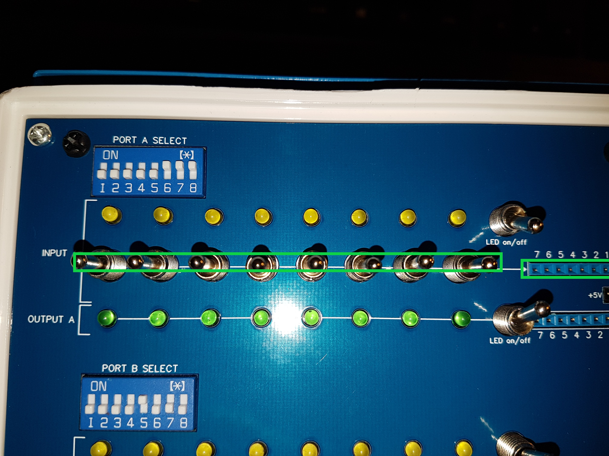

# IX) Utilisation

Les ports d'entrée-sortie sont contrôlés par des instructions IN et OUT du Z-80 ou du BASIC. L'écran LCD se contrôle via l'interface
I2C à l'aide d'une librairie à intégrer dans vos programmes, ou à l'aide de versions de SCM et BASIC en cours de développement.
Ces versions de SCM et BASIC peuvent également envoyer un écho de leur sortie console sur l'écran LCD. Les caractéristiques de l'écran,
de la console LCD et de l'écho sont contrôlées par des variables en RAM.

## IX-1) Port de contrôle (13/0Dh)

Le port de contrôle est câblé sur le numéro de port 13 (0D en hexadécimal) : ceci correspond aux deux logiciels de
contrôle disponibles pour l'ordinateur SC126.

Les 8 LED de Bluety 
sous l'écran LCD représentent le dernier octet écrit sur ce port de contrôle

- Le moniteur Small Computer Monitor affiche l'état de ses tests à l'allumage sur ce port.
- Le boot de RomWBW affiche l'avancement de son démarrage sur ce port.
- Tout programme peut allumer ou éteindre ces 8 LEDs en envoyant une donnée 8-bits sur le port 13. La LED la plus à gauche représente
le bit de poids fort : écrire 80h allumera uniquement cette LED.

"Conseil"Remarque : le port 13 retient la dernière donnée
écrite, donc il faut explicitement écrire un 0 pour éteindre les LEDs, notamment avec RomWBW qui laisse les 8 LEDs allumées à la fin
de son démarrage.
</TD></TR></TABLE>

## IX-2) Ports d'entrée sortie A et B

Les 2 ports possèdent chacun 8 LEDs pour le port en entrée et 8 LEDs pour le port en sortie. Dans les deux cas, le bit de poids fort
(bit 7) est représenté par la LED la plus à gauche.

Le numéro de chacun des deux ports est sélectionnable par les huit interrupteurs d'un dipswitch qui représentent les valeurs de 0 à 255.
Là aussi, le bit de poids fort (bit 7) est situé à gauche. Pour sélectionner le port 80h, placez l'interrupteur le plus à gauche en HAUT, et
tous les autres en bas.

### IX-2.1) Utiliser le port A ou B en entrée

Chacun des ports en entrée dispose d'un connecteur 8 fils, de 8 LEDs et de 8 interrupteurs.

| Etape | Description                                                  |                                                        |
| ----- | :----------------------------------------------------------- | -----------------------------------------------------: |
| 1     | Choisissez le numéro de port avec le DIPswitch, le bit de poids fort du numéro est représenté par l'interrupteur le plus à gauche. Par exemple, pour utiliser le port 7, on place les trois interrupteurs les plus à droite en position haute et les cinq autres en position basse. |  |
| 2     | Placez les interrupteurs en position médiane et connectez vos fils sur le port d'entrée. |      |
| 3     | Les interrupteurs peuvent être placés en position haute pour forcer un bit à 1 ou en position basse pour le forcer à 0. |           |
| 4     | L'interrupteur supérieur à droite des LEDs les active ou désactive. Chaque LED affiche l'état de l'entrée qui lui correspond. En position basse, l'interrupteur éteint les LEDs quel que soit l'état du port, ce qui évite que le port d'entrée ou de sortie dépense du courant pour l'allumage des LEDs. |           |
| 5     | Pour lire l'état du port , utilisez : ● l'instruction `IN` du Z-80 ● l'instruction `IN0` du Z-180 ● la fonction `INP()` du BASIC ● la commande `IN` de SCM La donnée reçue aura les bits à 1 sur les entrées qui seront à +5V, et les LEDs de ces bits seront allumées (si l'interrupteur on/off est sur *on*). Les bits des entrées reliées à GND ou recevant moins de 5V seront à 0 et la LED sera éteinte. |                                                        |

Attention: les lignes d'entrée alimentent directement des circuits intégrés et les LEDs, aussi vous ne devez pas tirer plus de quelques milliampères
et pas beaucoup plus de +5V sous peine de brûler des composants et de rendre définitivement inutile le poirt d'entrée.

En général, un niveau d'entrée inférieur à +4.7V sera considéré comme
un bit à 0.

### IX-2.2) Utiliser le port A ou B en sortie

| Etape | Description                                                  |                                                        |
| ----- | ------------------------------------------------------------ | -----------------------------------------------------: |
| 1     | Choisissez le numéro de port avec le DIPswitch, le bit de poids fort du numéro est représenté par l'interrupteur le plus à gauche. Par exemple, pour utiliser le port 7, on place les trois interrupteurs les plus à droite en position haute et les cinq autres en position basse. |  |
| 2     | Connectez vos fils sur le port de sortie si besoin.          |             |
| 3     | L'interrupteur inférieur à droite des LEDs active ou désactive les LEDs. Lorsqu'elles sont désactivées, le connecteur de sortie reçoit tout le courant disponible, sinon les LEDs allumées prennent une part de la charge. |             |
| 4     | Pour écrire une donnée 8 bits sur le port, utilisez : ● l'instruction `OUT` du Z-80 ● l'instruction `OUT0` du Z-180 ● la commande `OUT` du BASIC ● la commande `OUT`de SCM 5V sont placés sur les sorties des bits placés à 1 et les LEDs des bits à 1 sont allumées. Les autres bits restent à 0 et la LED éteinte. |             |
| 5     | Vous pouvez utiliser le connecteur +5V/GND pour alimenter des dispositifs extérieurs comme des circuits avec des relais ou des capteurs, indépendamment de l'état du port ou des interrupteurs en façade. |                                                        |

Remarque : Chaque port de sortie retient sa dernière donnée, donc pour éteindre les LEDs il faut explicitement écrire un 0.Vous pouvez utiliser le dipswitch pour espionner
n'importe quel numéro de port, par exemple les ports internes du Z-180 sur le SC126 ou les ports contrôlés par une ROM
avec BusRaider.
</TD></TR></TABLE>

## IX-3) Ecran LCD : Interface I2C (SC126)

Sur un SC126, l'écran LCD est contrôlé par le bus I2C sur le port 0Ch. L'écran du kit étant livré avec un adaptateur I2C, vous n'avez
aucune carte supplémentaire à installer, et rien d'autre à effectuer que le branchement déjà décrit d'un câble 4 fils fourni dans le
kit Bluety.

L'adaptateur I2C de l'écran ne possède pas de sortie pour l'insérer dans une chaine et doit donc être placé en dernier, aussi pour
utiliser d'autres dispositifs I2C vous devrez les placer avant et vous assurer qu'ils possèdent une sortie pour reconduire le bus vers
un dispositif suivant. Reportez vous aux spécifications I2C et à celles de vos dispositifs I2C.

AU lieu d'utiliser l'écran I2C fourni avec Bluety vous pouvez installer un écran similaire sans adaptateur I2C et le contrôler
par le biais d'un port parallèle ou d'une carte E/S. Le site de Stephen S. Cousins décrit diverses manières de controler un écran LCD
à partir d'un SC126 ou nd'un RC2014. Le kit Bluety ne propose pas ces options par lui même et vous devrez vous équiper selon les 
instructions du site de Stephen S. Cousins.

## IX-4) Ecran LCD : Interface parallèle (SC126,RC2014 Pro)

Il n'existe pas de bus I2C dans le kit RC2014 Pro, aussi vous devrez passer par une interface parallèle, comme décrit dans [l'exemple
de Stephen S. Cousins](https://smallcomputercentral.wordpress.com/example-alphanumeric-lcd/) qui utilise soit un port de sortie 8-bits,
soit un Z-80 PIO, le tout vers 8 broches de l'écran LCD.

Avec le SC126, vous pouvez aussi utiliser cette solution si vous destinez le bus I2C à un autre usage.

Lors de la commande du kit Bluety, vous devrez spécifier que vous souhaitez un écran LCD <EM>sans module I2C</EM>, 
ou bien il vous faudra le déssouder ce qui est très difficile.
</TD></TR></TABLE>

Sur le plan matériel, vous devez installer une carte pour contrôler un port de sortie. Il existe au moins
trois kits qui permettent cela :

- la carte d'entrée-sortie 8 bits [SC129](https://smallcomputercentral.wordpress.com/sc129-digital-i-o-rc2014/) de Stephen S. Cousins
  (achat sur [Tindie](https://www.tindie.com/products/tindiescx/sc129-digital-io-module-kit-for-rc2014/)) : elle possède un connecteur de
  sortie sur lequel vous brancherez un câble 8 fils
- le [Digital Output Module](http://rc2014.co.uk/modules/digital-io/) de Spencer Owens (achat sur [Tindie](https://www.tindie.com/products/Semachthemonkey/digital-output-module-for-rc2014-z80-computer/)) :
  vous devrez configurer le numéro de base des ports comme indiqué dans la documentation de Spencer et utiliser les broches de l'un
  des 3 ports pour brancher un câble 8 fils
- la carte [SC103 Z-80 PIO](https://smallcomputercentral.wordpress.com/sc103-z80-pio-module-rc2014/) de Stephen S. Cousins :
  vous devrez configurer le numéro de base des ports comme indiqué dans la documentation de Stephen et utiliser les broches
  de l'un des 2 ports pour brancher un câble 8 fils

Le contrôle matériel sera le même quelle que soit la carte. Le reste concerne l'installation logicielle qui contrôle le SC216 ou le RC2014.

A ce jour, je n'ai pas encore développé de logiciel pour cette interface matérielle.

## IX-5) Ecran LCD : Interface logicielle

Actuellement, l'interface LCD logicielle est développée pour le bus I2C sur un SC126. Deux logiciels sont en cours de développement :

* Une version de Small Computer Monitor 1.2 (destiné au SC126)
* Une version du BASIC NASCOM adapté par Grant Searles

Lorsque ces logiciels seront achevés, une version utilisant un port de sortie en sera dérivée.

Une version CP/M du BASIC-80 est à l'étude.

Fonctions :

- sortie en mode console avec gestion backspace et linefeed et scroll automatique
- scroll
- effacement
- positionnement curseur
- retour chariot auto ou ignoré
- affichage texte 
- programmation 16 caractères user
- codes de contrôle ou caractères user pour les codes 0 à 15
- curseur bloc ou underline
- curseur visible ou non
- curseur clignotant ou fixe
- écho device normal ou non (SCM, BASIC)
